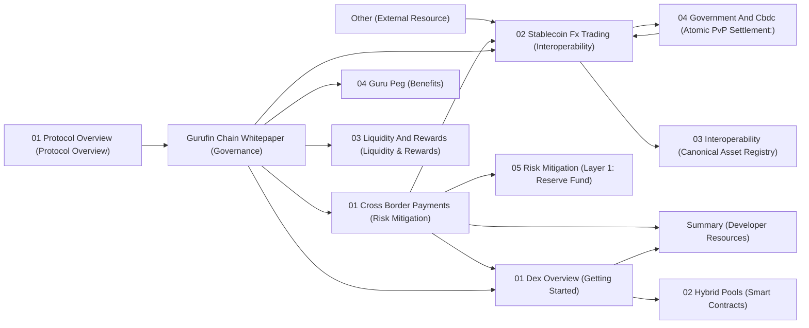

# Project Knowledge Base Overview

This knowledge base serves as a comprehensive resource for understanding the Gurufin project. It is structured into distinct modules, each focusing on a specific aspect of the platform, from its core architecture and decentralized exchange to its governance model and compliance frameworks. The project comprises 426 unique concepts interconnected by 511 relationships, organized into 48 clusters for logical navigation.

## Project Structure Summary

The Gurufin project is designed around a robust decentralized finance (DeFi) ecosystem, centered on a stablecoin and a decentralized exchange (DEX). Key functionalities include cross-border payments, interchain operability, and advanced smart contract capabilities. Governance is community-driven, ensuring a decentralized and resilient system. Compliance and risk mitigation are also integral, incorporating sophisticated mechanisms to ensure regulatory adherence and financial stability.

## Modules

Each module within this knowledge base covers a specific area of the Gurufin project:

### Gurufin Chain Whitepaper (Governance)
This module details the foundational principles, vision, and governance mechanisms of the Gurufin Chain. It outlines the decision-making processes, roles of stakeholders, and the overall framework guiding the project's evolution.

### 01 Dex Overview (Getting Started)
An introductory guide to the Gurufin Decentralized Exchange (DEX), explaining its core functionalities, user interface, and how to get started with trading and liquidity provision.

### 02 What Is Gurufin (Reserve & Backing)
Explores the core identity of Gurufin, focusing on its stablecoin's reserve assets, backing mechanisms, and the fundamental principles that ensure its stability and value.

### 02 Stablecoin Fx Trading (Interoperability)
Delves into the stablecoin's utility in foreign exchange (FX) trading, highlighting its interoperability features that enable seamless cross-currency transactions.

### 04 Smart Contract Logic (Activation)
Provides an in-depth look at the smart contract architecture underpinning Gurufin's operations, detailing how these contracts are activated and managed for various platform functions.

### 01 Protocol Overview (Protocol Overview)
Offers a high-level summary of the entire Gurufin protocol, outlining its various components, their interactions, and the overall vision for the platform.

### 01 Cross Border Payments (Risk Mitigation)
Focuses on Gurufin's solutions for efficient and secure cross-border payments, emphasizing the risk mitigation strategies employed to ensure reliable transactions.

### 01 Overview (Compliance Framework)
An introductory module that outlines the regulatory and compliance framework within which Gurufin operates, ensuring adherence to global standards.

### 02 Hybrid Pools (Smart Contracts)
Explores the concept and implementation of hybrid liquidity pools within Gurufin's DEX, detailing how smart contracts manage and optimize these pools.

### 05 Compliance And Regulation (Compliance & Regulation)
A comprehensive module on Gurufin's approach to compliance and regulatory matters, covering legal frameworks, policies, and operational safeguards.

### 02 Network Architecture (Network Architecture)
Details the underlying technical architecture of the Gurufin network, including its blockchain structure, consensus mechanisms, and node operations.

### 03 Mint And Burn (Burning Process)
Explains the economic mechanisms behind the Gurufin stablecoin, specifically how new tokens are minted and existing ones are burned to maintain peg stability.

### 06 Governance (Delegators)
Focuses on the governance model, particularly the role of delegators in the decision-making process and their influence on the Gurufin ecosystem.

### 07 Validator Guide (Security)
A practical guide for network validators, detailing their responsibilities, security protocols, and operational procedures to maintain network integrity.

### 04 Ecosystem Grant Program (Application Process)
Describes the Gurufin Ecosystem Grant Program, outlining the application process and criteria for projects seeking funding to build on the platform.

### 04 Guru Peg (Benefits)
Explains the mechanics of the Guru Peg, Gurufin's stablecoin pegging mechanism, and the benefits it provides to users and the overall ecosystem.

### 04 Multi Currency Support (Cross-Chain Interoperability)
Highlights Gurufin's capabilities for supporting multiple currencies and its approach to achieving seamless cross-chain interoperability.

### 02 Reserve And Backing (24/7 Live Proof-of-Reserves)
Provides details on the continuous, transparent proof-of-reserves mechanism that underpins the Gurufin stablecoin, ensuring its 24/7 backing.

### 03 Liquidity And Rewards (Liquidity & Rewards)
Covers the strategies for providing liquidity to the Gurufin DEX and the various reward structures available to liquidity providers.

### 05 Tokenomics (Economic Sustainability)
Analyzes the economic model of the Gurufin token, including its distribution, utility, and mechanisms designed to ensure long-term economic sustainability.

### Other (External Resource)
A catch-all module for references to external resources, documentation, or relevant information outside the immediate knowledge base.

### 02 Api Reference (API Reference)
A technical reference for Gurufin's Application Programming Interfaces (APIs), providing developers with the tools and documentation to integrate with the platform.

### 03 Interoperability (Canonical Asset Registry)
Focuses on Gurufin's approach to interoperability through the implementation of a canonical asset registry, facilitating cross-chain asset transfers.

### 04 Government And Cbdc (Atomic PvP Settlement:)
Explores Gurufin's potential applications in government and Central Bank Digital Currency (CBDC) contexts, particularly regarding atomic peer-to-peer settlement.

### 05 Risk Mitigation (Layer 1: Reserve Fund)
Details the first layer of risk mitigation within Gurufin, specifically the role and management of the reserve fund in safeguarding asset stability.

### Summary (Developer Resources)
A concise overview of resources available to developers, including documentation, SDKs, and tools for building on the Gurufin platform.

### 01 Testnet Access (API Ports)
Provides information on accessing the Gurufin Testnet, including details on API ports and connectivity for development and testing purposes.

### 03 Roadmap (Phase 2: Expansion)
Outlines the project's future development plans, specifically focusing on the expansion phase and upcoming features.

### Oracle Priced Reserve Swap (OPRS) Execution:
Details the execution process of Oracle Priced Reserve Swaps, a mechanism for efficient and fair asset exchange within the ecosystem.

### [GX Stablecoin Network](../gx_chain/01_overview.md)
An overview of the GX Stablecoin Network, a related or integrated component of the Gurufin ecosystem.

### [Network Architecture](./02_network_architecture.md)
A direct link to the network architecture documentation for detailed technical understanding.

### How to Build on Gurufin for Cross-Border Payments
A guide for developers on leveraging the Gurufin platform to build solutions for cross-border payments.

### Jurisdictional Compliance
Addresses the complexities of jurisdictional compliance and how Gurufin navigates various legal and regulatory landscapes.

### Tokenized Assets
Discusses the concept and implementation of tokenized assets within the Gurufin ecosystem.

### 100% Fiat-Backed Reserves:
Highlights the commitment to 100% fiat-backed reserves for the stablecoin, ensuring its stable value.

### Bank API Connectivity:
Details the integration capabilities with traditional banking systems via APIs.

### Prices are determined by real-world FX rates
Explains how the platform's pricing mechanisms are tied to real-world foreign exchange rates.

### Stablecoin Spot Trading Platforms:
Covers the various platforms where Gurufin's stablecoin can be spot-traded.

### Structured Product Issuance:
Discusses the issuance of structured financial products on the Gurufin platform.

### Block Explorer
Provides information on the block explorer tool for monitoring and verifying transactions on the Gurufin Chain.

### DeFi Interoperability
Explores Gurufin's role and capabilities in the broader DeFi ecosystem, focusing on interoperability.

### Gurufin Chain Integration
Details the process and benefits of integrating with the Gurufin Chain.

### Selective Disclosure
Addresses mechanisms for selective disclosure of information, particularly relevant for privacy and compliance.

### [GuruDex Overview](../gurudex/01_dex_overview.md)
A direct link to the GuruDex overview for quick access.

### Interoperability and Compliance
Examines the interplay between interoperability features and compliance requirements.

### Example: Institutional RFQ FX Trading
Provides a practical example of institutional Request for Quote (RFQ) FX trading on the platform.

### Swap Flow for Retail Users:
Illustrates the typical swap transaction flow for individual retail users.

### Use Case Scenarios for CBDC
Outlines various potential use cases for Central Bank Digital Currencies (CBDCs) leveraging Gurufin technology.

## Cross-Module Relationships

