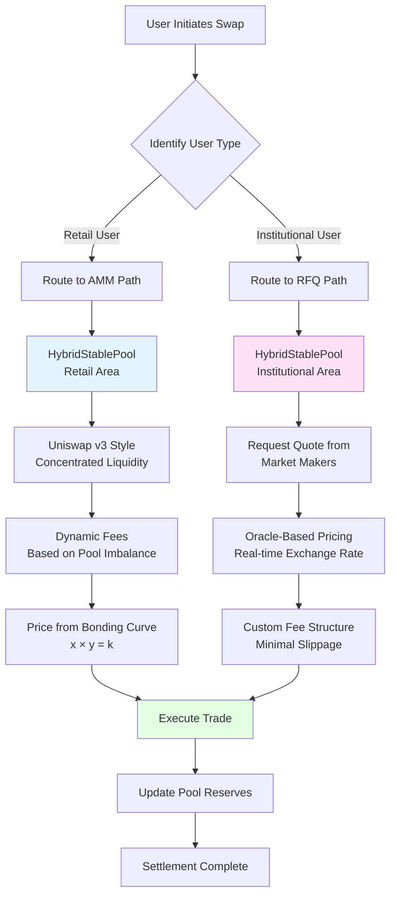

# Hybrid Execution Model

The Gurufin Chain introduces a sophisticated **Hybrid Execution Model** that combines the strengths of two distinct trading mechanisms: an **Automated Market Maker (AMM)** for retail users and a **Request-for-Quote (RFQ)** system for institutional clients. This dual approach allows Gurufin to serve a wide range of market participants, ensuring deep liquidity, efficient price discovery, and optimal trading experiences for all.

## The Two Sides of the Hybrid Model

| Component | Target Audience | Mechanism | Key Features |
|---|---|---|---|
| **Automated Market Maker (AMM)** | Retail Users & Small Traders | Utilizes a Uniswap v3-style concentrated liquidity model. | - **Dynamic Fees**: Fees adjust based on pool imbalance and volatility. - **Open & Permissionless**: Anyone can provide liquidity and trade. - **High Efficiency**: Concentrated liquidity minimizes slippage for smaller trades. |
| **Request-for-Quote (RFQ)** | Institutional Clients & Large Traders | Allows institutions to request quotes directly from professional market makers. | - **Minimal Slippage**: Large trades are executed at a quoted price, avoiding the price impact of AMMs. - **Custom Pricing**: Institutions can receive tailored pricing from market makers. - **Privacy**: Trade details are not broadcast to the public mempool. |

## How It Works

The Hybrid Execution Model operates within a single, unified liquidity pool for each stablecoin pair. This innovative design, known as the **HybridStablePool**, allows both retail and institutional trades to be settled against the same pool of assets, maximizing liquidity efficiency.

When a user initiates a swap, the system identifies the user type and routes the trade to the appropriate execution path:

- **Retail Trades**: Are routed to the AMM, where the price is determined by the bonding curve.
- **Institutional Trades**: Are routed to the RFQ system, where they are matched with quotes from registered market makers.

This architecture ensures that the Gurufin Chain can handle both a high volume of small retail trades and large institutional block trades without compromising on performance or efficiency.

### Hybrid Execution Flow Diagram

