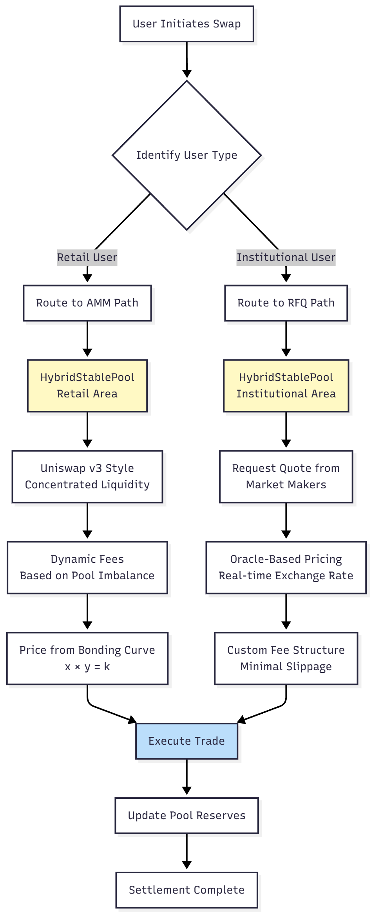

# 하이브리드 실행 모델

Gurufin Chain은 두 가지 구별되는 거래 메커니즘의 강점을 결합한 정교한 **하이브리드 실행 모델**을 도입합니다: 소매 사용자를 위한 **Automated Market Maker(AMM)**와 기관 고객을 위한 **Request-for-Quote(RFQ)** 시스템입니다. 이러한 이중 접근 방식을 통해 Gurufin은 광범위한 시장 참여자에게 서비스를 제공하여 깊은 유동성, 효율적인 가격 발견 및 모두를 위한 최적의 거래 경험을 보장합니다.

## 하이브리드 모델의 두 가지 측면

| 구성 요소 | 대상 고객 | 메커니즘 | 주요 기능 |
| -------------------------------- | ------------------------------------- | ------------------------------------------------------------------------------- | --------------------------------------------------------------------------------------------------------------------------------------------------------------------------------------------------------------------------------------------------------------------------------------------------------------------- |
| **Automated Market Maker (AMM)** | 소매 사용자 및 소규모 거래자 | Uniswap v3 스타일의 집중 유동성 모델을 활용합니다. | 
- <strong>동적 수수료</strong>: 수수료는 풀 불균형 및 변동성에 따라 조정됩니다. - <strong>개방적 &#x26; 무허가</strong>: 누구나 유동성을 제공하고 거래할 수 있습니다. - <strong>높은 효율성</strong>: 집중 유동성이 소규모 거래의 슬리피지를 최소화합니다.
 |
| **Request-for-Quote (RFQ)** | 기관 고객 및 대규모 거래자 | 기관이 전문 시장 조성자로부터 직접 견적을 요청할 수 있습니다. | 
- <strong>최소 슬리피지</strong>: 대규모 거래는 견적 가격으로 실행되어 AMM의 가격 영향을 피합니다. - <strong>맞춤형 가격 책정</strong>: 기관은 시장 조성자로부터 맞춤형 가격을 받을 수 있습니다. - <strong>프라이버시</strong>: 거래 세부 사항은 공개 메모리 풀에 브로드캐스트되지 않습니다.
 |

## 작동 방식

하이브리드 실행 모델은 각 스테이블코인 쌍에 대한 단일 통합 유동성 풀 내에서 작동합니다. **HybridStablePool**로 알려진 이 혁신적인 설계를 통해 소매 및 기관 거래가 동일한 자산 풀에 대해 정산되어 유동성 효율성을 극대화할 수 있습니다.

사용자가 스왑을 시작하면 시스템은 사용자 유형을 식별하고 거래를 적절한 실행 경로로 라우팅합니다:

* **소매 거래**: AMM으로 라우팅되며 가격은 본딩 곡선에 의해 결정됩니다.
* **기관 거래**: RFQ 시스템으로 라우팅되며 등록된 시장 조성자의 견적과 매칭됩니다.

이 아키텍처는 Gurufin Chain이 성능이나 효율성을 손상시키지 않고 대량의 소규모 소매 거래와 대규모 기관 블록 거래를 모두 처리할 수 있도록 보장합니다.

### 하이브리드 실행 흐름 다이어그램

<figure><figcaption></figcaption></figure>

