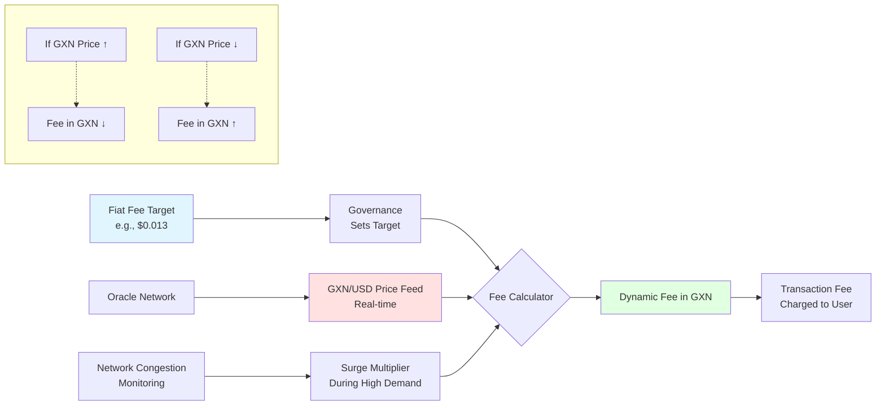

# Guru-PEG: Fiat-Predictable Transaction Fees

One of the most significant challenges for the adoption of blockchain technology in mainstream finance and retail payments is the volatility of transaction fees. Traditional gas models, where fees are determined by network congestion and token price speculation, create an unpredictable and often expensive user experience. **Guru-PEG** is Gurufin's innovative solution to this problem, providing a fiat-indexed fee mechanism that ensures stable and predictable transaction costs.

## How Guru-PEG Works

The Guru-PEG mechanism is designed to maintain a stable, fiat-equivalent fee for transactions on the Gurufin Chain. This is achieved through a combination of on-chain governance, real-time price oracles, and a dynamic adjustment system.

### Guru-PEG Dynamic Fee Adjustment Diagram

**Formula:** `Fee (GXN) = Fiat Target / GXN Price × Surge Multiplier`

| Component | Description |
|---|---|
| **Fiat-Indexed Fee Target** | The base transaction fee is pegged to a specific fiat value (e.g., $0.013 for a standard transfer). This target is set by on-chain governance and can be adjusted based on the Consumer Price Index (CPI) to account for inflation. |
| **Real-Time Price Oracle** | A decentralized oracle network provides real-time price feeds for the Guru native token (GXN) against various fiat currencies (e.g., GXN/USD). |
| **Dynamic Fee Adjustment** | The actual transaction fee in GXN is dynamically adjusted based on the oracle price feed to match the fiat-pegged target. If the price of GXN increases, the fee in GXN decreases, and vice versa. |
| **Congestion Pricing** | To manage network congestion, Guru-PEG includes a surge multiplier that can temporarily increase fees during periods of high demand, ensuring network stability and preventing spam. |

## Benefits of Guru-PEG

- **Predictability**: Users and businesses can forecast their transaction costs with a high degree of accuracy, making it easier to build sustainable business models on the blockchain.
- **Affordability**: By pegging fees to low, stable fiat values, Gurufin makes micropayments and other high-volume applications economically viable.
- **User Experience**: Guru-PEG simplifies the user experience by abstracting away the complexity of gas price speculation. Users can pay fees in various tokens, further enhancing usability.
- **Network Stability**: The congestion pricing mechanism helps to maintain network stability and prevent spam attacks during periods of high demand.

Guru-PEG is a cornerstone of Gurufin's vision to create a user-friendly and accessible financial infrastructure for the Web3 economy. By providing predictable and affordable transaction fees, we are paving the way for the mass adoption of blockchain technology in everyday financial applications.
