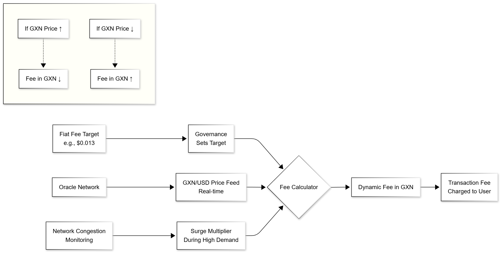

# Guru-PEG: 법정화폐 예측 가능한 수수료

주류 금융 및 소매 결제에서 블록체인 기술을 채택하는 데 있어 가장 중요한 과제 중 하나는 거래 수수료의 변동성입니다. 네트워크 혼잡과 토큰 가격 투기에 의해 수수료가 결정되는 전통적인 가스 모델은 예측 불가능하고 종종 비용이 많이 드는 사용자 경험을 만듭니다. **Guru-PEG**는 이 문제에 대한 Gurufin의 혁신적인 솔루션으로, 안정적이고 예측 가능한 거래 비용을 보장하는 법정화폐 인덱스 수수료 메커니즘을 제공합니다.

## Guru-PEG 작동 방식

Guru-PEG 메커니즘은 Gurufin Chain의 거래에 대해 안정적인 법정화폐 등가 수수료를 유지하도록 설계되었습니다. 이는 온체인 거버넌스, 실시간 가격 오라클 및 동적 조정 시스템의 조합을 통해 달성됩니다.

### Guru-PEG 동적 수수료 조정 다이어그램

<figure><figcaption></figcaption></figure>

**공식:** `수수료 (GXN) = 법정화폐 목표 / GXN 가격 × 급등 승수`

| 구성 요소 | 설명 |
| --------------------------- | ----------------------------------------------------------------------------------------------------------------------------------------------------------------------------------------------------------------------------------- |
| **법정화폐 인덱스 수수료 목표** | 기본 거래 수수료는 특정 법정화폐 가치(예: 표준 전송의 경우 $0.013)에 고정됩니다. 이 목표는 온체인 거버넌스에 의해 설정되며 인플레이션을 고려하기 위해 소비자 물가 지수(CPI)를 기반으로 조정할 수 있습니다. |
| **실시간 가격 오라클** | 탈중앙화 오라클 네트워크는 Guru 네이티브 토큰(GXN)에 대한 다양한 법정화폐(예: GXN/USD)에 대한 실시간 가격 피드를 제공합니다. |
| **동적 수수료 조정** | GXN의 실제 거래 수수료는 법정화폐 고정 목표와 일치하도록 오라클 가격 피드를 기반으로 동적으로 조정됩니다. GXN의 가격이 상승하면 GXN의 수수료가 감소하고 그 반대의 경우도 마찬가지입니다. |
| **혼잡 가격 책정** | 네트워크 혼잡을 관리하기 위해 Guru-PEG에는 높은 수요 기간 동안 수수료를 일시적으로 증가시킬 수 있는 급등 승수가 포함되어 네트워크 안정성을 보장하고 스팸을 방지합니다. |

## Guru-PEG의 이점

* **예측 가능성**: 사용자와 비즈니스는 높은 정확도로 거래 비용을 예측할 수 있어 블록체인에서 지속 가능한 비즈니스 모델을 구축하기가 더 쉽습니다.
* **경제성**: 수수료를 낮고 안정적인 법정화폐 가치에 고정함으로써 Gurufin은 소액 결제 및 기타 대용량 애플리케이션을 경제적으로 실행 가능하게 만듭니다.
* **사용자 경험**: Guru-PEG는 가스 가격 투기의 복잡성을 추상화하여 사용자 경험을 단순화합니다. 사용자는 다양한 토큰으로 수수료를 지불할 수 있어 사용성이 더욱 향상됩니다.
* **네트워크 안정성**: 혼잡 가격 책정 메커니즘은 높은 수요 기간 동안 네트워크 안정성을 유지하고 스팸 공격을 방지하는 데 도움이 됩니다.

Guru-PEG는 Web3 경제를 위한 사용자 친화적이고 접근 가능한 금융 인프라를 만들기 위한 Gurufin 비전의 초석입니다. 예측 가능하고 저렴한 거래 수수료를 제공함으로써 일상적인 금융 애플리케이션에서 블록체인 기술의 대량 채택을 위한 길을 닦고 있습니다.

