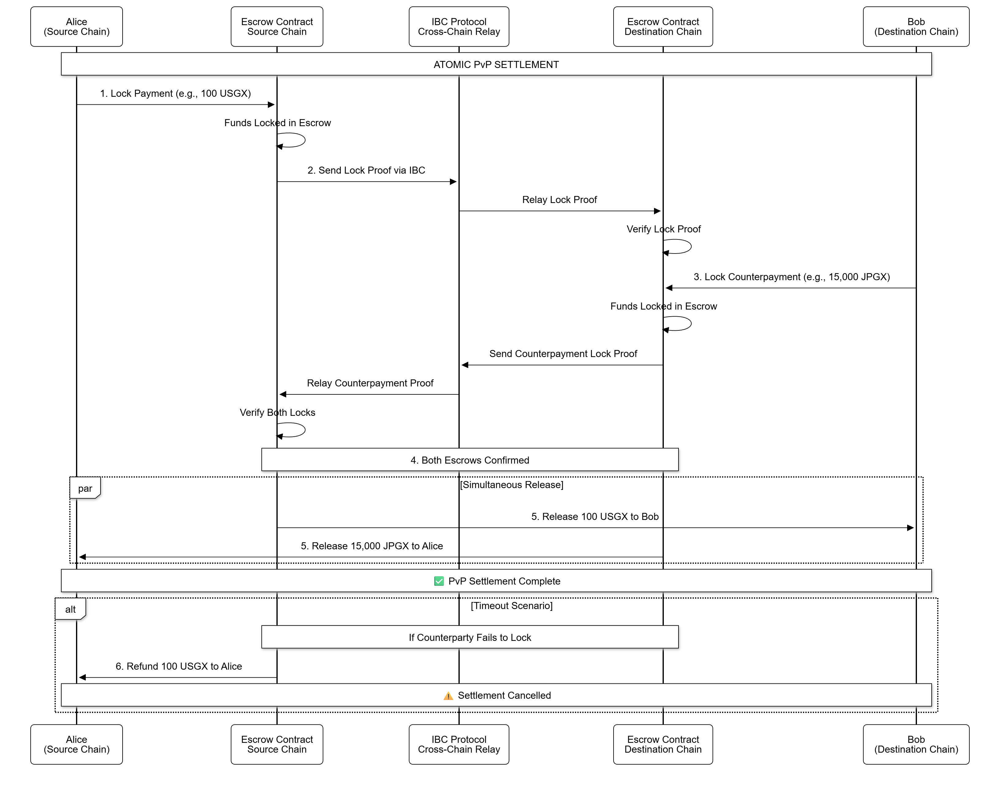

# Payment-vs-Payment (PvP) Settlement

## Overview

Payment-vs-Payment (PvP) settlement is a critical mechanism in cross-border finance that ensures the simultaneous exchange of payments in different currencies, eliminating settlement risk. Gurufin Chain, as a global on-chain FX and DeFi hub, implements atomic PvP settlement to enable secure, efficient, and trustless cross-chain transfers of sovereign stablecoins. This approach eradicates principal risk—the risk that one party pays but does not receive the countervalue—and bridge risk associated with intermediary systems.

By leveraging an escrow-based mechanism integrated with Inter-Blockchain Communication (IBC) protocols, Gurufin achieves atomicity in cross-chain settlements. This ensures that either both legs of a currency exchange complete successfully or neither does, preserving the integrity of cross-border payments and FX trades.

***

## Atomic Cross-Chain Settlement on Gurufin Chain

### Eliminating Principal and Bridge Risk

Traditional cross-border payment systems often expose participants to principal risk, where one party may deliver funds without receiving the corresponding payment. Additionally, bridge risk arises when intermediaries or bridges between blockchains fail or act maliciously, causing loss or delays.

Gurufin Chain addresses these challenges by:

* **Atomicity:** Ensuring that payment instructions on both chains execute as a single indivisible operation.
* **Escrow-based locking:** Temporarily holding funds in escrow smart contracts until both payment legs are confirmed.
* **IBC Integration:** Utilizing the Inter-Blockchain Communication protocol to securely relay messages and proofs between chains.

This design guarantees that funds are either exchanged simultaneously or returned to their originators, removing exposure to incomplete settlements.

### Escrow-Based Mechanism

At the core of Gurufin’s PvP settlement is an escrow smart contract deployed on each participating chain. The process unfolds as follows:

1. **Initiation:** The sender locks the payment amount in the escrow contract on the source chain.
2. **IBC Message Relay:** A proof of escrow lock is transmitted via IBC to the counterparty chain.
3. **Counterpayment Lock:** Upon verification, the counterparty locks the corresponding amount in escrow on their chain.
4. **Finalization:** Once both escrows are confirmed, the contracts release funds to the respective recipients simultaneously.
5. **Timeout and Refund:** If either party fails to lock funds within a predefined timeout, the escrow contracts refund the locked amounts to the original senders.

This mechanism ensures that neither party can unilaterally withdraw funds without the counterpayment being secured, thereby enforcing atomic settlement.

### IBC Integration

Gurufin Chain’s architecture is built on an **IBC-first interoperability model**, enabling seamless communication and transaction finality across sovereign stablecoin chains and external blockchains. IBC facilitates:

* **Secure Packet Transfer:** Transmitting escrow lock proofs and settlement confirmations with cryptographic guarantees.
* **Deterministic Finality:** Leveraging Tendermint BFT consensus for sub-second finality, ensuring timely settlement.
* **Cross-Chain Verification:** Validating escrow states on remote chains without trust assumptions on intermediaries.

The integration of IBC is fundamental to achieving atomic PvP settlement, as it provides the communication layer that synchronizes escrow states across chains.

***

## PvP Settlement Workflow

### PvP Settlement Flow Diagram

<figure><figcaption></figcaption></figure>

| Step | Action                             | Description                                                                                   |
| ---- | ---------------------------------- | --------------------------------------------------------------------------------------------- |
| 1    | Lock Payment on Source Chain       | Sender deposits funds into escrow smart contract on the source chain.                         |
| 2    | Relay Lock Proof via IBC           | The escrow lock event is packaged and sent to the counterparty chain through IBC.             |
| 3    | Lock Counterpayment on Destination | Counterparty verifies proof and locks corresponding funds in escrow on the destination chain. |
| 4    | Confirm Both Locks                 | Both chains confirm escrow locks are in place.                                                |
| 5    | Release Funds                      | Escrow contracts release funds to recipients simultaneously, completing the PvP settlement.   |
| 6    | Timeout & Refund                   | If counterparty fails to lock funds within timeout, escrow refunds original sender.           |

***

## Technical Architecture

### Escrow Contract Design

The escrow contracts on Gurufin Chain and GX Stablecoin chains are designed with the following features:

* **Deterministic Finality:** Using Tendermint BFT consensus ensures that once a transaction is committed, it is irreversible.
* **Timeout Parameters:** Configurable time windows prevent indefinite locking of funds.
* **Multi-Party Authorization:** Supports quorum-based authorization for mint/burn operations on GX stablecoins.
* **Compliance Integration:** Embedded KYC/AML checks and travel rule metadata support for regulatory adherence.

### IBC Protocol Role

IBC acts as the backbone for cross-chain communication, enabling:

* **Packet Relaying:** Secure transmission of escrow lock and unlock messages.
* **State Verification:** Light client proofs allow each chain to verify the escrow state of the other chain.
* **Error Handling:** Automatic rollback and refund mechanisms triggered on communication failure or timeout.

### Integration with GX Stablecoin Chains

Gurufin Chain interoperates with the GX network of jurisdiction-specific sovereign stablecoin chains. Each GX chain operates under a Proof-of-Authority consensus with licensed validators, ensuring regulatory compliance and reserve backing transparency.

The PvP settlement mechanism leverages:

* **Automated Mint/Burn:** Upon successful escrow settlement, stablecoins are minted or burned atomically to reflect the cross-border transfer.
* **IBC Compatibility:** GX chains natively support IBC, enabling seamless escrow state synchronization.
* **Reserve Transparency:** 24/7 live proof-of-reserves ensures that all stablecoins involved in PvP settlements are fully backed.

***

## Benefits of Gurufin PvP Settlement

| Benefit                     | Description                                                                                          |
| --------------------------- | ---------------------------------------------------------------------------------------------------- |
| **Atomicity**               | Ensures simultaneous settlement of both payment legs, eliminating principal risk.                    |
| **Bridge Risk Elimination** | Removes reliance on intermediaries or bridges by using trustless escrow and IBC verification.        |
| **Regulatory Compliance**   | Built-in KYC/AML and travel rule metadata support across escrow and mint/burn operations.            |
| **High Performance**        | Sub-second finality and five-figure TPS throughput enable scalable, real-time cross-border payments. |
| **Interoperability**        | IBC-first design supports seamless integration with sovereign stablecoins and external chains.       |
| **Fee Predictability**      | Guru-PEG mechanism ensures stable, low-cost fees for settlement operations.                          |

***

## Summary

Gurufin Chain’s Payment-vs-Payment (PvP) settlement mechanism represents a significant advancement in cross-border FX and stablecoin payments. By combining an escrow-based atomic settlement protocol with robust IBC integration, it eliminates principal and bridge risks inherent in traditional systems. The synergy between Gurufin Chain and GX sovereign stablecoin chains ensures regulatory compliance, transparency, and liquidity, making Gurufin a neutral and trusted settlement hub for the Web3 economy.

***

## References

| Document                     | Description                                       |
| ---------------------------- | ------------------------------------------------- |
| Gurufin Chain Documentation  | Technical stack, consensus, interoperability      |
| GX Stablecoin Chain Overview | Sovereign stablecoin infrastructure and mint/burn |
| FXSwap Architecture          | Hybrid liquidity pools and oracle integration     |
| IBC Protocol Specification   | Inter-Blockchain Communication fundamentals       |

***

_For developers and institutions interested in implementing or integrating PvP settlement on Gurufin Chain, please refer to the_ [_Developer Resources_](../developer-resources.md) _and_ [_IBC Integration Guide_](../ibc-integration.md)_._
