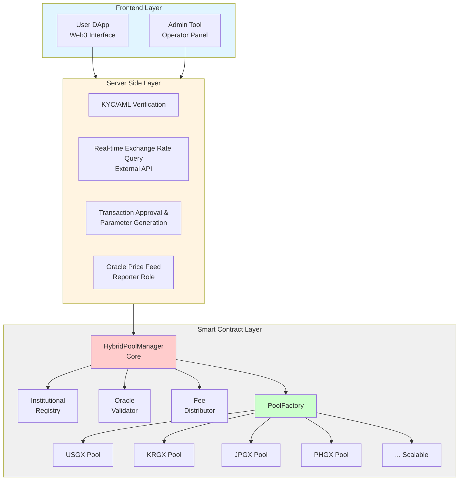
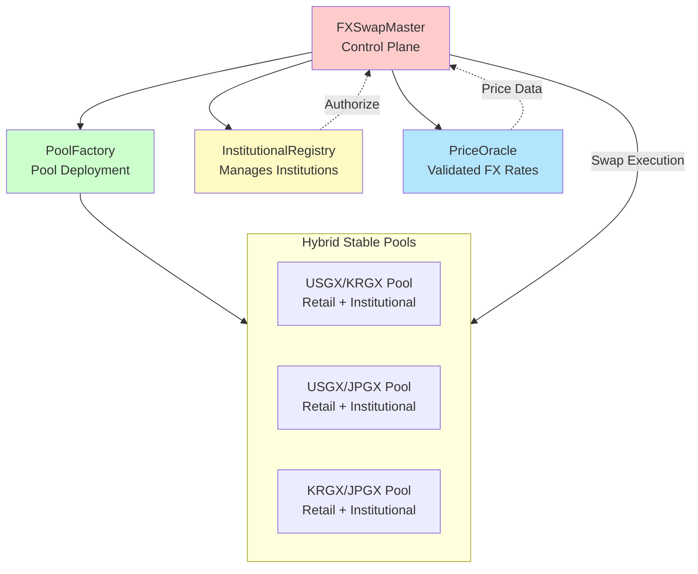

# Architecture

The GuruDex platform is a sophisticated decentralized foreign exchange (FX) swap system designed to serve both retail and institutional users with high efficiency, liquidity, and compliance. Built atop the Gurufin Chain and leveraging the GX Stablecoin ecosystem, GuruDex integrates advanced smart contract components to deliver seamless FX swaps between sovereign stablecoins. This page provides a comprehensive overview of the core smart contracts—**FXSwapMaster**, **HybridStablePool**, **PriceOracle**, and **InstitutionalRegistry**—and explains the overall system design, highlighting the architectural principles that enable GuruDex’s unique hybrid liquidity and dual-algorithm execution model.

***

## System Design Overview

GuruDex is architected as a coin-based FX swap platform that consolidates institutional and retail liquidity into unified pools, optimizing capital efficiency and minimizing slippage. The system employs a **hybrid pool design** that internally separates retail Automated Market Maker (AMM) liquidity from institutional liquidity, which is priced via real-time oracle feeds. This dual-algorithm approach ensures that retail users benefit from decentralized, permissionless AMM trading, while institutional participants enjoy low-slippage, rate-locked swaps with customized fee structures and compliance controls.

At the heart of the system lies the **FXSwapMaster** contract, which orchestrates pool creation, management, and user interactions. It interfaces with the **HybridStablePool** contracts that maintain liquidity reserves and execute swaps. The **PriceOracle** contract provides authoritative, real-time FX rates with strict validation mechanisms, while the **InstitutionalRegistry** manages institutional onboarding, permissions, and risk parameters.

### Three-Layer Architecture

GuruDex adopts a 3-layer hybrid structure to combine the decentralization and transparency of on-chain systems with the efficiency and security of off-chain systems:

**Frontend Layer**
- Provides web interface for user interaction
- Offers operational panel for institutional administrators
- Integrates with Web3 wallets to communicate with blockchain

**Server Side Layer**
- Performs KYC/AML verification for institutional users
- Collects real-time exchange rate data via external APIs
- Handles transaction approval and parameter generation
- Acts as Reporter to provide oracle prices on-chain

**Smart Contract Layer**
- All assets and trading logic executed on-chain
- Ensures decentralization and transparency
- Maintains immutable transaction records

***

## Core Contracts

### FXSwapMaster

The **FXSwapMaster** contract functions as the central management hub of the GuruDex system. It is responsible for creating and registering liquidity pools, coordinating swap operations, and enforcing system-wide policies such as rate limits and fee structures.

Key responsibilities of FXSwapMaster include:

* **Pool Lifecycle Management**: Deploying new HybridStablePool instances for supported stablecoins and maintaining references to active pools.
* **Swap Routing**: Determining user type (retail or institutional) and routing swap requests to the appropriate pool and algorithm.
* **Rate Limiting**: Enforcing per-transaction and hourly/daily volume limits to mitigate abuse and manage risk.
* **Fee Aggregation**: Collecting and distributing fees accrued from retail and institutional trades.

By centralizing these functions, FXSwapMaster ensures consistent governance and scalability across the GuruDex ecosystem.

***

### HybridStablePool

The **HybridStablePool** contract embodies the liquidity layer of GuruDex, combining retail AMM liquidity and institutional liquidity within a single pool structure. This design maximizes liquidity depth and capital efficiency while maintaining internal separation for privacy and compliance.

The pool architecture is divided into two distinct areas:

* **Retail Area (AMM)**: Implements a Uniswap v3-style concentrated liquidity AMM optimized for stablecoin pairs. It uses a constant product formula with dynamic fees that adjust based on pool imbalance to incentivize rebalancing and maintain equilibrium.
* **Institutional Area**: Supports real-time, oracle-based pricing for large institutional trades. This area applies custom fee rates, enforces transaction limits, and processes swaps at precise FX rates validated by the PriceOracle.

This hybrid design enables GuruDex to serve diverse user needs within a unified liquidity framework, reducing operational complexity and deployment costs.

***

### PriceOracle

The **PriceOracle** contract is the authoritative source of FX rate data within GuruDex. It receives exchange rate updates from a permissioned network of vetted providers and applies rigorous validation to ensure data integrity.

Core functions of PriceOracle include:

* **Rate Storage and Validation**: Maintaining current base-quote currency pairs with associated rates, timestamps, and confidence metrics.
* **Deviation Checks**: Ensuring new price submissions do not deviate beyond configured thresholds from existing rates to prevent manipulation.
* **Data Freshness Enforcement**: Rejecting stale data older than the maximum allowed age to guarantee real-time accuracy.
* **Aggregation and Outlier Rejection**: Utilizing weighted median aggregation to combine multiple data sources while excluding outliers.

The PriceOracle underpins institutional swap pricing and fee equilibrium mechanisms, contributing to the system’s reliability and trustworthiness.

***

### InstitutionalRegistry

The **InstitutionalRegistry** contract manages the onboarding, authorization, and configuration of institutional participants within GuruDex. It enforces compliance and risk controls by maintaining detailed institution profiles and access permissions.

Key features include:

* **Role Management**: Defining owner, operator, and reporter roles for administrative control.
* **User Type Classification**: Categorizing users as NONE, RETAIL, or INSTITUTIONAL to govern access and swap behavior.
* **Institutional Settings**: Storing institution-specific parameters such as transaction limits, fee rates, minimum liquidity requirements, maximum price deviation tolerance, and data age constraints.
* **Onboarding Workflow**: Supporting a multi-step registration process including initial registration, off-chain KYC/AML verification, activation, and coin/pool authorization.

By integrating these controls, InstitutionalRegistry ensures that institutional trades comply with regulatory standards and internal risk policies.

***

## Architecture Diagram Description

The following diagram illustrates the high-level architecture of GuruDex’s FX swap system:

* **FXSwapMaster** acts as the control plane, coordinating pool creation and swap execution.
* **PoolFactory** is responsible for deploying HybridStablePool instances.
* **InstitutionalRegistry** manages institutional participants and their permissions.
* **PriceOracle** supplies validated FX rates for institutional swaps.
* Each **HybridStablePool** maintains a single liquidity pool per stablecoin pair, internally partitioned into retail and institutional segments.

***

## Contract Responsibilities and Interactions

| Contract                  | Primary Responsibilities                                                               | Key Interactions                                                                |
| ------------------------- | -------------------------------------------------------------------------------------- | ------------------------------------------------------------------------------- |
| **FXSwapMaster**          | Acts as the central management contract for the system, deploying all sub-components and managing major roles such as Owner and Operator. Responsible for central pool management, swap routing, fee aggregation, and rate limiting | Calls HybridStablePool for swaps; queries InstitutionalRegistry and PriceOracle |
| **HybridPoolManager**     | Handles core orchestration of swap execution, calling different swap logic (real-time exchange rate or AMM) based on whether the user is institutional or retail | Integrates with FXSwapMaster; selects appropriate algorithm based on user type |
| **HybridStablePool**      | The single pool where liquidity for each FX stablecoin is actually stored. Consolidates liquidity from both institutional and retail users. Executes retail AMM and institutional oracle-based swaps | Receives swap requests from FXSwapMaster; updates reserves and fees             |
| **InstitutionalRegistry** | Manages and validates all information about institutional users including registration, KYC/AML status, trading limits, and customized fee rates | Authorizes institutional swaps; enforces limits and fee rates; manages onboarding workflow |
| **PriceOracle**           | Records real-time exchange rate data provided by server-side and validates price data validity (time, deviation, confidence) during swaps | Provides price data to HybridStablePool and FXSwapMaster; performs triple validation |
| **PoolFactory**           | Creates and registers single pools for the coin when new FX stablecoins are added to the system | Deploys new HybridStablePool instances upon FXSwapMaster's instruction |
| **FeeDistributor**        | Collects swap fees generated and distributes them to liquidity providers (LPs) according to their shares | Collects fees from HybridStablePool; distributes to LP token holders |

***

## Supported Stablecoins

GuruDex currently supports FX swaps among the following sovereign stablecoins issued on the GX Stablecoin chain:

| Stablecoin | Pegged Currency | Description                 |
| ---------- | --------------- | --------------------------- |
| **USGX**   | USD             | United States Dollar pegged |
| **KRGX**   | KRW             | South Korean Won pegged     |
| **JPGX**   | JPY             | Japanese Yen pegged         |
| **PHGX**   | PHP             | Philippine Peso pegged      |

Each stablecoin is backed 1:1 by fiat reserves and operates on independent Layer-1 chains with PoA consensus, ensuring sovereign-grade stability and compliance.

***

## Hybrid Pool Design Benefits

The hybrid pool model employed by GuruDex offers several strategic advantages:

* **Liquidity Concentration**: By consolidating retail and institutional liquidity into a single pool per stablecoin pair, GuruDex achieves deeper liquidity and reduced slippage compared to fragmented pools.
* **Operational Efficiency**: Managing one pool per coin pair (instead of multiple pair pools) reduces deployment and maintenance overhead by approximately 66%, enhancing scalability.
* **Internal Separation**: Although liquidity is pooled, retail and institutional balances are tracked separately within the contract, preserving privacy and enabling tailored fee and limit policies.
* **Dynamic Fee Mechanism**: Fees adjust dynamically based on pool imbalance, incentivizing users to maintain equilibrium and protecting liquidity providers from adverse selection.
* **Compliance Integration**: Institutional trades are subject to rigorous KYC/AML and risk controls enforced via InstitutionalRegistry and PriceOracle, ensuring regulatory adherence.

***

## Swap Execution Flow

### Retail User Swap

Retail users interact with the system through the AMM mechanism embedded in the HybridStablePool. The swap flow includes:

1. User submits a swap request specifying direction, input amount, and minimum acceptable output.
2. FXSwapMaster verifies the user is retail and enforces rate limits.
3. HybridStablePool calculates output using the Uniswap v3-style constant product formula, applying dynamic fees based on pool imbalance.
4. Reserves are updated, and the output amount is transferred to the user.
5. Fees are accumulated for liquidity provider rewards.

### Institutional User Swap

Institutional swaps leverage oracle-based pricing and customized parameters:

1. Institution undergoes off-chain KYC/AML verification and is registered in InstitutionalRegistry.
2. Institution submits a swap request including the oracle-provided price.
3. FXSwapMaster verifies institutional status, validates the oracle price against deviation and freshness constraints.
4. Swap limits and fee rates specific to the institution are enforced.
5. HybridStablePool executes the swap at the oracle price with low fees.
6. Reserves are updated, and output tokens are transferred.
7. Volume is recorded for compliance and limit tracking.

***

## Conclusion

The GuruDex architecture exemplifies a cutting-edge FX swap platform that harmonizes retail accessibility with institutional rigor. By integrating the **FXSwapMaster**, **HybridStablePool**, **PriceOracle**, and **InstitutionalRegistry** contracts within a unified, hybrid liquidity framework, GuruDex delivers a scalable, compliant, and efficient FX trading environment. This design supports the Gurufin Chain’s vision of a global on-chain FX/DeFi hub, enabling seamless cross-border stablecoin swaps with predictable fees, deep liquidity, and regulatory-grade controls.

For developers and integrators, understanding the interplay between these core components is essential to leveraging GuruDex’s full potential in building next-generation FX and DeFi applications.
