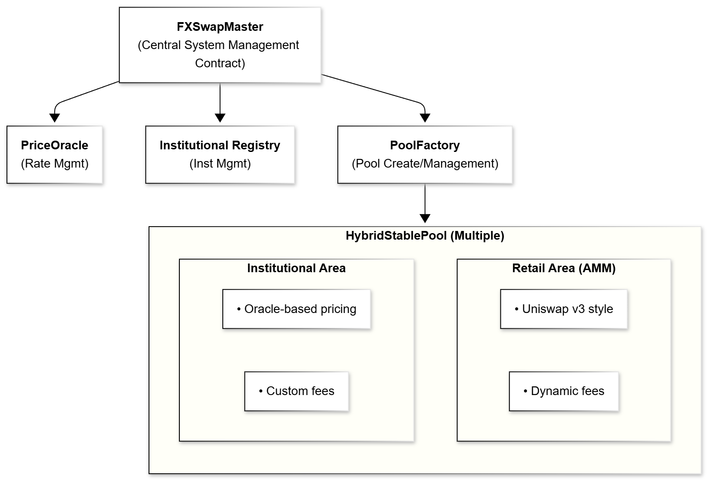

# 아키텍처

GuruDex 플랫폼은 높은 효율성, 유동성 및 규정 준수로 소매 및 기관 사용자 모두에게 서비스를 제공하도록 설계된 정교한 탈중앙화 외환(FX) 스왑 시스템입니다. Gurufin Chain 위에 구축되고 GX Stablecoin 생태계를 활용하여 GuruDex는 주권 스테이블코인 간의 원활한 FX 스왑을 제공하기 위해 고급 스마트 계약 구성 요소를 통합합니다. 이 페이지는 핵심 스마트 계약인 **FXSwapMaster**, **HybridStablePool**, **PriceOracle** 및 **InstitutionalRegistry**에 대한 포괄적인 개요를 제공하고 GuruDex의 고유한 하이브리드 유동성 및 듀얼 알고리즘 실행 모델을 가능하게 하는 아키텍처 원칙을 강조하는 전체 시스템 설계를 설명합니다.

***

## 시스템 설계 개요

GuruDex는 기관 및 소매 유동성을 통합 풀로 통합하여 자본 효율성을 최적화하고 슬리피지를 최소화하는 코인 기반 FX 스왑 플랫폼으로 아키텍처되었습니다. 시스템은 소매 자동화된 시장 조성자(AMM) 유동성을 실시간 오라클 피드를 통해 가격이 책정되는 기관 유동성과 내부적으로 분리하는 **하이브리드 풀 설계**를 사용합니다. 이 듀얼 알고리즘 접근 방식은 소매 사용자가 탈중앙화되고 무허가인 AMM 거래의 혜택을 받는 동시에 기관 참여자는 맞춤형 수수료 구조 및 규정 준수 제어를 통해 낮은 슬리피지, 비율 고정 스왑을 즐길 수 있도록 보장합니다.

시스템의 핵심에는 풀 생성, 관리 및 사용자 상호 작용을 조정하는 **FXSwapMaster** 계약이 있습니다. 유동성 준비금을 유지하고 스왑을 실행하는 **HybridStablePool** 계약과 인터페이스합니다. **PriceOracle** 계약은 엄격한 검증 메커니즘으로 권위 있는 실시간 FX 비율을 제공하며 **InstitutionalRegistry**는 기관 온보딩, 권한 및 위험 매개변수를 관리합니다.

### 3계층 아키텍처

GuruDex는 온체인의 탈중앙성과 투명성을 유지하면서도 오프체인 시스템의 효율성과 보안성을 결합하기 위해 3개 레이어로 구성된 하이브리드 구조를 채택합니다:

```
┌───────────────────────────────────────────────────────────────────┐
│                        Frontend Layer                              │
│   ┌──────────────────┐         ┌─────────────────────┐           │
│   │   User DApp      │         │    Admin Tool       │           │
│   │ (Web3 Interface) │         │  (Operator Panel)   │           │
│   └──────────────────┘         └─────────────────────┘           │
└───────────────────────────────────────────────────────────────────┘
                                  │
                                  ▼
┌───────────────────────────────────────────────────────────────────┐
│                      Server Side Layer                             │
│   ┌────────────────────────────────────────────────────────────┐  │
│   │  - KYC/AML 검증                                            │  │
│   │  - 실시간 환율 조회 (외부 API)                             │  │
│   │  - 거래 승인 및 파라미터 생성                              │  │
│   │  - 오라클 가격 피드 (Reporter 역할)                        │  │
│   └────────────────────────────────────────────────────────────┘  │
└───────────────────────────────────────────────────────────────────┘
                                  │
                                  ▼
┌───────────────────────────────────────────────────────────────────┐
│                    Smart Contract Layer                            │
│   ┌─────────────────────────────────────────────────────────────┐│
│   │           HybridPoolManager (Core)                          ││
│   └─────────────────────────────────────────────────────────────┘│
│           ▼              ▼              ▼                         │
│   ┌──────────────┐ ┌──────────────┐ ┌──────────────┐            │
│   │Institutional │ │   Oracle     │ │     Fee      │            │
│   │  Registry    │ │  Validator   │ │ Distributor  │            │
│   └──────────────┘ └──────────────┘ └──────────────┘            │
│                           ▼                                        │
│   ┌─────────────────────────────────────────────────────────────┐│
│   │                    PoolFactory                              ││
│   └─────────────────────────────────────────────────────────────┘│
│                           ▼                                        │
│   ┌────────┬────────┬────────┬────────┬─────────────────────────┐│
│   │  USGX  │  KRGX  │  JPGX  │  PHGX  │   ... (확장 가능)       ││
│   │  Pool  │  Pool  │  Pool  │  Pool  │                         ││
│   └────────┴────────┴────────┴────────┴─────────────────────────┘│
└───────────────────────────────────────────────────────────────────┘
```

**Frontend Layer (프론트엔드 계층)**
- 사용자가 상호작용하는 웹 인터페이스 제공
- 기관 관리자를 위한 운영 패널 제공
- Web3 지갑과 통합되어 블록체인과 통신

**Server Side Layer (서버 사이드 계층)**
- 기관 사용자의 KYC/AML 검증 수행
- 외부 API를 통해 실시간 환율 데이터 수집
- 거래 승인 및 파라미터 생성 처리
- 오라클 가격을 온체인에 제공하는 Reporter 역할 수행

**Smart Contract Layer (스마트 컨트랙트 계층)**
- 모든 자산과 거래 로직이 온체인에서 실행
- 탈중앙화와 투명성 보장
- 변조 불가능한 거래 기록 유지

***

## 핵심 계약

### FXSwapMaster

**FXSwapMaster** 계약은 GuruDex 시스템의 중앙 관리 허브로 기능합니다. 유동성 풀 생성 및 등록, 스왑 작업 조정 및 비율 제한 및 수수료 구조와 같은 시스템 전체 정책 시행을 담당합니다.

FXSwapMaster의 주요 책임은 다음과 같습니다:

* **풀 수명 주기 관리**: 지원되는 스테이블코인에 대한 새로운 HybridStablePool 인스턴스 배포 및 활성 풀에 대한 참조 유지.
* **스왑 라우팅**: 사용자 유형(소매 또는 기관)을 결정하고 스왑 요청을 적절한 풀 및 알고리즘으로 라우팅.
* **비율 제한**: 남용을 완화하고 위험을 관리하기 위해 거래당 및 시간당/일일 거래량 제한을 시행.
* **수수료 집계**: 소매 및 기관 거래에서 발생한 수수료를 수집하고 분배.

이러한 기능을 중앙 집중화함으로써 FXSwapMaster는 GuruDex 생태계 전반에 걸쳐 일관된 거버넌스와 확장성을 보장합니다.

***

### HybridStablePool

**HybridStablePool** 계약은 단일 풀 구조 내에서 소매 AMM 유동성과 기관 유동성을 결합하는 GuruDex의 유동성 레이어를 구현합니다. 이 설계는 프라이버시 및 규정 준수를 위해 내부 분리를 유지하면서 유동성 깊이와 자본 효율성을 극대화합니다.

풀 아키텍처는 두 개의 구별되는 영역으로 나뉩니다:

* **소매 영역(AMM)**: 스테이블코인 쌍에 최적화된 Uniswap v3 스타일의 집중 유동성 AMM을 구현합니다. 재균형을 장려하고 균형을 유지하기 위해 풀 불균형에 따라 조정되는 동적 수수료와 함께 상수 곱 공식을 사용합니다.
* **기관 영역**: 대규모 기관 거래를 위한 실시간 오라클 기반 가격 책정을 지원합니다. 이 영역은 맞춤형 수수료율을 적용하고 거래 제한을 시행하며 PriceOracle에 의해 검증된 정확한 FX 비율로 스왑을 처리합니다.

이 하이브리드 설계를 통해 GuruDex는 운영 복잡성과 배포 비용을 줄이면서 통합 유동성 프레임워크 내에서 다양한 사용자 요구를 제공할 수 있습니다.

***

### PriceOracle

**PriceOracle** 계약은 GuruDex 내의 FX 비율 데이터의 권위 있는 소스입니다. 검증된 제공자의 허가된 네트워크에서 환율 업데이트를 받고 데이터 무결성을 보장하기 위해 엄격한 검증을 적용합니다.

PriceOracle의 핵심 기능은 다음과 같습니다:

* **비율 저장 및 검증**: 관련 비율, 타임스탬프 및 신뢰 메트릭과 함께 현재 기본-견적 통화 쌍을 유지.
* **편차 확인**: 새로운 가격 제출이 조작을 방지하기 위해 기존 비율에서 구성된 임계값을 벗어나지 않도록 보장.
* **데이터 신선도 시행**: 실시간 정확성을 보장하기 위해 최대 허용 기간보다 오래된 부실 데이터를 거부.
* **집계 및 이상값 거부**: 가중 중앙값 집계를 활용하여 이상값을 제외하면서 여러 데이터 소스를 결합.

PriceOracle은 기관 스왑 가격 책정 및 수수료 균형 메커니즘을 뒷받침하며 시스템의 신뢰성과 신뢰성에 기여합니다.

***

### InstitutionalRegistry

**InstitutionalRegistry** 계약은 GuruDex 내의 기관 참여자의 온보딩, 승인 및 구성을 관리합니다. 자세한 기관 프로필 및 액세스 권한을 유지하여 규정 준수 및 위험 제어를 시행합니다.

주요 기능은 다음과 같습니다:

* **역할 관리**: 관리 제어를 위한 소유자, 운영자 및 리포터 역할을 정의.
* **사용자 유형 분류**: 액세스 및 스왑 동작을 제어하기 위해 사용자를 NONE, RETAIL 또는 INSTITUTIONAL로 분류.
* **기관 설정**: 거래 제한, 수수료율, 최소 유동성 요구 사항, 최대 가격 편차 허용 오차 및 데이터 기간 제약과 같은 기관별 매개변수 저장.
* **온보딩 워크플로**: 초기 등록, 오프체인 KYC/AML 확인, 활성화 및 코인/풀 승인을 포함한 다단계 등록 프로세스 지원.

이러한 제어를 통합함으로써 InstitutionalRegistry는 기관 거래가 규제 표준 및 내부 위험 정책을 준수하도록 보장합니다.

***

## 아키텍처 다이어그램 설명

다음 다이어그램은 GuruDex의 FX 스왑 시스템의 상위 수준 아키텍처를 보여줍니다:

<figure><figcaption></figcaption></figure>

* **FXSwapMaster**는 풀 생성 및 스왑 실행을 조정하는 제어 플레인 역할을 합니다.
* **PoolFactory**는 HybridStablePool 인스턴스 배포를 담당합니다.
* **InstitutionalRegistry**는 기관 참여자 및 권한을 관리합니다.
* **PriceOracle**은 기관 스왑에 대한 검증된 FX 비율을 제공합니다.
* 각 **HybridStablePool**은 스테이블코인 쌍당 단일 유동성 풀을 유지하며 소매 및 기관 부문으로 내부적으로 분할됩니다.

***

## 계약 책임 및 상호 작용

| 계약 | 주요 책임 | 주요 상호 작용 |
| ------------------------- | -------------------------------------------------------------------------------------- | ------------------------------------------------------------------------------- |
| **FXSwapMaster** | 시스템의 중앙 관리 컨트랙트로, 모든 하위 컴포넌트를 배포하고 전체 시스템의 Owner, Operator 등 주요 역할을 관리합니다. 풀의 중앙 관리, 스왑 라우팅, 수수료 집계, 비율 제한 담당 | 스왑을 위해 HybridStablePool 호출; InstitutionalRegistry 및 PriceOracle 쿼리 |
| **HybridPoolManager** | 스왑 실행의 핵심 오케스트레이션을 담당하며, 사용자가 기관인지 일반 사용자인지에 따라 다른 스왑 로직(실시간 환율 또는 AMM)을 호출합니다. | FXSwapMaster와 통합; 사용자 유형에 따라 적절한 알고리즘 선택 |
| **HybridStablePool** | 각 외환 스테이블 코인의 유동성이 실제로 보관되는 단일 풀입니다. 기관과 일반 사용자의 유동성이 통합되어 관리됩니다. 소매 AMM 및 기관 오라클 기반 스왑 실행 | FXSwapMaster로부터 스왑 요청 수신; 준비금 및 수수료 업데이트 |
| **InstitutionalRegistry** | 기관 사용자의 등록, KYC/AML 상태, 거래 한도, 맞춤형 수수료율 등 모든 정보를 관리하고 검증하는 역할을 수행합니다. | 기관 스왑 승인; 제한 및 수수료율 시행; 온보딩 워크플로 관리 |
| **PriceOracle** | 서버 사이드에서 제공하는 실시간 환율 데이터를 온체인에 기록하고, 스왑 시 가격 데이터의 유효성(시간, 편차, 신뢰도)을 검증합니다. | HybridStablePool 및 FXSwapMaster에 가격 데이터 제공; 3중 검증 수행 |
| **PoolFactory** | 새로운 외환 스테이블 코인이 추가될 때 해당 코인의 단일 풀을 생성하고 시스템에 등록하는 역할을 합니다. | FXSwapMaster의 지시에 따라 새로운 HybridStablePool 배포 |
| **FeeDistributor** | 발생한 스왑 수수료를 수집하여 유동성 공급자(LP)들의 지분에 따라 분배하는 역할을 담당합니다. | HybridStablePool로부터 수수료 수집; LP 토큰 보유자에게 분배 |

***

## 지원되는 스테이블코인

GuruDex는 현재 GX Stablecoin 체인에서 발행된 다음 주권 스테이블코인 간의 FX 스왑을 지원합니다:

| 스테이블코인 | 페그 통화 | 설명 |
| ---------- | --------------- | --------------------------- |
| **USGX** | USD | 미국 달러 페그 |
| **KRGX** | KRW | 대한민국 원 페그 |
| **JPGX** | JPY | 일본 엔 페그 |
| **PHGX** | PHP | 필리핀 페소 페그 |

각 스테이블코인은 법정화폐 준비금에 의해 1:1로 뒷받침되며 PoA 합의를 가진 독립 Layer-1 체인에서 운영되어 주권급 안정성과 규정 준수를 보장합니다.

***

## 하이브리드 풀 설계 이점

GuruDex가 사용하는 하이브리드 풀 모델은 여러 전략적 이점을 제공합니다:

* **유동성 집중**: 스테이블코인 쌍당 단일 풀에 소매 및 기관 유동성을 통합함으로써 GuruDex는 분산된 풀에 비해 더 깊은 유동성과 감소된 슬리피지를 달성합니다.
* **운영 효율성**: 코인 쌍당 하나의 풀 관리(여러 쌍 풀 대신)는 배포 및 유지 관리 오버헤드를 약 66% 줄여 확장성을 향상시킵니다.
* **내부 분리**: 유동성이 풀링되어 있지만 소매 및 기관 잔액은 계약 내에서 별도로 추적되어 프라이버시를 보존하고 맞춤형 수수료 및 제한 정책을 가능하게 합니다.
* **동적 수수료 메커니즘**: 수수료는 풀 불균형에 따라 동적으로 조정되어 사용자가 균형을 유지하도록 장려하고 유동성 제공자를 불리한 선택으로부터 보호합니다.
* **규정 준수 통합**: 기관 거래는 InstitutionalRegistry 및 PriceOracle을 통해 시행되는 엄격한 KYC/AML 및 위험 제어의 대상이 되어 규제 준수를 보장합니다.

***

## 스왑 실행 흐름

### 소매 사용자 스왑

소매 사용자는 HybridStablePool에 내장된 AMM 메커니즘을 통해 시스템과 상호 작용합니다. 스왑 흐름은 다음과 같습니다:

1. 사용자는 방향, 입력 금액 및 최소 허용 가능한 출력을 지정하여 스왑 요청을 제출합니다.
2. FXSwapMaster는 사용자가 소매임을 확인하고 비율 제한을 시행합니다.
3. HybridStablePool은 풀 불균형에 따라 동적 수수료를 적용하여 Uniswap v3 스타일의 상수 곱 공식을 사용하여 출력을 계산합니다.
4. 준비금이 업데이트되고 출력 금액이 사용자에게 전송됩니다.
5. 유동성 제공자 보상을 위해 수수료가 축적됩니다.

### 기관 사용자 스왑

기관 스왑은 오라클 기반 가격 책정 및 맞춤형 매개변수를 활용합니다:

1. 기관은 오프체인 KYC/AML 확인을 거치고 InstitutionalRegistry에 등록됩니다.
2. 기관은 오라클이 제공한 가격을 포함한 스왑 요청을 제출합니다.
3. FXSwapMaster는 기관 상태를 확인하고 편차 및 신선도 제약에 대해 오라클 가격을 검증합니다.
4. 기관에 특정한 스왑 제한 및 수수료율이 시행됩니다.
5. HybridStablePool은 낮은 수수료로 오라클 가격으로 스왑을 실행합니다.
6. 준비금이 업데이트되고 출력 토큰이 전송됩니다.
7. 규정 준수 및 제한 추적을 위해 거래량이 기록됩니다.

***

## 결론

GuruDex 아키텍처는 소매 접근성과 기관 엄격성을 조화시키는 최첨단 FX 스왑 플랫폼을 예시합니다. 통합 하이브리드 유동성 프레임워크 내에서 **FXSwapMaster**, **HybridStablePool**, **PriceOracle** 및 **InstitutionalRegistry** 계약을 통합함으로써 GuruDex는 확장 가능하고 규정을 준수하며 효율적인 FX 거래 환경을 제공합니다. 이 설계는 예측 가능한 수수료, 깊은 유동성 및 규제급 제어로 원활한 국경 간 스테이블코인 스왑을 가능하게 하는 글로벌 온체인 FX/DeFi 허브인 Gurufin Chain의 비전을 지원합니다.

개발자와 통합자에게 이러한 핵심 구성 요소 간의 상호 작용을 이해하는 것은 차세대 FX 및 DeFi 애플리케이션을 구축하는 데 GuruDex의 전체 잠재력을 활용하는 데 필수적입니다.

