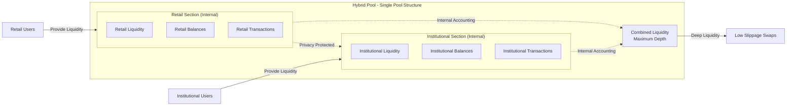
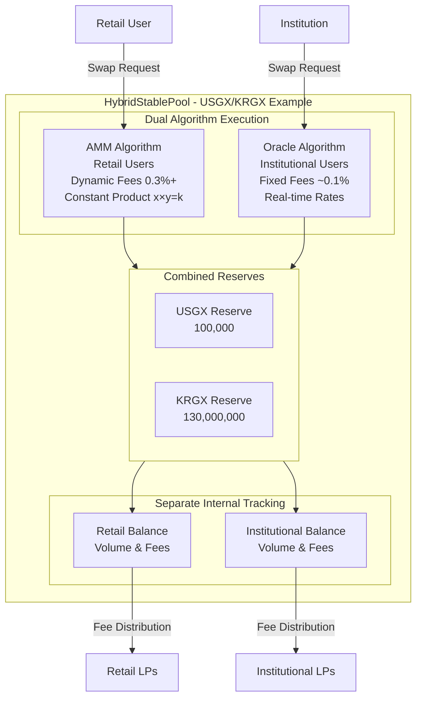

# Hybrid Pools

Hybrid Pools represent a core innovation within the FXSwap platform on Gurufin Chain, designed to seamlessly integrate both institutional and retail liquidity into a single, unified liquidity pool. This architecture enables efficient FX swaps across a spectrum of user types while preserving privacy and operational efficiency through internal separation mechanisms.

***

## Single Unified Pool vs Pair Pool: Structural Design Choice

GuruDex has **adopted the Single Unified Pool approach** for managing liquidity. This is a fundamentally different and innovative approach from the traditional Pair Pool method.

### Comparative Analysis

| Criteria | Pair Pool Approach | Single Unified Pool Approach ⭐ |
| :--- | :--- | :--- |
| **Pool Count** | N×(N-1)/2 | N |
| **4 Currency Example** | 6 pools | 4 pools |
| **Liquidity Efficiency** | ⭐⭐ | ⭐⭐⭐⭐⭐ |
| **Slippage** | High | Low |
| **Management Complexity** | High | Low |
| **Gas Cost** | High | Low |
| **Scalability** | Difficult | Easy |

### Design Rationale

1. **Liquidity Concentration**: All liquidity concentrates in a single pool per coin, minimizing slippage
2. **Efficiency**: Only 4 pools needed instead of 6 for 4 currencies (66% reduction)
3. **Scalability**: Adding a new currency requires creating just 1 pool
4. **Management Simplicity**: Simplified management with single pool per coin

### Single Pool Structure Characteristics

GuruDex **creates one single pool per currency**, with institutions and retail users sharing the same liquidity pool:

- ✅ **Excellent Capital Efficiency**: All liquidity concentrated in one pool
- ✅ **Optimal Swap Efficiency**: Deep liquidity minimizes slippage
- ⚠️ **Revenue Imbalance Addressed**: Institutional LP rewards capped at 7% annual return
- ⚠️ **Risk Propagation Prevention**: Circuit breaker and security mechanisms applied

### Security Measures for Single Pool

To address revenue fairness issues, the following mechanisms are applied:

**1. Legal Interest Rate Cap (7% Annual)**
- Compliance with Korean Interest Rate Limitation Act (Loan Business Act: 20% cap)
- Conservative application of 7% annual cap for safety margin
- Prevents excessive returns to institutional investors

**2. Differentiated Reward Distribution**
- Institutional LPs: Capped at 7% annual legal interest rate
- Retail LPs: (Institutional Rewards - 7%) + Retail Rewards → Higher returns expected

**3. Additional Security Mechanisms**
- Stake limits: Maximum stake settings
- Withdrawal limits: Cooldown period, max 30% per request
- Flash Loan defense
- Trust score system

## Combining Institutional and Retail Liquidity

GuruDex's Hybrid Pool design consolidates these liquidity sources into a single pool per stablecoin pair, leveraging a dual-algorithm approach to serve both retail and institutional users effectively.

Within each Hybrid Pool, liquidity is managed in two distinct internal areas:

* **Retail Area:** Utilizes an AMM algorithm inspired by Uniswap v3, optimized for smaller trades with dynamic fees that respond to pool imbalances.
* **Institutional Area:** Employs an oracle-driven pricing mechanism with real-time exchange rates, enabling large trades with minimal slippage and custom fee structures.

This integrated approach allows all liquidity—whether from retail liquidity providers or institutional counterparties—to contribute to a single consolidated pool, maximizing depth and capital efficiency.

***

## Benefits of the Hybrid Pool Approach

The Hybrid Pool architecture delivers multiple strategic advantages over separate liquidity pools, summarized in the table below:

| Benefit                      | Description                                                                                                              |
| ---------------------------- | ------------------------------------------------------------------------------------------------------------------------ |
| **Liquidity Maximization**   | Combining retail and institutional liquidity creates deeper pools, reducing slippage and improving price stability.      |
| **Operational Efficiency**   | Managing a single pool per stablecoin pair reduces complexity, lowering deployment and maintenance costs.                |
| **Scalability**              | Adding new stablecoins requires only one new pool, simplifying network expansion.                                        |
| **Cost Reduction**           | Fewer pools translate to reduced gas and infrastructure costs, benefiting all participants.                              |
| **Unified Fee Mechanism**    | Dynamic fees for retail trades and custom institutional fees coexist within one pool, optimizing revenue and incentives. |
| **Enhanced User Experience** | Both retail and institutional users access the same liquidity, ensuring consistent pricing and availability.             |

By consolidating liquidity, FXSwap is designed to achieve a more robust and scalable FX trading environment that supports a broad range of use cases—from retail remittances to high-volume institutional FX settlement.

***

## Internal Separation and Privacy Preservation

While liquidity is pooled together, FXSwap maintains strict internal separation of institutional and retail balances to ensure privacy and compliance. This separation is implemented at the smart contract and accounting layers, enabling the platform to:

* **Isolate User Balances:** Institutional and retail liquidity contributions and trade volumes are tracked separately, preventing cross-exposure of sensitive trading data.
* **Maintain Privacy:** Institutional trades, which often involve confidential pricing and volume information, remain shielded from retail participants and public view.
* **Support Compliance:** Segregated accounting facilitates wallet-tier compliance, including KYC/AML and sanctions screening, without compromising the anonymity of retail users.
* **Enable Custom Settings:** Institutional participants benefit from tailored fee rates, transaction limits, and risk parameters, managed independently within the pool.

### Internal Separation Diagram

This internal separation ensures that while liquidity is combined for efficiency, the privacy and regulatory requirements of different user classes are respected and enforced.

***

## Hybrid Pool Architecture Overview

The following diagram illustrates the Hybrid Pool structure within the FXSwap system:

***

## Dual Algorithm Execution

The Hybrid Pool supports two distinct swap execution algorithms tailored to the needs of retail and institutional users:

| User Type         | Algorithm Type         | Key Characteristics                                                                                                                                          |
| ----------------- | ---------------------- | ------------------------------------------------------------------------------------------------------------------------------------------------------------ |
| **Retail**        | AMM (Uniswap v3 style) | Uses a constant product formula (x \* y = k) with dynamic fees that increase as pool imbalance grows. Ideal for smaller, frequent trades.                    |
| **Institutional** | Oracle-Based RFQ       | Executes trades at real-time exchange rates sourced from a permissioned oracle network, with low fixed fees (\~0.1%) and volume limits to minimize slippage. |

This dual-algorithm system ensures that retail users benefit from automated, permissionless trading, while institutional users receive precise pricing and customized trade parameters.

***

## Liquidity Management and Fee Dynamics

Liquidity providers (LPs) contribute assets to the Hybrid Pool and receive LP tokens proportionally. The pool dynamically adjusts fees based on liquidity ratios to incentivize balanced reserves:

* **Dynamic Fee Mechanism:** Fees increase by approximately 1% for every 1% deviation from a balanced base-to-quote ratio, encouraging liquidity rebalancing.
* **Fee Distribution:** Accumulated fees are distributed to LPs daily, rewarding both retail and institutional liquidity contributions.

This mechanism maintains pool equilibrium and protects against adverse selection, enhancing overall market quality.

***

## Summary Table: Hybrid Pool Features

| Feature                         | Description                                                                                      |
| ------------------------------- | ------------------------------------------------------------------------------------------------ |
| **Single Pool per Pair**        | One consolidated liquidity pool per stablecoin pair, combining all user liquidity.               |
| **Internal Balance Separation** | Separate accounting for retail and institutional liquidity to maintain privacy and compliance.   |
| **Dual Swap Algorithms**        | AMM for retail users; oracle-based RFQ for institutions.                                         |
| **Dynamic Fee Model**           | Fees adjust dynamically based on pool imbalance to incentivize equilibrium.                      |
| **Institutional Controls**      | Custom fee rates, transaction limits, and risk parameters managed via institutional registry.    |
| **Privacy and Compliance**      | Wallet-tier compliance with optional zk-proof privacy modes and supervisory-grade observability. |
| **Scalable and Efficient**      | Reduced pool count lowers operational costs and simplifies network scaling.                      |

***

## Conclusion

The Hybrid Pool design within FXSwap on Gurufin Chain exemplifies a sophisticated approach to liquidity management in decentralized FX markets. By integrating institutional and retail liquidity into a single, privacy-preserving pool with dual execution algorithms, the platform is designed to achieve superior liquidity depth, operational efficiency, and compliance readiness. This architecture will support a wide range of FX trading use cases, from retail remittances to institutional settlement, positioning Gurufin Chain as a leading global on-chain FX and DeFi hub.

***

For further technical details on Hybrid Pools, including smart contract interfaces and institutional onboarding processes, please refer to the [FXSwap Architecture Documentation](02_hybrid_pools.md) and the [Gurufin Chain Technical Specifications](02_hybrid_pools.md).
