# Hybrid Pools

Hybrid Pools represent a core innovation within the FXSwap platform on Gurufin Chain, designed to seamlessly integrate both institutional and retail liquidity into a single, unified liquidity pool. This architecture enables efficient FX swaps across a spectrum of user types while preserving privacy and operational efficiency through internal separation mechanisms.

***

## Single Pool vs Separated Pool vs Hybrid Pool: Structural Design Analysis

Traditionally, liquidity pools for FX swaps or stablecoin trading have been segregated by user type, with separate pools for retail Automated Market Maker (AMM) participants and institutional Request-for-Quote (RFQ) clients. One of GuruDex's core design decisions is the structure of pools that manage liquidity.

Initially, two approaches were considered: the **Single Pool** approach, which concentrates all liquidity into one pool, and the **Separated Pool** approach, which divides pools by user type (institutional/retail). However, both approaches had clear advantages and disadvantages. Ultimately, the **Hybrid Dual-Layer** approach was proposed as the optimal solution, combining the strengths of both.

### Comparative Model Analysis

| Evaluation Criteria | Single Pool (Shared) | Separated Pool (Independent) | Hybrid (Optimal) |
| :--- | :--- | :--- | :--- |
| **Capital Efficiency** | 🟢 Best (Liquidity Concentration) | 🔴 Worst (Liquidity Fragmentation) | 🟡 Excellent (Core Pool + Dedicated Pools) |
| **Swap Efficiency** | 🟢 Best (Minimal Slippage) | 🔴 Worst (Maximum Slippage) | 🟡 Excellent (Optimal Pool Selection by Volume) |
| **Revenue Fairness** | 🔴 Worst (Contribution-Distribution Mismatch) | 🟢 Best (Perfect Separation) | 🟢 Best (Independent Revenue Distribution per Pool) |
| **Risk Management** | 🔴 Risky (Risk Propagation) | 🟢 Safe (Risk Isolation) | 🟡 Safe (Core Pool Risk + Isolation) |
| **Management Complexity** | 🟢 Simple | 🔴 Complex (2x Pools) | 🟡 Moderate (Hierarchical Structure) |
| **Overall Score** | 72 / 100 | 58 / 100 | **88 / 100** |

### Single Pool Problem: Revenue Unfairness

While single pools maximize capital efficiency, they suffer from a critical problem of **revenue distribution unfairness**. For example, when institutional users generating large volumes with low fees and retail users generating small volumes with high fees share liquidity, the total fees are distributed according to liquidity shares. This creates a reverse phenomenon where institutions with lower fee contributions receive more revenue, while retail users with higher contributions actually experience losses.

### Hybrid Dual-Layer: The Optimal Compromise

The proposed hybrid model solves this problem with the following hierarchical structure:

- **Layer 1: Shared Core Pool (Base Pool)**
  - Comprises approximately 50% of total liquidity, accessible to both institutions and retail users
  - Handles large trades to minimize slippage, with fees distributed fairly based on contributions
  - Fees generated from this pool are distributed equitably according to contribution

- **Layer 2: Dedicated Pools**
  - Remaining liquidity is separated into institutional-dedicated and retail-dedicated pools
  - Trades occurring in each pool distribute fees independently only to that pool's liquidity providers, ensuring 100% revenue fairness

The smart contract automatically selects the most efficient pool (core pool or dedicated pool) based on trade size and user type to execute the swap. Through this structure, GuruDex achieves the optimal balance between **capital efficiency and revenue fairness**.

## Combining Institutional and Retail Liquidity

GuruDex's Hybrid Pool design consolidates these liquidity sources into a single pool per stablecoin pair, leveraging a dual-algorithm approach to serve both retail and institutional users effectively.

Within each Hybrid Pool, liquidity is managed in two distinct internal areas:

* **Retail Area:** Utilizes an AMM algorithm inspired by Uniswap v3, optimized for smaller trades with dynamic fees that respond to pool imbalances.
* **Institutional Area:** Employs an oracle-driven pricing mechanism with real-time exchange rates, enabling large trades with minimal slippage and custom fee structures.

This integrated approach allows all liquidity—whether from retail liquidity providers or institutional counterparties—to contribute to a single consolidated pool, maximizing depth and capital efficiency.

***

## Benefits of the Hybrid Pool Approach

The Hybrid Pool architecture delivers multiple strategic advantages over separate liquidity pools, summarized in the table below:

| Benefit                      | Description                                                                                                              |
| ---------------------------- | ------------------------------------------------------------------------------------------------------------------------ |
| **Liquidity Maximization**   | Combining retail and institutional liquidity creates deeper pools, reducing slippage and improving price stability.      |
| **Operational Efficiency**   | Managing a single pool per stablecoin pair reduces complexity, lowering deployment and maintenance costs.                |
| **Scalability**              | Adding new stablecoins requires only one new pool, simplifying network expansion.                                        |
| **Cost Reduction**           | Fewer pools translate to reduced gas and infrastructure costs, benefiting all participants.                              |
| **Unified Fee Mechanism**    | Dynamic fees for retail trades and custom institutional fees coexist within one pool, optimizing revenue and incentives. |
| **Enhanced User Experience** | Both retail and institutional users access the same liquidity, ensuring consistent pricing and availability.             |

By consolidating liquidity, FXSwap achieves a more robust and scalable FX trading environment that supports a broad range of use cases—from retail remittances to high-volume institutional FX settlement.

***

## Internal Separation and Privacy Preservation

While liquidity is pooled together, FXSwap maintains strict internal separation of institutional and retail balances to ensure privacy and compliance. This separation is implemented at the smart contract and accounting layers, enabling the platform to:

* **Isolate User Balances:** Institutional and retail liquidity contributions and trade volumes are tracked separately, preventing cross-exposure of sensitive trading data.
* **Maintain Privacy:** Institutional trades, which often involve confidential pricing and volume information, remain shielded from retail participants and public view.
* **Support Compliance:** Segregated accounting facilitates wallet-tier compliance, including KYC/AML and sanctions screening, without compromising the anonymity of retail users.
* **Enable Custom Settings:** Institutional participants benefit from tailored fee rates, transaction limits, and risk parameters, managed independently within the pool.

### Internal Separation Diagram

```mermaid
graph LR
    subgraph HybridPool["Hybrid Pool - Single Pool Structure"]
        direction TB
        
        subgraph RetailSection["Retail Section (Internal)"]
            R1[Retail Liquidity]
            R2[Retail Balances]
            R3[Retail Transactions]
        end
        
        subgraph InstSection["Institutional Section (Internal)"]
            I1[Institutional Liquidity]
            I2[Institutional Balances]
            I3[Institutional Transactions]
        end
        
        SharedLiquidity[Combined Liquidity<br/>Maximum Depth]
    end
    
    RetailUsers[👥 Retail Users] -->|Provide Liquidity| RetailSection
    InstUsers[🏦 Institutional Users] -->|Provide Liquidity| InstSection
    
    RetailSection -.Internal Accounting.-> SharedLiquidity
    InstSection -.Internal Accounting.-> SharedLiquidity
    
    SharedLiquidity -->|Deep Liquidity| Swaps[Low Slippage Swaps]
    
    RetailSection -.Privacy Protected.-> InstSection
    
    style HybridPool fill:#f5f5f5
    style RetailSection fill:#e3f2fd
    style InstSection fill:#fff3e0
    style SharedLiquidity fill:#c8e6c9
    style Swaps fill:#81c784
```

This internal separation ensures that while liquidity is combined for efficiency, the privacy and regulatory requirements of different user classes are respected and enforced.

***

## Hybrid Pool Architecture Overview

The following diagram illustrates the Hybrid Pool structure within the FXSwap system:

```mermaid
flowchart TB
    subgraph Pool["HybridStablePool - USGX/KRGX Example"]
        direction TB
        
        subgraph Algorithms["Dual Algorithm Execution"]
            AMM["AMM Algorithm<br/>Retail Users<br/>Dynamic Fees 0.3%+<br/>Constant Product x×y=k"]
            Oracle["Oracle Algorithm<br/>Institutional Users<br/>Fixed Fees ~0.1%<br/>Real-time Rates"]
        end
        
        subgraph Reserves["Combined Reserves"]
            USGX[USGX Reserve<br/>100,000]
            KRGX[KRGX Reserve<br/>130,000,000]
        end
        
        subgraph Tracking["Separate Internal Tracking"]
            RetailTrack[Retail Balance<br/>Volume & Fees]
            InstTrack[Institutional Balance<br/>Volume & Fees]
        end
    end
    
    RetailUser[👤 Retail User] -->|Swap Request| AMM
    InstUser[🏦 Institution] -->|Swap Request| Oracle
    
    AMM --> Reserves
    Oracle --> Reserves
    
    Reserves --> RetailTrack
    Reserves --> InstTrack
    
    RetailTrack -->|Fee Distribution| RetailLP[Retail LPs]
    InstTrack -->|Fee Distribution| InstLP[Institutional LPs]
    
    style Pool fill:#f5f5f5
    style AMM fill:#e3f2fd
    style Oracle fill:#fff3e0
    style Reserves fill:#c8e6c9
    style Tracking fill:#fff9c4
```

***

## Dual Algorithm Execution

The Hybrid Pool supports two distinct swap execution algorithms tailored to the needs of retail and institutional users:

| User Type         | Algorithm Type         | Key Characteristics                                                                                                                                          |
| ----------------- | ---------------------- | ------------------------------------------------------------------------------------------------------------------------------------------------------------ |
| **Retail**        | AMM (Uniswap v3 style) | Uses a constant product formula (x \* y = k) with dynamic fees that increase as pool imbalance grows. Ideal for smaller, frequent trades.                    |
| **Institutional** | Oracle-Based RFQ       | Executes trades at real-time exchange rates sourced from a permissioned oracle network, with low fixed fees (\~0.1%) and volume limits to minimize slippage. |

This dual-algorithm system ensures that retail users benefit from automated, permissionless trading, while institutional users receive precise pricing and customized trade parameters.

***

## Liquidity Management and Fee Dynamics

Liquidity providers (LPs) contribute assets to the Hybrid Pool and receive LP tokens proportionally. The pool dynamically adjusts fees based on liquidity ratios to incentivize balanced reserves:

* **Dynamic Fee Mechanism:** Fees increase by approximately 1% for every 1% deviation from a balanced base-to-quote ratio, encouraging liquidity rebalancing.
* **Fee Distribution:** Accumulated fees are distributed to LPs daily, rewarding both retail and institutional liquidity contributions.

This mechanism maintains pool equilibrium and protects against adverse selection, enhancing overall market quality.

***

## Summary Table: Hybrid Pool Features

| Feature                         | Description                                                                                      |
| ------------------------------- | ------------------------------------------------------------------------------------------------ |
| **Single Pool per Pair**        | One consolidated liquidity pool per stablecoin pair, combining all user liquidity.               |
| **Internal Balance Separation** | Separate accounting for retail and institutional liquidity to maintain privacy and compliance.   |
| **Dual Swap Algorithms**        | AMM for retail users; oracle-based RFQ for institutions.                                         |
| **Dynamic Fee Model**           | Fees adjust dynamically based on pool imbalance to incentivize equilibrium.                      |
| **Institutional Controls**      | Custom fee rates, transaction limits, and risk parameters managed via institutional registry.    |
| **Privacy and Compliance**      | Wallet-tier compliance with optional zk-proof privacy modes and supervisory-grade observability. |
| **Scalable and Efficient**      | Reduced pool count lowers operational costs and simplifies network scaling.                      |

***

## Conclusion

The Hybrid Pool design within FXSwap on Gurufin Chain exemplifies a sophisticated approach to liquidity management in decentralized FX markets. By integrating institutional and retail liquidity into a single, privacy-preserving pool with dual execution algorithms, the platform achieves superior liquidity depth, operational efficiency, and compliance readiness. This architecture supports a wide range of FX trading use cases, from retail remittances to institutional settlement, positioning Gurufin Chain as a leading global on-chain FX and DeFi hub.

***

For further technical details on Hybrid Pools, including smart contract interfaces and institutional onboarding processes, please refer to the [FXSwap Architecture Documentation](02_hybrid_pools.md) and the [Gurufin Chain Technical Specifications](02_hybrid_pools.md).
