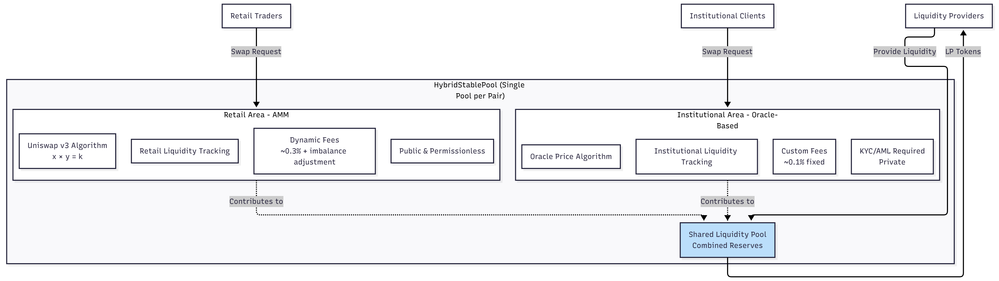

# 하이브리드 풀

하이브리드 풀은 Gurufin Chain의 FXSwap 플랫폼 내 핵심 혁신을 나타내며 기관 및 소매 유동성을 단일 통합 유동성 풀로 원활하게 통합하도록 설계되었습니다. 이 아키텍처는 내부 분리 메커니즘을 통해 프라이버시와 운영 효율성을 유지하면서 다양한 사용자 유형에 걸쳐 효율적인 FX 스왑을 가능하게 합니다.

***

## 기관 및 소매 유동성 결합

전통적으로 FX 스왑 또는 스테이블코인 거래를 위한 유동성 풀은 소매 자동화된 시장 조성자(AMM) 참여자를 위한 별도의 풀과 기관 Request-for-Quote(RFQ) 클라이언트를 위한 별도의 풀로 사용자 유형에 따라 분리되어 왔습니다. FXSwap의 하이브리드 풀 설계는 이러한 유동성 소스를 스테이블코인 쌍당 단일 풀로 통합하여 소매 및 기관 사용자 모두를 효과적으로 제공하기 위해 듀얼 알고리즘 접근 방식을 활용합니다.

각 하이브리드 풀 내에서 유동성은 두 개의 구별되는 내부 영역에서 관리됩니다:

* **소매 영역:** 동적 수수료로 풀 불균형에 반응하는 소규모 거래에 최적화된 Uniswap v3에서 영감을 받은 AMM 알고리즘을 활용합니다.
* **기관 영역:** 최소 슬리피지 및 맞춤형 수수료 구조로 대규모 거래를 가능하게 하는 실시간 환율을 가진 오라클 주도 가격 책정 메커니즘을 사용합니다.

이 통합 접근 방식은 소매 유동성 제공자 또는 기관 상대방으로부터의 모든 유동성이 단일 통합 풀에 기여하여 깊이와 자본 효율성을 극대화할 수 있도록 합니다.

***

## 하이브리드 풀 접근 방식의 이점

하이브리드 풀 아키텍처는 아래 표에 요약된 별도의 유동성 풀에 비해 여러 전략적 이점을 제공합니다:

| 이점 | 설명 |
| ---------------------------- | ------------------------------------------------------------------------------------------------------------------------ |
| **유동성 극대화** | 소매 및 기관 유동성을 결합하면 더 깊은 풀이 생성되어 슬리피지가 줄어들고 가격 안정성이 향상됩니다. |
| **운영 효율성** | 스테이블코인 쌍당 단일 풀을 관리하면 복잡성이 줄어들어 배포 및 유지 관리 비용이 낮아집니다. |
| **확장성** | 새로운 스테이블코인을 추가하려면 하나의 새 풀만 필요하여 네트워크 확장이 단순화됩니다. |
| **비용 절감** | 더 적은 풀은 모든 참여자에게 이익이 되는 감소된 가스 및 인프라 비용으로 이어집니다. |
| **통합 수수료 메커니즘** | 소매 거래에 대한 동적 수수료와 맞춤형 기관 수수료가 하나의 풀 내에서 공존하여 수익과 인센티브를 최적화합니다. |
| **향상된 사용자 경험** | 소매 및 기관 사용자 모두 동일한 유동성에 액세스하여 일관된 가격 책정 및 가용성을 보장합니다. |

유동성을 통합함으로써 FXSwap은 소매 송금부터 대량 기관 FX 정산까지 광범위한 사용 사례를 지원하는 보다 강력하고 확장 가능한 FX 거래 환경을 달성합니다.

***

## 내부 분리 및 프라이버시 보존

유동성이 함께 풀링되는 동안 FXSwap은 프라이버시 및 규정 준수를 보장하기 위해 기관 및 소매 잔액의 엄격한 내부 분리를 유지합니다. 이 분리는 스마트 계약 및 회계 레이어에서 구현되어 플랫폼이 다음을 수행할 수 있도록 합니다:

* **사용자 잔액 격리:** 기관 및 소매 유동성 기여 및 거래량은 별도로 추적되어 민감한 거래 데이터의 교차 노출을 방지합니다.
* **프라이버시 유지:** 종종 기밀 가격 책정 및 거래량 정보를 포함하는 기관 거래는 소매 참여자 및 공개 보기로부터 차단됩니다.
* **규정 준수 지원:** 분리된 회계는 소매 사용자의 익명성을 손상시키지 않으면서 KYC/AML 및 제재 스크리닝을 포함한 지갑 계층 규정 준수를 촉진합니다.
* **맞춤형 설정 활성화:** 기관 참여자는 풀 내에서 독립적으로 관리되는 맞춤형 수수료율, 거래 제한 및 위험 매개변수의 혜택을 받습니다.

### 내부 분리 다이어그램

<figure><figcaption></figcaption></figure>

이 내부 분리는 효율성을 위해 유동성이 결합되는 동안 서로 다른 사용자 클래스의 프라이버시 및 규제 요구 사항이 존중되고 시행되도록 보장합니다.

***

## 하이브리드 풀 아키텍처 개요

다음 다이어그램은 FXSwap 시스템 내의 하이브리드 풀 구조를 보여줍니다:

<figure><figcaption></figcaption></figure>

***

## 듀얼 알고리즘 실행

하이브리드 풀은 소매 및 기관 사용자의 요구에 맞춘 두 가지 구별되는 스왑 실행 알고리즘을 지원합니다:

| 사용자 유형 | 알고리즘 유형 | 주요 특성 |
| ----------------- | ---------------------- | ------------------------------------------------------------------------------------------------------------------------------------------------------------ |
| **소매** | AMM (Uniswap v3 스타일) | 풀 불균형이 증가함에 따라 증가하는 동적 수수료와 함께 상수 곱 공식(x \* y = k)을 사용합니다. 소규모 빈번한 거래에 이상적입니다. |
| **기관** | 오라클 기반 RFQ | 허가된 오라클 네트워크에서 공급되는 실시간 환율로 거래를 실행하며 슬리피지를 최소화하기 위해 낮은 고정 수수료(\~0.1%) 및 거래량 제한이 있습니다. |

이 듀얼 알고리즘 시스템은 소매 사용자가 자동화된 무허가 거래의 혜택을 받는 동시에 기관 사용자가 정확한 가격 책정 및 맞춤형 거래 매개변수를 받도록 보장합니다.

***

## 결론

Gurufin Chain의 FXSwap 내 하이브리드 풀 설계는 탈중앙화 FX 시장에서 유동성 관리에 대한 정교한 접근 방식을 예시합니다. 기관 및 소매 유동성을 듀얼 실행 알고리즘을 가진 단일 프라이버시 보존 풀로 통합함으로써 플랫폼은 우수한 유동성 깊이, 운영 효율성 및 규정 준수 준비를 달성합니다. 이 아키텍처는 소매 송금부터 기관 정산까지 광범위한 FX 거래 사용 사례를 지원하여 Gurufin Chain을 선도적인 글로벌 온체인 FX 및 DeFi 허브로 포지셔닝합니다.

