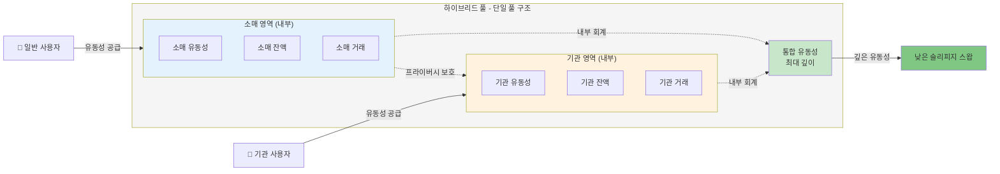
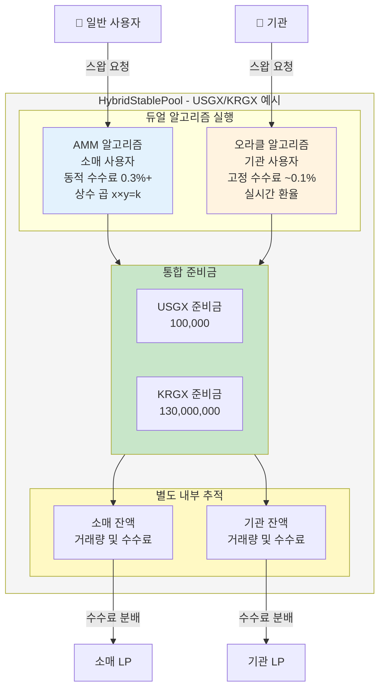

# 하이브리드 풀

하이브리드 풀은 Gurufin Chain의 FXSwap 플랫폼 내 핵심 혁신을 나타내며 기관 및 소매 유동성을 단일 통합 유동성 풀로 원활하게 통합하도록 설계되었습니다. 이 아키텍처는 내부 분리 메커니즘을 통해 프라이버시와 운영 효율성을 유지하면서 다양한 사용자 유형에 걸쳐 효율적인 FX 스왑을 가능하게 합니다.

***

## 단일 풀 vs 분리 풀 vs 하이브리드 풀: 구조적 선택 분석

전통적으로 FX 스왑 또는 스테이블코인 거래를 위한 유동성 풀은 소매 자동화된 시장 조성자(AMM) 참여자를 위한 별도의 풀과 기관 Request-for-Quote(RFQ) 클라이언트를 위한 별도의 풀로 사용자 유형에 따라 분리되어 왔습니다. GuruDex의 핵심 설계 결정 중 하나는 유동성을 관리하는 풀의 구조입니다. 

초기에는 모든 유동성을 하나의 풀에 집중시키는 **단일 풀(Single Pool)** 방식과, 사용자 유형(기관/일반)에 따라 풀을 분리하는 **분리 풀(Separated Pool)** 방식이 고려되었습니다. 그러나 두 방식 모두 명확한 장단점을 가지고 있어, 최종적으로 이 둘의 장점을 결합한 **하이브리드 듀얼 레이어(Hybrid Dual-Layer)** 방식이 최적의 대안으로 제시되었습니다.

### 모델별 비교 분석

| 평가 항목 | 단일 풀 (공유) | 분리 풀 (독립) | 하이브리드 (최적안) |
| :--- | :--- | :--- | :--- |
| **자본 효율성** | 🟢 최상 (유동성 집중) | 🔴 최하 (유동성 파편화) | 🟡 우수 (코어 풀 + 전용 풀) |
| **스왑 효율성** | 🟢 최상 (슬리피지 최소화) | 🔴 최하 (슬리피지 극대화) | 🟡 우수 (거래량에 따라 최적 풀 선택) |
| **수익 공정성** | 🔴 최하 (기여-분배 불일치) | 🟢 최상 (완벽한 분리) | 🟢 최상 (풀별 독립적 수익 분배) |
| **리스크 관리** | 🔴 위험 (리스크 전파) | 🟢 안전 (리스크 격리) | 🟡 안전 (코어 풀 리스크 + 격리) |
| **관리 복잡도** | 🟢 단순 | 🔴 복잡 (풀 개수 2배) | 🟡 중간 (계층적 구조) |
| **종합 평가** | 72 / 100 | 58 / 100 | **88 / 100** |

### 단일 풀의 문제점: 수익 불공정성

단일 풀은 자본 효율성을 극대화하지만, **수익 분배의 불공정성**이라는 치명적인 문제를 야기합니다. 예를 들어, 낮은 수수료로 대규모 거래를 일으키는 기관과 높은 수수료로 소규모 거래를 하는 일반 사용자의 유동성이 섞여 있을 경우, 발생한 전체 수수료는 유동성 지분에 따라 분배됩니다. 이 과정에서 수수료 기여도가 낮은 기관이 더 많은 수익을 가져가고, 기여도가 높은 일반 사용자는 오히려 손실을 보는 역전 현상이 발생할 수 있습니다.

### 하이브리드 듀얼 레이어: 최적의 타협점

이러한 문제를 해결하기 위해 제안된 하이브리드 모델은 다음과 같은 계층적 구조를 가집니다:

- **Layer 1: 공용 코어 풀 (Base Pool)**
  - 전체 유동성의 약 50%를 차지하며, 기관과 일반 사용자 모두 접근 가능합니다.
  - 대규모 거래를 처리하여 슬리피지를 최소화하고, 이 풀에서 발생하는 수수료는 기여도에 따라 공정하게 분배됩니다.

- **Layer 2: 전용 풀 (Dedicated Pool)**
  - 나머지 유동성은 기관 전용 풀과 일반 사용자 전용 풀로 분리됩니다.
  - 각 풀에서 발생하는 거래는 해당 풀의 유동성 공급자에게만 독립적으로 수수료가 분배되어 수익의 공정성을 100% 보장합니다.

스마트 컨트랙트는 거래의 규모와 사용자 유형을 판단하여 가장 효율적인 풀(코어 풀 또는 전용 풀)을 자동으로 선택하여 스왑을 실행합니다. 이 구조를 통해 GuruDex는 **자본 효율성과 수익 공정성**이라는 두 가지 핵심 요구사항을 모두 충족하는 최적의 균형점을 달성했습니다.

## 기관 및 소매 유동성 결합

GuruDex의 하이브리드 풀 설계는 이러한 유동성 소스를 스테이블코인 쌍당 단일 풀로 통합하여 소매 및 기관 사용자 모두를 효과적으로 제공하기 위해 듀얼 알고리즘 접근 방식을 활용합니다.

각 하이브리드 풀 내에서 유동성은 두 개의 구별되는 내부 영역에서 관리됩니다:

* **소매 영역:** 동적 수수료로 풀 불균형에 반응하는 소규모 거래에 최적화된 Uniswap v3에서 영감을 받은 AMM 알고리즘을 활용합니다.
* **기관 영역:** 최소 슬리피지 및 맞춤형 수수료 구조로 대규모 거래를 가능하게 하는 실시간 환율을 가진 오라클 주도 가격 책정 메커니즘을 사용합니다.

이 통합 접근 방식은 소매 유동성 제공자 또는 기관 상대방으로부터의 모든 유동성이 단일 통합 풀에 기여하여 깊이와 자본 효율성을 극대화할 수 있도록 합니다.

***

## 하이브리드 풀 접근 방식의 이점

하이브리드 풀 아키텍처는 아래 표에 요약된 별도의 유동성 풀에 비해 여러 전략적 이점을 제공합니다:

| 이점 | 설명 |
| ---------------------------- | ------------------------------------------------------------------------------------------------------------------------ |
| **유동성 극대화** | 소매 및 기관 유동성을 결합하면 더 깊은 풀이 생성되어 슬리피지가 줄어들고 가격 안정성이 향상됩니다. |
| **운영 효율성** | 스테이블코인 쌍당 단일 풀을 관리하면 복잡성이 줄어들어 배포 및 유지 관리 비용이 낮아집니다. |
| **확장성** | 새로운 스테이블코인을 추가하려면 하나의 새 풀만 필요하여 네트워크 확장이 단순화됩니다. |
| **비용 절감** | 더 적은 풀은 모든 참여자에게 이익이 되는 감소된 가스 및 인프라 비용으로 이어집니다. |
| **통합 수수료 메커니즘** | 소매 거래에 대한 동적 수수료와 맞춤형 기관 수수료가 하나의 풀 내에서 공존하여 수익과 인센티브를 최적화합니다. |
| **향상된 사용자 경험** | 소매 및 기관 사용자 모두 동일한 유동성에 액세스하여 일관된 가격 책정 및 가용성을 보장합니다. |

유동성을 통합함으로써 FXSwap은 소매 송금부터 대량 기관 FX 정산까지 광범위한 사용 사례를 지원하는 보다 강력하고 확장 가능한 FX 거래 환경을 달성합니다.

***

## 내부 분리 및 프라이버시 보존

유동성이 함께 풀링되는 동안 FXSwap은 프라이버시 및 규정 준수를 보장하기 위해 기관 및 소매 잔액의 엄격한 내부 분리를 유지합니다. 이 분리는 스마트 계약 및 회계 레이어에서 구현되어 플랫폼이 다음을 수행할 수 있도록 합니다:

* **사용자 잔액 격리:** 기관 및 소매 유동성 기여 및 거래량은 별도로 추적되어 민감한 거래 데이터의 교차 노출을 방지합니다.
* **프라이버시 유지:** 종종 기밀 가격 책정 및 거래량 정보를 포함하는 기관 거래는 소매 참여자 및 공개 보기로부터 차단됩니다.
* **규정 준수 지원:** 분리된 회계는 소매 사용자의 익명성을 손상시키지 않으면서 KYC/AML 및 제재 스크리닝을 포함한 지갑 계층 규정 준수를 촉진합니다.
* **맞춤형 설정 활성화:** 기관 참여자는 풀 내에서 독립적으로 관리되는 맞춤형 수수료율, 거래 제한 및 위험 매개변수의 혜택을 받습니다.

### 내부 분리 다이어그램

이 내부 분리는 효율성을 위해 유동성이 결합되는 동안 서로 다른 사용자 클래스의 프라이버시 및 규제 요구 사항이 존중되고 시행되도록 보장합니다.

***

## 하이브리드 풀 아키텍처 개요

다음 다이어그램은 FXSwap 시스템 내의 하이브리드 풀 구조를 보여줍니다:

***

## 듀얼 알고리즘 실행

하이브리드 풀은 소매 및 기관 사용자의 요구에 맞춘 두 가지 구별되는 스왑 실행 알고리즘을 지원합니다:

| 사용자 유형 | 알고리즘 유형 | 주요 특성 |
| ----------------- | ---------------------- | ------------------------------------------------------------------------------------------------------------------------------------------------------------ |
| **소매** | AMM (Uniswap v3 스타일) | 풀 불균형이 증가함에 따라 증가하는 동적 수수료와 함께 상수 곱 공식(x \* y = k)을 사용합니다. 소규모 빈번한 거래에 이상적입니다. |
| **기관** | 오라클 기반 RFQ | 허가된 오라클 네트워크에서 공급되는 실시간 환율로 거래를 실행하며 슬리피지를 최소화하기 위해 낮은 고정 수수료(\~0.1%) 및 거래량 제한이 있습니다. |

이 듀얼 알고리즘 시스템은 소매 사용자가 자동화된 무허가 거래의 혜택을 받는 동시에 기관 사용자가 정확한 가격 책정 및 맞춤형 거래 매개변수를 받도록 보장합니다.

***

## 유동성 관리 및 수수료 역학

유동성 제공자(LP)는 하이브리드 풀에 자산을 기여하고 비례적으로 LP 토큰을 받습니다. 풀은 균형 잡힌 준비금을 인센티브화하기 위해 유동성 비율에 따라 수수료를 동적으로 조정합니다:

* **동적 수수료 메커니즘:** 수수료는 균형 잡힌 기본-견적 비율로부터 1% 편차마다 약 1% 증가하여 유동성 재균형을 장려합니다.
* **수수료 분배:** 축적된 수수료는 매일 LP에게 분배되어 소매 및 기관 유동성 기여 모두를 보상합니다.

이 메커니즘은 풀 균형을 유지하고 불리한 선택으로부터 보호하여 전반적인 시장 품질을 향상시킵니다.

***

## 요약 표: 하이브리드 풀 기능

| 기능 | 설명 |
| ------------------------------- | ------------------------------------------------------------------------------------------------ |
| **쌍당 단일 풀** | 모든 사용자 유동성을 결합하는 스테이블코인 쌍당 하나의 통합 유동성 풀. |
| **내부 잔액 분리** | 프라이버시 및 규정 준수를 유지하기 위한 소매 및 기관 유동성에 대한 별도 회계. |
| **듀얼 스왑 알고리즘** | 소매 사용자를 위한 AMM; 기관을 위한 오라클 기반 RFQ. |
| **동적 수수료 모델** | 균형을 인센티브화하기 위해 풀 불균형에 따라 수수료가 동적으로 조정됩니다. |
| **기관 제어** | 기관 레지스트리를 통해 관리되는 맞춤형 수수료율, 거래 제한 및 위험 매개변수. |
| **프라이버시 및 규정 준수** | 선택적 zk-proof 프라이버시 모드 및 감독 등급 관찰 가능성을 갖춘 지갑 계층 규정 준수. |
| **확장 가능하고 효율적** | 감소된 풀 수는 운영 비용을 낮추고 네트워크 확장을 단순화합니다. |

***

## 결론

Gurufin Chain의 FXSwap 내 하이브리드 풀 설계는 탈중앙화 FX 시장에서 유동성 관리에 대한 정교한 접근 방식을 예시합니다. 기관 및 소매 유동성을 듀얼 실행 알고리즘을 가진 단일 프라이버시 보존 풀로 통합함으로써 플랫폼은 우수한 유동성 깊이, 운영 효율성 및 규정 준수 준비를 달성합니다. 이 아키텍처는 소매 송금부터 기관 정산까지 광범위한 FX 거래 사용 사례를 지원하여 Gurufin Chain을 선도적인 글로벌 온체인 FX 및 DeFi 허브로 포지셔닝합니다.

***

스마트 계약 인터페이스 및 기관 온보딩 프로세스를 포함한 하이브리드 풀에 대한 자세한 기술 정보는 [FXSwap 아키텍처 문서](02_hybrid_pools.md) 및 [Gurufin Chain 기술 사양](02_hybrid_pools.md)을 참조하십시오.
