# Smart Contract Logic

At the core of GuruDex is a modular smart contract architecture designed for flexibility, security, and efficiency. The system is composed of multiple contracts, each managing a specific part of the FX swap process.

## Core Contract Overview

| Contract                | Description                                                                                                                                                                         |
| ----------------------- | ----------------------------------------------------------------------------------------------------------------------------------------------------------------------------------- |
| `FXSwapMaster`          | The central orchestration contract that manages all system parameters, contract addresses, and global settings. It serves as the entry point for upgrades and governance proposals. |
| `HybridStablePool`      | A liquidity pool for each stablecoin pair. It holds both retail and institutional liquidity and implements swap algorithms tailored to each user type.                              |
| `PoolFactory`           | Responsible for creating and managing `HybridStablePool` contracts. It deploys new pools when new stablecoin pairs are added.                                                       |
| `InstitutionalRegistry` | Onboards and manages institutional users. It stores KYC/AML status, trading limits, and user types (retail/institutional).                                                          |
| `PriceOracle`           | Stores and validates real-time exchange rate data from external sources. It provides price feeds for institutional swaps.                                                           |

## Swap Execution Flow

When a swap is initiated, the `HybridStablePool` contract executes the following logic to distinguish between retail and institutional users.

### Swap Flow Diagram

```mermaid
flowchart TD
    User([User Submits Swap]) --> Check{Check User Type}
    
    Check -->|Retail| RetailPath["Execute _swapRetail<br/>• AMM Algorithm<br/>• Dynamic Fees<br/>• Pool-based pricing"]
    Check -->|Institutional| InstPath["Execute _swapInstitutional<br/>• Oracle Algorithm<br/>• Fixed Fees<br/>• Real-time rates"]
    
    RetailPath --> Complete1[✅ Swap Complete]
    InstPath --> Complete2[✅ Swap Complete]
    
    style User fill:#e3f2fd
    style Check fill:#fff9c4
    style RetailPath fill:#b3e5fc
    style InstPath fill:#fff3e0
    style Complete1 fill:#81c784
    style Complete2 fill:#81c784
```



```solidity
function swap(address user, uint256 amountIn, bool isBaseToQuote) external {
    IInstitutionalRegistry.UserType userType = institutionalRegistry.getUserType(user);

    if (userType == IInstitutionalRegistry.UserType.INSTITUTIONAL) {
        _swapInstitutional(user, amountIn, isBaseToQuote);
    } else {
        _swapRetail(user, amountIn, isBaseToQuote);
    }
}
```

### Retail Swap Logic (`_swapRetail`)

Retail swaps use a Uniswap v3-style concentrated liquidity AMM (Automated Market Maker). This logic integrates a dynamic fee mechanism that adjusts fees based on pool imbalance.

| Step | Action              | Description                                                                                        |
| ---- | ------------------- | -------------------------------------------------------------------------------------------------- |
| 1    | **Fee Calculation** | Calls `calculateDynamicFee()` to determine the swap fee based on the current pool liquidity ratio. |
| 2    | **Fee Deduction**   | Deducts the fee from the input amount.                                                             |
| 3    | **AMM Calculation** | Calculates the output amount using the constant product formula.                                   |
| 4    | **Slippage Check**  | Verifies that the calculated output amount is greater than the user-specified minimum amount.      |
| 5    | **Reserve Update**  | Updates the pool's reserves to reflect the swap.                                                   |
| 6    | **Fund Transfer**   | Transfers the output amount to the user.                                                           |

### Institutional Swap Logic (`_swapInstitutional`)

Institutional swaps leverage real-time oracle prices to ensure minimal slippage on large trades. This process includes additional verification steps.

| Step | Action                      | Description                                                                                                                              |
| ---- | --------------------------- | ---------------------------------------------------------------------------------------------------------------------------------------- |
| 1    | **User Verification**       | Confirms that the user is an active institution in the `InstitutionalRegistry`.                                                          |
| 2    | **Oracle Price Validation** | Retrieves the latest exchange rate from the `PriceOracle` and verifies that the price is current and within the maximum deviation range. |
| 3    | **Limit Check**             | Checks the user's trading limits and daily volume.                                                                                       |
| 4    | **Output Calculation**      | Calculates the output amount using `amountOut = amountIn * oraclePrice`.                                                                 |
| 5    | **Fee Application**         | Applies a fixed fee configured per institution (typically 0.1%).                                                                         |
| 6    | **Reserve Update**          | Updates the pool's reserves.                                                                                                             |
| 7    | **Fund Transfer**           | Transfers the output amount to the user and records the transaction volume.                                                              |

## Institutional Onboarding Process

Unlike retail users, institutional users must undergo separate screening and registration procedures. This enhances security and provides institution-specific customized services.

### Onboarding Workflow

```mermaid
flowchart TD
    Start([New Institution]) --> Step1
    
    Step1["📝 Step 1: Basic Information Registration<br/>Institution → registerInstitution()<br/>Status: PENDING"]
    
    Step1 --> Step2
    
    Step2["🔍 Step 2: Off-chain KYC/AML Verification<br/>FXSwap Operations Team<br/>• Verify corporate registration<br/>• Verify representative identity<br/>• Verify fund sources<br/>• Check regulatory compliance"]
    
    Step2 --> Decision{Verification<br/>Passed?}
    
    Decision -->|No| Rejected[❌ Registration Rejected]
    Decision -->|Yes| Step3
    
    Step3["✅ Step 3: Institution Activation<br/>Operator → activateInstitution()<br/>• Set transaction limits<br/>• Set custom fee rate<br/>• Set max price deviation<br/>• Set data freshness requirements<br/>Status: ACTIVE"]
    
    Step3 --> Step4
    
    Step4["🔑 Step 4: Access Authorization<br/>Operator → allowCoinForInstitution()<br/>Operator → authorizePoolForInstitution()<br/>• Specify tradeable coins<br/>• Grant pool access"]
    
    Step4 --> Step5
    
    Step5["🎉 Step 5: Trading Enabled<br/>Institution can now perform swaps"]
    
    Step5 --> End([Active Institution])
    Rejected --> End2([Rejected])
    
    style Start fill:#e8f5e9
    style Step1 fill:#fff9c4
    style Step2 fill:#fff3e0
    style Decision fill:#ffccbc
    style Step3 fill:#c8e6c9
    style Step4 fill:#b3e5fc
    style Step5 fill:#c5e1a5
    style End fill:#a5d6a7
    style Rejected fill:#ef9a9a
    style End2 fill:#ef9a9a
```



### Detailed Explanation of Each Step

#### Step 1: Basic Information Registration (`registerInstitution`)

```solidity
function registerInstitution(
    string memory name,
    address walletAddress,
    string memory contactInfo
) external
```

- Institution registers their basic information with the smart contract
- Initial status set to `PENDING`
- Cannot yet perform transactions

#### Step 2: Off-chain KYC/AML Verification

- Thorough verification process performed off-chain by GuruDex operations team
- Verification items:
  * Corporate registration documents and business licenses
  * Identity verification of representatives and beneficial owners
  * Verification of fund sources and business purposes
  * Check against international sanctions lists (OFAC, etc.)
  * Review anti-money laundering (AML) policies and procedures

#### Step 3: Institution Activation (`activateInstitution`)

```solidity
function activateInstitution(
    address institutionAddress,
    uint256 perTxLimit,
    uint256 dailyLimit,
    uint256 customFeeRate,
    uint256 maxPriceDeviation,
    uint256 maxStaleness
) external onlyOperator
```

- Permission function executable only by Operator
- Sets institution-specific custom parameters:
  * **perTxLimit**: Maximum amount per single transaction (e.g., 1,000,000 USGX)
  * **dailyLimit**: Daily cumulative transaction limit (e.g., 10,000,000 USGX)
  * **customFeeRate**: Institution-specific fee rate (e.g., 0.1% = 10 basis points)
  * **maxPriceDeviation**: Oracle price allowed deviation (e.g., 2%)
  * **maxStaleness**: Oracle data maximum age (e.g., 5 minutes = 300 seconds)
- Changes status to `ACTIVE`

#### Step 4: Access Permission Grant

```solidity
function allowCoinForInstitution(
    address institutionAddress,
    address coinAddress
) external onlyOperator

function authorizePoolForInstitution(
    address institutionAddress,
    address poolAddress
) external onlyOperator
```

- Allows specific stablecoins that institution can trade
- Authorizes liquidity pools institution can access
- Risk management through granular permission control

### Institution Status Management

| Status | Description | Possible Actions |
|---|---|---|
| **NONE** | Unregistered | Can call registerInstitution() |
| **PENDING** | Registration complete, awaiting verification | Cannot trade, verification in progress |
| **ACTIVE** | Verification complete, activated | Can perform all approved transactions |
| **SUSPENDED** | Temporarily suspended | Cannot trade, awaiting reactivation |
| **REVOKED** | Permanently revoked | All operations forbidden |

### Example: Bank Onboarding

**Scenario**: ABC Bank registers as institutional user on GuruDex

1. **Registration**: ABC Bank calls `registerInstitution()` to submit basic information
2. **Verification**: GuruDex operations team performs 2-3 day KYC/AML verification
3. **Activation**: After verification, activate with following parameters:
   - Per-transaction limit: 500,000 USGX
   - Daily limit: 5,000,000 USGX
   - Fee rate: 0.08% (VIP tier)
   - Price deviation: 1.5%
   - Data freshness: 3 minutes
4. **Authorization**: Approve access to USGX, KRGX, JPGX coins and corresponding pools
5. **Trading Begins**: ABC Bank can now perform large-scale FX swaps within approved scope

## Liquidity Management

Liquidity providers deposit funds into the `HybridStablePool` and receive LP tokens. The `addLiquidity` and `removeLiquidity` functions mint or burn LP tokens proportionally to the pool's total liquidity and reserves, ensuring fair distribution.

Through the Virtual-Pair mechanism, LPs can provide liquidity simultaneously to two single pools and manage their stake through one virtual LP token. For more details, refer to the [Liquidity and Rewards](04_liquidity_and_rewards.md) documentation.
