# GuruDex Smart Contract Logic

At the core of GuruDex is a modular smart contract architecture designed for flexibility, security, and efficiency. The system is composed of multiple contracts, each managing a specific part of the FX swap process.

## Core Contract Overview

| Contract | Description |
|---|---|
| `FXSwapMaster` | The central orchestration contract that manages all system parameters, contract addresses, and global settings. It serves as the entry point for upgrades and governance proposals. |
| `HybridStablePool` | A liquidity pool for each stablecoin pair. It holds both retail and institutional liquidity and implements swap algorithms tailored to each user type. |
| `PoolFactory` | Responsible for creating and managing `HybridStablePool` contracts. It deploys new pools when new stablecoin pairs are added. |
| `InstitutionalRegistry` | Onboards and manages institutional users. It stores KYC/AML status, trading limits, and user types (retail/institutional). |
| `PriceOracle` | Stores and validates real-time exchange rate data from external sources. It provides price feeds for institutional swaps. |

## Swap Execution Flow

When a swap is initiated, the `HybridStablePool` contract executes the following logic to distinguish between retail and institutional users.

### Swap Flow Diagram

```mermaid
flowchart TD
    A[User Initiates Swap] --> B{Check User Type}
    B -->|Retail| C[Execute Retail Swap]
    B -->|Institutional| D[Execute Institutional Swap]
    
    C --> C1[Calculate Dynamic Fee]
    C1 --> C2[Deduct Fee from Input]
    C2 --> C3[AMM Calculation<br/>Constant Product Formula]
    C3 --> C4{Slippage Check<br/>Output >= Min?}
    C4 -->|Yes| C5[Update Pool Reserves]
    C4 -->|No| C6[Revert Transaction]
    C5 --> C7[Transfer Tokens to User]
    
    D --> D1[Verify User Status]
    D1 --> D2[Validate Oracle Price]
    D2 --> D3{Check Trading Limits<br/>& Daily Volume}
    D3 -->|Pass| D4[Calculate Output<br/>amountOut = amountIn × oraclePrice]
    D3 -->|Fail| D5[Revert Transaction]
    D4 --> D6[Apply Fixed Fee]
    D6 --> D7[Update Pool Reserves]
    D7 --> D8[Transfer Tokens & Record Volume]
    
    C7 --> E[Swap Complete]
    D8 --> E
```



```solidity
function swap(address user, uint256 amountIn, bool isBaseToQuote) external {
    IInstitutionalRegistry.UserType userType = institutionalRegistry.getUserType(user);

    if (userType == IInstitutionalRegistry.UserType.INSTITUTIONAL) {
        _swapInstitutional(user, amountIn, isBaseToQuote);
    } else {
        _swapRetail(user, amountIn, isBaseTo-Quote);
    }
}
```

### Retail Swap Logic (`_swapRetail`)

Retail swaps use a Uniswap v3-style concentrated liquidity AMM (Automated Market Maker). This logic integrates a dynamic fee mechanism that adjusts fees based on pool imbalance.

| Step | Action | Description |
|---|---|---|
| 1 | **Fee Calculation** | Calls `calculateDynamicFee()` to determine the swap fee based on the current pool liquidity ratio. |
| 2 | **Fee Deduction** | Deducts the fee from the input amount. |
| 3 | **AMM Calculation** | Calculates the output amount using the constant product formula. |
| 4 | **Slippage Check** | Verifies that the calculated output amount is greater than the user-specified minimum amount. |
| 5 | **Reserve Update** | Updates the pool's reserves to reflect the swap. |
| 6 | **Fund Transfer** | Transfers the output amount to the user. |

### Institutional Swap Logic (`_swapInstitutional`)

Institutional swaps leverage real-time oracle prices to ensure minimal slippage on large trades. This process includes additional verification steps.

| Step | Action | Description |
|---|---|---|
| 1 | **User Verification** | Confirms that the user is an active institution in the `InstitutionalRegistry`. |
| 2 | **Oracle Price Validation** | Retrieves the latest exchange rate from the `PriceOracle` and verifies that the price is current and within the maximum deviation range. |
| 3 | **Limit Check** | Checks the user's trading limits and daily volume. |
| 4 | **Output Calculation** | Calculates the output amount using `amountOut = amountIn * oraclePrice`. |
| 5 | **Fee Application** | Applies a fixed fee configured per institution (typically 0.1%). |
| 6 | **Reserve Update** | Updates the pool's reserves. |
| 7 | **Fund Transfer** | Transfers the output amount to the user and records the transaction volume. |

## Liquidity Management

Liquidity providers deposit funds into the `HybridStablePool` and receive LP tokens. The `addLiquidity` and `removeLiquidity` functions mint or burn LP tokens proportionally to the pool's total liquidity and reserves, ensuring fair distribution.
