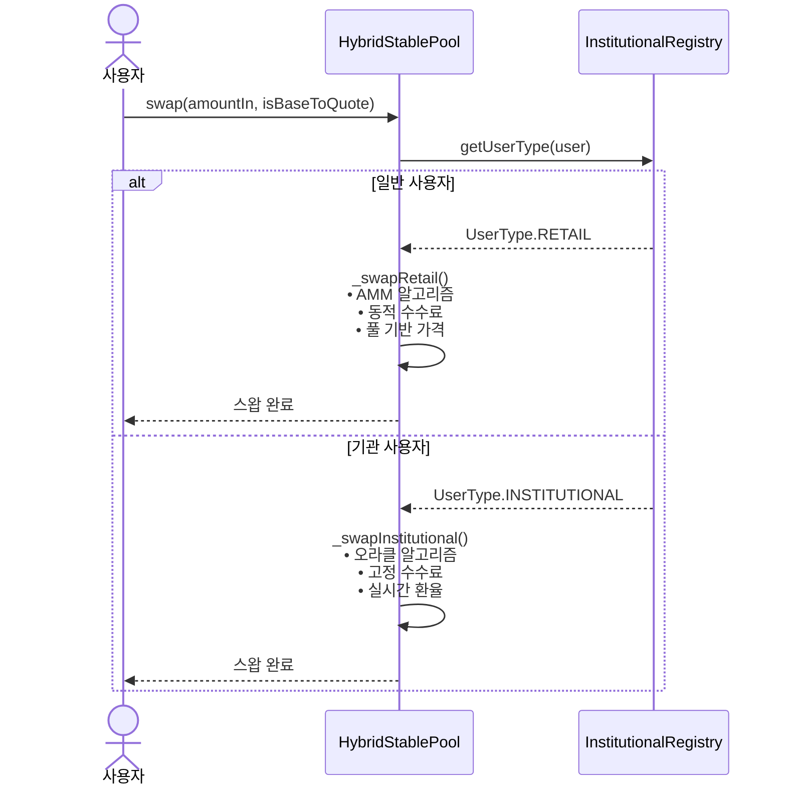
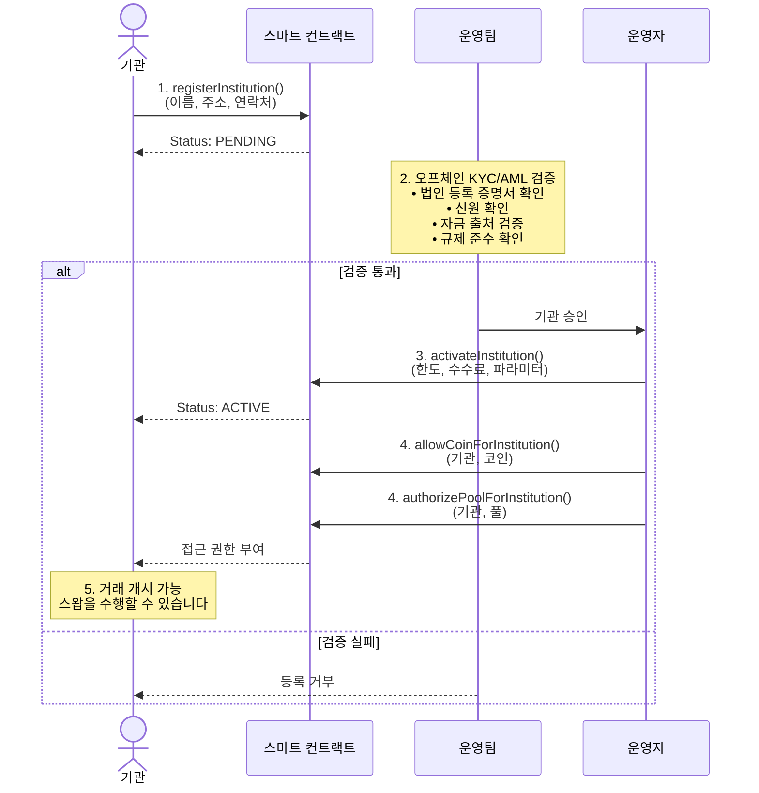

# 🇰🇷 한국어

GuruDex의 핵심은 유연성, 보안 및 효율성을 위해 설계된 모듈식 스마트 계약 아키텍처입니다. 시스템은 FX 스왑 프로세스의 특정 부분을 관리하는 여러 계약으로 구성됩니다.

## 핵심 계약 개요

| 계약                      | 설명                                                                           |
| ----------------------- | ---------------------------------------------------------------------------- |
| `FXSwapMaster`          | 모든 시스템 매개변수, 계약 주소 및 글로벌 설정을 관리하는 중앙 조정 계약입니다. 업그레이드 및 거버넌스 제안의 진입점 역할을 합니다. |
| `HybridStablePool`      | 각 스테이블코인 쌍에 대한 유동성 풀입니다. 소매 및 기관 유동성을 모두 보유하고 각 사용자 유형에 맞춘 스왑 알고리즘을 구현합니다.   |
| `PoolFactory`           | `HybridStablePool` 계약을 생성하고 관리하는 역할을 담당합니다. 새로운 스테이블코인 쌍이 추가될 때 새 풀을 배포합니다.  |
| `InstitutionalRegistry` | 기관 사용자를 온보딩하고 관리합니다. KYC/AML 상태, 거래 한도 및 사용자 유형(소매/기관)을 저장합니다.               |
| `PriceOracle`           | 외부 소스로부터 실시간 환율 데이터를 저장하고 검증합니다. 기관 스왑에 대한 가격 피드를 제공합니다.                     |

## 스왑 실행 흐름

스왑이 시작되면 `HybridStablePool` 계약은 다음 로직을 실행하여 소매 및 기관 사용자를 구별합니다.

### 스왑 흐름 다이어그램



```solidity
function swap(address user, uint256 amountIn, bool isBaseToQuote) external {
    IInstitutionalRegistry.UserType userType = institutionalRegistry.getUserType(user);

    if (userType == IInstitutionalRegistry.UserType.INSTITUTIONAL) {
        _swapInstitutional(user, amountIn, isBaseToQuote);
    } else {
        _swapRetail(user, amountIn, isBaseToQuote);
    }
}
```

### 소매 스왑 로직 (`_swapRetail`)

소매 스왑은 Uniswap v3 스타일의 집중 유동성 AMM(Automated Market Maker)을 사용합니다. 이 로직은 풀 불균형에 따라 수수료를 조정하는 동적 수수료 메커니즘을 통합합니다.

| 단계 | 작업           | 설명                                                           |
| -- | ------------ | ------------------------------------------------------------ |
| 1  | **수수료 계산**   | `calculateDynamicFee()`를 호출하여 현재 풀 유동성 비율에 따라 스왑 수수료를 결정합니다. |
| 2  | **수수료 차감**   | 입력 금액에서 수수료를 차감합니다.                                          |
| 3  | **AMM 계산**   | 상수 곱 공식을 사용하여 출력 금액을 계산합니다.                                  |
| 4  | **슬리피지 확인**  | 계산된 출력 금액이 사용자 지정 최소 금액보다 큰지 확인합니다.                          |
| 5  | **준비금 업데이트** | 스왑을 반영하여 풀의 준비금을 업데이트합니다.                                    |
| 6  | **자금 이체**    | 출력 금액을 사용자에게 이체합니다.                                          |

### 기관 스왑 로직 (`_swapInstitutional`)

기관 스왑은 실시간 오라클 가격을 활용하여 대규모 거래에서 최소 슬리피지를 보장합니다. 이 프로세스에는 추가 검증 단계가 포함됩니다.

| 단계 | 작업            | 설명                                                          |
| -- | ------------- | ----------------------------------------------------------- |
| 1  | **사용자 확인**    | 사용자가 `InstitutionalRegistry`에서 활성 기관임을 확인합니다.               |
| 2  | **오라클 가격 검증** | `PriceOracle`에서 최신 환율을 검색하고 가격이 최신이며 최대 편차 범위 내에 있는지 확인합니다. |
| 3  | **한도 확인**     | 사용자의 거래 한도 및 일일 거래량을 확인합니다.                                 |
| 4  | **출력 계산**     | `amountOut = amountIn * oraclePrice`를 사용하여 출력 금액을 계산합니다.    |
| 5  | **수수료 적용**    | 기관별로 구성된 고정 수수료를 적용합니다(일반적으로 0.1%).                         |
| 6  | **준비금 업데이트**  | 풀의 준비금을 업데이트합니다.                                            |
| 7  | **자금 이체**     | 출력 금액을 사용자에게 이체하고 거래량을 기록합니다.                               |

## 기관 온보딩 프로세스

기관 사용자는 일반 사용자와 달리 별도의 심사 및 등록 절차를 거쳐야 합니다. 이는 보안을 강화하고 기관별 맞춤형 서비스를 제공하기 위함입니다.

### 온보딩 워크플로



### 각 단계별 상세 설명

#### Step 1: 기본 정보 등록 (`registerInstitution`)

```solidity
function registerInstitution(
    string memory name,
    address walletAddress,
    string memory contactInfo
) external
```

* 기관이 자신의 기본 정보를 스마트 컨트랙트에 등록
* 초기 상태는 `PENDING`으로 설정
* 아직 거래를 수행할 수 없음

#### Step 2: 오프체인 KYC/AML 검증

* GuruDex 운영팀이 오프체인에서 수행하는 철저한 검증 프로세스
* 검증 항목:
  * 법인 등록 증명서 및 사업자 등록증
  * 대표자 및 수익적 소유자(Beneficial Owner) 신원 확인
  * 자금 출처 및 사업 목적 검증
  * 국제 제재 목록(OFAC 등) 확인
  * 자금세탁방지(AML) 정책 및 절차 검토

#### Step 3: 기관 활성화 (`activateInstitution`)

```solidity
function activateInstitution(
    address institutionAddress,
    uint256 perTxLimit,
    uint256 dailyLimit,
    uint256 customFeeRate,
    uint256 maxPriceDeviation,
    uint256 maxStaleness
) external onlyOperator
```

* Operator만 실행 가능한 권한 함수
* 기관별 맞춤형 파라미터 설정:
  * **perTxLimit**: 단일 거래당 최대 금액 (예: 1,000,000 USGX)
  * **dailyLimit**: 일일 누적 거래 한도 (예: 10,000,000 USGX)
  * **customFeeRate**: 기관 전용 수수료율 (예: 0.1% = 10 basis points)
  * **maxPriceDeviation**: 오라클 가격 허용 편차 (기본: 1%, 최대 5%)
  * **maxStaleness**: 오라클 데이터 최대 기간 (예: 5분 = 300초)
* 상태를 `ACTIVE`로 변경

#### Step 4: 접근 권한 부여

```solidity
function allowCoinForInstitution(
    address institutionAddress,
    address coinAddress
) external onlyOperator

function authorizePoolForInstitution(
    address institutionAddress,
    address poolAddress
) external onlyOperator
```

* 기관이 거래할 수 있는 특정 스테이블코인 허용
* 기관이 접근할 수 있는 유동성 풀 승인
* 세밀한 권한 제어를 통한 리스크 관리

### 기관 상태 관리

| 상태            | 설명             | 가능한 작업                      |
| ------------- | -------------- | --------------------------- |
| **NONE**      | 미등록 상태         | registerInstitution() 호출 가능 |
| **PENDING**   | 등록 완료, 검증 대기 중 | 거래 불가, 검증 진행 중              |
| **ACTIVE**    | 검증 완료, 활성화됨    | 모든 승인된 거래 수행 가능             |
| **SUSPENDED** | 일시 정지 상태       | 거래 불가, 재활성화 대기              |
| **REVOKED**   | 권한 영구 박탈       | 모든 작업 불가                    |

### 예시: 은행 온보딩

**시나리오**: ABC Bank가 GuruDex에 기관 사용자로 등록

1. **등록**: ABC Bank가 `registerInstitution()`을 호출하여 기본 정보 제출
2. **검증**: GuruDex 운영팀이 2-3일간 KYC/AML 검증 수행
3. **활성화**: 검증 완료 후 다음 파라미터로 활성화:
   * 거래당 한도: 500,000 USGX
   * 일일 한도: 5,000,000 USGX
   * 수수료율: 0.08% (VIP 등급)
   * 가격 편차: 1.5%
   * 데이터 신선도: 3분
4. **권한 부여**: USGX, KRGX, JPGX 코인 및 해당 풀 접근 승인
5. **거래 시작**: ABC Bank가 승인된 범위 내에서 대규모 FX 스왑 수행 가능

## 유동성 관리

유동성 제공자는 `HybridStablePool`에 자금을 예치하고 LP 토큰을 받습니다. `addLiquidity` 및 `removeLiquidity` 함수는 풀의 총 유동성 및 준비금에 비례하여 LP 토큰을 발행하거나 소각하여 공정한 분배를 보장합니다.

Virtual-Pair 메커니즘을 통해 LP는 두 개의 단일 풀에 동시에 유동성을 공급하고, 하나의 가상 LP 토큰으로 지분을 관리할 수 있습니다. 자세한 내용은 [유동성 및 보상](04_liquidity_and_rewards_kr.md) 문서를 참조하십시오.
