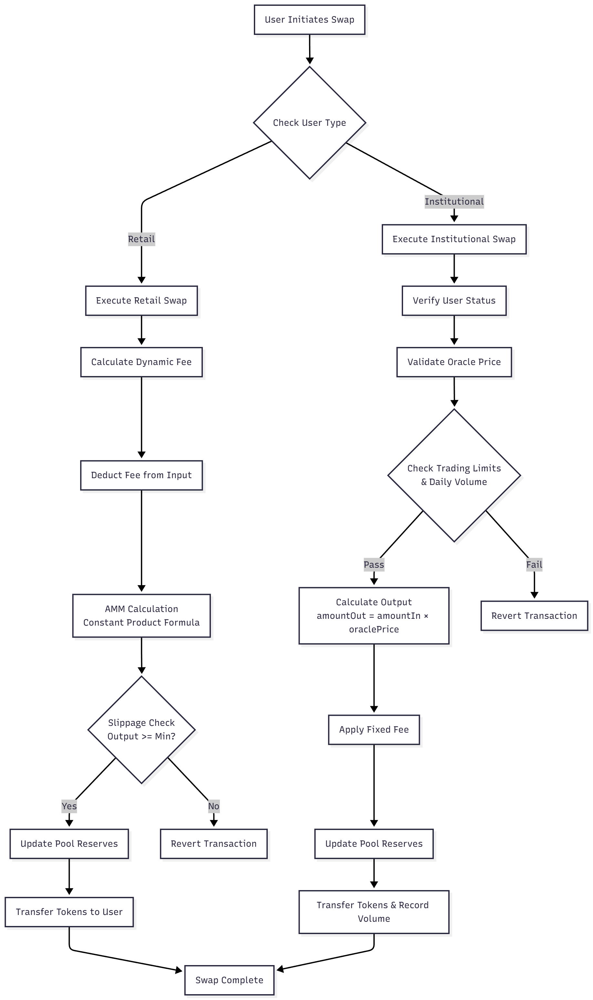

# 스마트 계약 로직

GuruDex의 핵심은 유연성, 보안 및 효율성을 위해 설계된 모듈식 스마트 계약 아키텍처입니다. 시스템은 FX 스왑 프로세스의 특정 부분을 관리하는 여러 계약으로 구성됩니다.

## 핵심 계약 개요

| 계약 | 설명 |
| ----------------------- | ----------------------------------------------------------------------------------------------------------------------------------------------------------------------------------- |
| `FXSwapMaster` | 모든 시스템 매개변수, 계약 주소 및 글로벌 설정을 관리하는 중앙 조정 계약입니다. 업그레이드 및 거버넌스 제안의 진입점 역할을 합니다. |
| `HybridStablePool` | 각 스테이블코인 쌍에 대한 유동성 풀입니다. 소매 및 기관 유동성을 모두 보유하고 각 사용자 유형에 맞춘 스왑 알고리즘을 구현합니다. |
| `PoolFactory` | `HybridStablePool` 계약을 생성하고 관리하는 역할을 담당합니다. 새로운 스테이블코인 쌍이 추가될 때 새 풀을 배포합니다. |
| `InstitutionalRegistry` | 기관 사용자를 온보딩하고 관리합니다. KYC/AML 상태, 거래 한도 및 사용자 유형(소매/기관)을 저장합니다. |
| `PriceOracle` | 외부 소스로부터 실시간 환율 데이터를 저장하고 검증합니다. 기관 스왑에 대한 가격 피드를 제공합니다. |

## 스왑 실행 흐름

스왑이 시작되면 `HybridStablePool` 계약은 다음 로직을 실행하여 소매 및 기관 사용자를 구별합니다.

### 스왑 흐름 다이어그램

<figure><figcaption></figcaption></figure>

```solidity
function swap(address user, uint256 amountIn, bool isBaseToQuote) external {
    IInstitutionalRegistry.UserType userType = institutionalRegistry.getUserType(user);

    if (userType == IInstitutionalRegistry.UserType.INSTITUTIONAL) {
        _swapInstitutional(user, amountIn, isBaseToQuote);
    } else {
        _swapRetail(user, amountIn, isBaseToQuote);
    }
}
```

### 소매 스왑 로직 (`_swapRetail`)

소매 스왑은 Uniswap v3 스타일의 집중 유동성 AMM(Automated Market Maker)을 사용합니다. 이 로직은 풀 불균형에 따라 수수료를 조정하는 동적 수수료 메커니즘을 통합합니다.

| 단계 | 작업 | 설명 |
| ---- | ------------------- | -------------------------------------------------------------------------------------------------- |
| 1 | **수수료 계산** | `calculateDynamicFee()`를 호출하여 현재 풀 유동성 비율에 따라 스왑 수수료를 결정합니다. |
| 2 | **수수료 차감** | 입력 금액에서 수수료를 차감합니다. |
| 3 | **AMM 계산** | 상수 곱 공식을 사용하여 출력 금액을 계산합니다. |
| 4 | **슬리피지 확인** | 계산된 출력 금액이 사용자 지정 최소 금액보다 큰지 확인합니다. |
| 5 | **준비금 업데이트** | 스왑을 반영하여 풀의 준비금을 업데이트합니다. |
| 6 | **자금 이체** | 출력 금액을 사용자에게 이체합니다. |

### 기관 스왑 로직 (`_swapInstitutional`)

기관 스왑은 실시간 오라클 가격을 활용하여 대규모 거래에서 최소 슬리피지를 보장합니다. 이 프로세스에는 추가 검증 단계가 포함됩니다.

| 단계 | 작업 | 설명 |
| ---- | --------------------------- | ---------------------------------------------------------------------------------------------------------------------------------------- |
| 1 | **사용자 확인** | 사용자가 `InstitutionalRegistry`에서 활성 기관임을 확인합니다. |
| 2 | **오라클 가격 검증** | `PriceOracle`에서 최신 환율을 검색하고 가격이 최신이며 최대 편차 범위 내에 있는지 확인합니다. |
| 3 | **한도 확인** | 사용자의 거래 한도 및 일일 거래량을 확인합니다. |
| 4 | **출력 계산** | `amountOut = amountIn * oraclePrice`를 사용하여 출력 금액을 계산합니다. |
| 5 | **수수료 적용** | 기관별로 구성된 고정 수수료를 적용합니다(일반적으로 0.1%). |
| 6 | **준비금 업데이트** | 풀의 준비금을 업데이트합니다. |
| 7 | **자금 이체** | 출력 금액을 사용자에게 이체하고 거래량을 기록합니다. |

## 유동성 관리

유동성 제공자는 `HybridStablePool`에 자금을 예치하고 LP 토큰을 받습니다. `addLiquidity` 및 `removeLiquidity` 함수는 풀의 총 유동성 및 준비금에 비례하여 LP 토큰을 발행하거나 소각하여 공정한 분배를 보장합니다.

