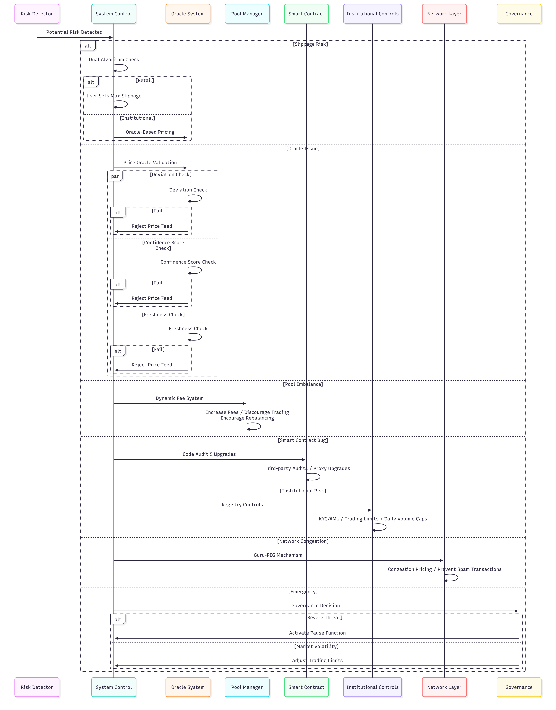

# Risk Mitigation

GuruDex uses a multi-layered risk mitigation strategy to protect the platform and users' assets. These mechanisms are built into the smart contract level and are designed to protect against potential threats.

## Core Risk Mitigation Mechanisms

| Risk Type                           | Mitigation Mechanism                      | Description                                                                                                                                                                                      |
| ----------------------------------- | ----------------------------------------- | ------------------------------------------------------------------------------------------------------------------------------------------------------------------------------------------------ |
| **Slippage Risk**                   | **Dual Swap Algorithm**                   | Uses oracle-based pricing for institutional trades to minimize slippage on large orders. Retail users can set maximum slippage tolerance when submitting swaps.                                  |
| **Oracle Failure/Manipulation**     | **Price Deviation and Confidence Checks** | The `PriceOracle` verifies that submitted prices do not deviate significantly from the last accepted price. It also validates the confidence of the data to reject abnormal price feeds.         |
| **Liquidity Pool Depletion**        | **Dynamic Fees and Rate Limiting**        | The dynamic fee mechanism discourages trading when the pool becomes imbalanced, encouraging rebalancing. Hourly and per-transaction rate limits prevent a single entity from depleting the pool. |
| **Smart Contract Vulnerabilities**  | **Code Audits and Upgradeability**        | All smart contracts are audited by reputable third-party security firms. The `FXSwapMaster` contract uses a proxy pattern to allow upgrades for bug fixes and improvements.                      |
| **Institutional Counterparty Risk** | **Onboarding and Limits**                 | The `InstitutionalRegistry` requires institutions to undergo KYC/AML verification before trading. Trading limits and daily volume caps are applied to each institution to limit exposure.        |
| **Network Congestion**              | **Guru-PEG Fee Mechanism**                | Guru-PEG integrates a congestion pricing model that slightly increases fees during high-demand periods to prevent spam transactions and ensure network stability.                                |

## Emergency Safety Measures

In the event of severe market volatility or unexpected threats, GuruDex includes several safety measures.

* **Pause Function**: The owner of the `FXSwapMaster` contract can temporarily suspend all swap and liquidity management functions to buy time to investigate and mitigate threats. This function is activated through decentralized governance proposals.
* **Dynamic Adjustment of Trading Limits**: Governance can adjust trading limits and daily volume in real-time to quickly reduce risk exposure.

### Risk Mitigation Flow Diagram

<figure><figcaption></figcaption></figure>

These comprehensive risk management features enable GuruDex to provide users with a safe, reliable, and resilient FX swap platform.
