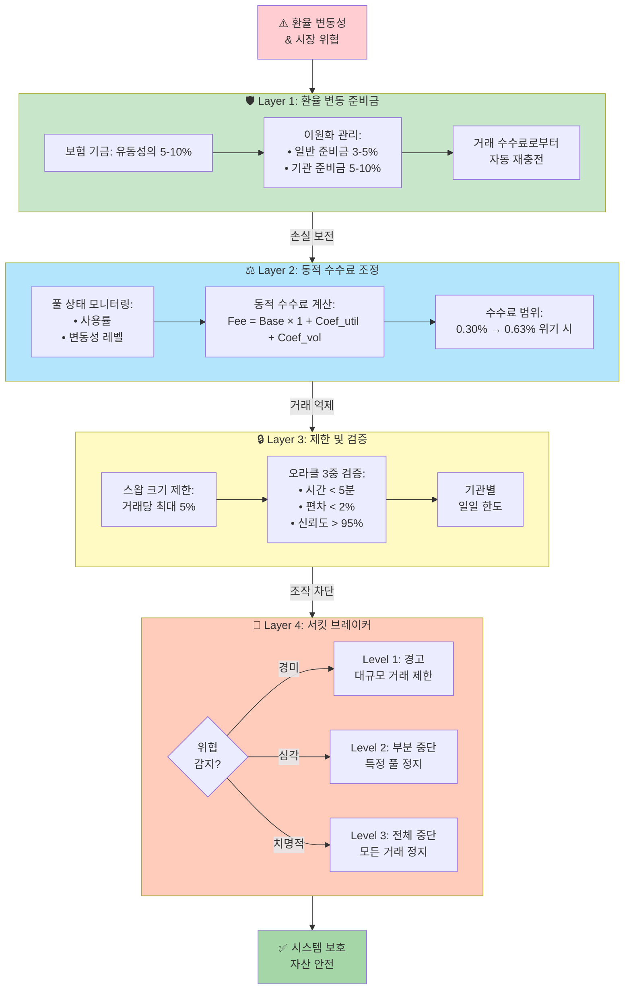
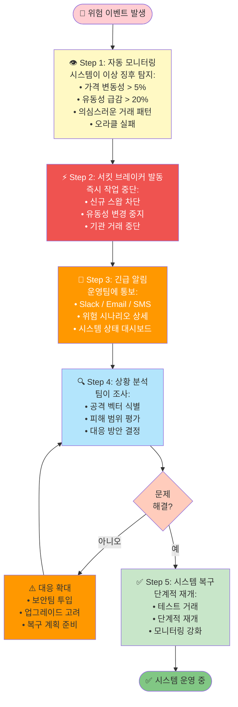
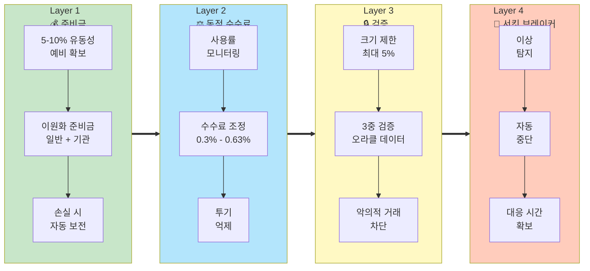

# 위험 완화: 4단계 방어 전략

GuruDex는 플랫폼과 사용자 자산을 보호하기 위해 **다층적인 4단계 방어 전략**을 구축했습니다. 외환 시장의 변동성은 DEX의 안정성을 위협하는 가장 큰 요소이며, 이러한 리스크를 효과적으로 관리하기 위해 각 단계는 서로 보완하며 시스템의 견고성을 보장합니다.

## 방어 전략 개요



***

## Layer 1: 환율 변동 준비금 (Exchange Rate Risk Reserve)

### 역할 및 목적

환율 변동 준비금은 급격한 환율 변동으로 인해 발생하는 풀의 손실을 보전하기 위한 **보험 기금(Insurance Fund)**입니다. 이는 예측 불가능한 외환 시장 변동성으로부터 유동성 공급자(LP)를 보호하는 첫 번째 방어선입니다.

### 재원 확보 및 관리

- **초기 준비금**: 각 풀 유동성의 **5-10%**를 별도로 확보
- **재충전 메커니즘**: 
  - 손실 발생 시 자동으로 준비금에서 보전
  - 부족분은 거래 수수료 수익의 일정 비율로 재충전
  - 준비금이 임계값 이하로 떨어지면 자동 알림 발생

### 이원화 관리: 일반 vs 기관 준비금

GuruDex는 리스크를 격리하고 사용자 유형별로 차별화된 보상 정책을 적용하기 위해 준비금을 **이원화**하여 관리합니다:

| 구분 | 일반 준비금 | 기관 준비금 |
|---|---|---|
| **용도** | 소매 사용자의 소액 손실 보전 | 기관의 대규모 거래 손실 보전 |
| **규모** | 풀 유동성의 3-5% | 풀 유동성의 5-10% |
| **리스크 특성** | 높은 빈도, 낮은 단위 손실 | 낮은 빈도, 높은 단위 손실 |
| **재충전 소스** | 소매 거래 수수료 (0.3%) | 기관 거래 수수료 (0.1%) |
| **효과** | 일반 사용자의 리스크 노출 최소화 | 기관 리스크 격리 및 시스템 안정성 보장 |

### 작동 예시

**시나리오**: USD/KRW 환율이 1,300에서 1,350으로 급등 (3.8% 상승)

1. **손실 계산**: USGX-KRGX 풀에 약 100,000 USD 상당의 불균형 발생
2. **준비금 발동**: 
   - 일반 준비금에서 30,000 USD 보전
   - 기관 준비금에서 70,000 USD 보전
3. **LP 보호**: 유동성 공급자는 환율 변동에도 불구하고 원금 손실 없음
4. **재충전**: 향후 30일간 거래 수수료의 20%를 준비금 재충전에 사용

***

## Layer 2: 동적 수수료 조정 (Dynamic Fee Adjustment)

### 역할 및 목적

동적 수수료는 시장 상황에 따라 거래 비용을 **실시간으로 조정**하여 과도한 거래를 억제하고 풀의 균형을 유지하는 자동화된 시장 안정화 메커니즘입니다.

### 조정 로직

수수료는 다음 공식에 따라 동적으로 계산됩니다:

\[
Fee_{adjusted} = Fee_{base} \times (1 + Coefficient_{utilization} + Coefficient_{volatility})
\]

**구성 요소**:
- **Fee_base**: 기본 수수료 (예: 0.3%)
- **Coefficient_utilization**: 풀 사용률 계수 (유동성 부족도)
- **Coefficient_volatility**: 환율 변동성 계수 (시장 불안정도)

### 시나리오별 수수료 조정 예시

| 상황 | 기본수수료 | 사용률 | 변동성 | 사용률 계수 | 변동성 계수 | 최종 조정수수료 |
| :--- | :--- | :--- | :--- | :--- | :--- | :--- |
| **정상 (안정적)** | 0.3% | 50% | 0.5% | 0.00 | 0.00 | **0.30%** |
| **높은 사용률** | 0.3% | 85% | 0.5% | 0.35 | 0.00 | **0.41%** (+37%) |
| **높은 변동성** | 0.3% | 50% | 2.0% | 0.00 | 0.20 | **0.36%** (+20%) |
| **둘 다 높음 (위기)** | 0.3% | 90% | 3.0% | 0.80 | 0.30 | **0.63%** (+110%) |

### 효과

- **풀 사용률이 높을 때**: 수수료 인상 → 거래 억제 → 유동성 고갈 방지
- **변동성이 클 때**: 수수료 인상 → 투기 거래 감소 → 시장 안정화
- **시장 안정 시**: 낮은 수수료 유지 → 원활한 거래 환경 제공

***

## Layer 3: 스왑 크기 제한 및 가격 검증

### 3-1. 스왑 크기 제한

#### 목적
단일 거래가 풀에 미치는 영향을 제한하여 **고래(Whale) 또는 악의적 행위자에 의한 가격 조작**을 방지합니다.

#### 제한 메커니즘

- **거래당 한도**: 전체 유동성의 **5%**를 초과하는 스왑은 차단
- **일일 누적 한도**: 
  - 소매 사용자: 제한 없음 (단, 거래당 한도 적용)
  - 기관 사용자: 기관별 맞춤 일일 한도 적용

**예시**:
- 풀 유동성: 10,000,000 USGX
- 거래당 최대: 500,000 USGX (5%)
- 초과 거래 시도 시 트랜잭션 자동 거부

### 3-2. 오라클 가격 검증 (3중 검증)

기관 거래 시 사용되는 오라클 가격은 컨트랙트 레벨에서 **3중 검증**을 거쳐 신뢰성과 안전성을 보장합니다.

#### ① 시간 검증 (Timestamp Validation)

```solidity
require(
    block.timestamp - oracleData.timestamp <= maxStaleness,
    "Price data is stale"
);
```

- **목적**: 오래된 데이터로 인한 부정확한 가격 적용 방지
- **기준**: 최대 허용 기간 (예: 5분) 이내의 데이터만 허용
- **효과**: 실시간 시장 가격 반영 보장

#### ② 편차 검증 (Deviation Validation)

```solidity
uint256 deviation = abs(newPrice - storedPrice) / storedPrice;
require(deviation <= maxPriceDeviation, "Price deviation too large");
```

- **목적**: 급격한 가격 변동 또는 오라클 오류 감지
- **기준**: 이전 가격 대비 2% 이내의 변동만 허용
- **효과**: 비정상적인 가격 점프로 인한 시스템 피해 방지

#### ③ 신뢰도 검증 (Confidence Validation)

```solidity
require(
    oracleData.confidence >= minConfidenceThreshold,
    "Oracle confidence too low"
);
```

- **목적**: 저품질 또는 불확실한 가격 데이터 거부
- **기준**: 신뢰도 점수 95% 이상만 허용
- **효과**: 고품질 가격 피드만 사용하여 거래 정확성 보장

### 검증 실패 시 처리

오라클 가격이 3중 검증 중 하나라도 실패하면:
1. 거래가 즉시 거부됨
2. 이벤트 로그에 실패 사유 기록
3. 운영팀에 자동 알림 전송
4. 필요 시 해당 오라클 소스 일시 중단

***

## Layer 4: 서킷 브레이커 (Circuit Breaker)

### 역할 및 목적

서킷 브레이커는 시스템의 **최후의 방어선**으로, 심각한 위협이 감지되었을 때 관련 거래를 일시적으로 중단시키는 자동화된 안전장치입니다. 공격자가 시스템을 악용할 시간을 차단하고, 운영팀이 상황을 분석하고 대응할 수 있는 시간을 확보하여 자산 손실을 방지합니다.

### 발동 조건

서킷 브레이커는 다음과 같은 사전에 정의된 위험 시나리오가 감지되면 자동으로 발동됩니다:

#### 조건 1: 과도한 가격 변동

```solidity
if (abs(currentPrice - averagePrice) / averagePrice > EXTREME_VOLATILITY_THRESHOLD) {
    triggerCircuitBreaker("Extreme price volatility detected");
}
```

- **임계값**: 평균 가격 대비 **5% 이상**의 급격한 변동
- **측정 기간**: 최근 10분간의 평균 가격
- **예시**: 플래시 크래시, 오라클 조작 시도

#### 조건 2: 유동성 급감

```solidity
if (currentLiquidity < previousLiquidity * LIQUIDITY_DROP_THRESHOLD) {
    triggerCircuitBreaker("Rapid liquidity drain detected");
}
```

- **임계값**: 이전 대비 **20% 이상**의 유동성 감소
- **측정 기간**: 최근 1시간
- **예시**: 대규모 인출 패닉, 뱅크런(Bank Run)

#### 조건 3: 연속적인 대규모 거래

```solidity
if (largeTxCount > MAX_LARGE_TX_IN_PERIOD && totalVolume > VOLUME_THRESHOLD) {
    triggerCircuitBreaker("Suspicious large transaction pattern");
}
```

- **임계값**: 1시간 내 **5회 이상**의 최대 한도 거래
- **볼륨 임계값**: 풀 유동성의 **50% 이상** 거래량
- **예시**: 봇 공격, 플래시론(Flash Loan) 공격

#### 조건 4: 오라클 실패 또는 불일치

```solidity
if (oracleFailureCount > MAX_ORACLE_FAILURES || priceDiscrepancy > MAX_DISCREPANCY) {
    triggerCircuitBreaker("Oracle reliability compromised");
}
```

- **임계값**: 10분 내 **3회 이상** 오라클 검증 실패
- **불일치 임계값**: 여러 오라클 소스 간 **3% 이상** 가격 차이
- **예시**: 오라클 해킹, 데이터 피드 중단

### 서킷 브레이커 작동 프로세스



### 서킷 브레이커 레벨

GuruDex는 위협의 심각도에 따라 **3단계 서킷 브레이커**를 운영합니다:

| 레벨 | 명칭 | 발동 조건 | 영향 범위 | 해제 권한 |
|---|---|---|---|---|
| **Level 1** | **경고 (Warning)** | 중간 위협 감지 | - 대규모 거래 일시 제한<br/>- 모니터링 강화 | 자동 해제 (30분 후) |
| **Level 2** | **부분 중단 (Partial Halt)** | 심각한 위협 감지 | - 특정 풀의 모든 스왑 중단<br/>- 해당 풀 유동성 변경 중단<br/>- 다른 풀은 정상 운영 | Operator 승인 필요 |
| **Level 3** | **전체 중단 (Full Halt)** | 시스템적 위기 | - 모든 스왑 중단<br/>- 모든 유동성 변경 중단<br/>- 기관 거래 전면 중단 | Owner + 거버넌스 승인 필요 |

### 실제 작동 예시

**시나리오**: 플래시론 공격 시도 감지

1. **09:30:00** - 공격자가 대량의 자금을 빌려 USGX-KRGX 풀에서 연속 대규모 스왑 시도
2. **09:30:15** - 자동 모니터링 시스템이 이상 패턴 감지:
   - 15초 내 5회의 최대 한도 거래
   - 풀 유동성 30% 이동
3. **09:30:16** - **Level 2 서킷 브레이커 발동**:
   - USGX-KRGX 풀의 모든 거래 즉시 중단
   - 공격자의 추가 거래 차단
4. **09:30:20** - 운영팀에 긴급 알림 전송
5. **09:45:00** - 운영팀이 상황 분석 완료:
   - 플래시론 공격 확인
   - 실제 손실 없음 (서킷 브레이커가 조기 차단)
6. **10:00:00** - Operator 승인으로 거래 재개
7. **결과**: **자산 손실 0원, 시스템 정상 복구**

***

## 추가 리스크 관리 메커니즘

### 스마트 계약 보안

| 보안 조치 | 설명 |
|---|---|
| **코드 감사** | 평판이 좋은 제3자 보안 회사(예: CertiK, OpenZeppelin)에 의한 정기 감사 |
| **버그 바운티** | 취약점 발견 시 보상 프로그램 운영하여 화이트햇 해커 참여 유도 |
| **업그레이드 가능성** | 프록시 패턴을 사용하여 버그 수정 및 개선 사항 신속 배포 가능 |
| **타임락** | 중요한 시스템 변경 사항은 24-48시간 타임락 적용하여 커뮤니티 검토 기회 제공 |

### 기관 리스크 관리

| 관리 항목 | 설명 |
|---|---|
| **KYC/AML 검증** | InstitutionalRegistry를 통한 철저한 신원 확인 및 자금세탁방지 검증 |
| **거래 한도** | 기관별 거래당 한도 및 일일 누적 한도 설정으로 노출 제한 |
| **맞춤형 수수료** | 기관별 리스크 프로파일에 따른 차등 수수료 적용 |
| **실시간 모니터링** | 기관 거래 패턴 실시간 모니터링 및 이상 거래 자동 탐지 |

### 네트워크 및 시스템 리스크

| 리스크 | 완화 방안 |
|---|---|
| **네트워크 혼잡** | Guru-PEG의 동적 가스 수수료 조정으로 우선순위 거래 보장 |
| **오라클 중앙화** | 다중 오라클 소스 사용 및 가중 중앙값 집계로 단일 실패점 제거 |
| **거버넌스 공격** | 시간 지연 투표, 최소 정족수, 긴급 거부권(veto) 메커니즘 |

***

## 4단계 방어 전략 종합 요약

| 방어 레이어 | 목적 | 주요 메커니즘 | 효과 |
|---|---|---|---|
| **Layer 1: 준비금** | 손실 보전 | 환율 변동 준비금 5-10% 확보 | LP 원금 보호, 시스템 안정성 |
| **Layer 2: 동적 수수료** | 거래 억제 | 사용률/변동성 기반 수수료 조정 | 풀 균형 유지, 투기 차단 |
| **Layer 3: 제한 및 검증** | 영향 제한 | 거래 크기 제한 + 오라클 3중 검증 | 가격 조작 방지, 품질 보장 |
| **Layer 4: 서킷 브레이커** | 긴급 중단 | 자동 위협 탐지 및 거래 중단 | 공격 차단, 대응 시간 확보 |

### 위험 완화 흐름 다이어그램



***

## 결론

GuruDex의 4단계 방어 전략은 외환 시장의 예측 불가능한 변동성 속에서도 플랫폼의 **안정성과 자산의 안전**을 보장하는 강력한 안전장치입니다. 

- **Layer 1 (준비금)**은 손실이 발생했을 때 즉각적으로 보전
- **Layer 2 (동적 수수료)**는 시장을 자동으로 안정화
- **Layer 3 (제한 및 검증)**은 악의적 행위를 사전에 차단
- **Layer 4 (서킷 브레이커)**는 최후의 방어선으로 시스템을 보호

이러한 다층적 접근 방식을 통해 GuruDex는 단순한 기술적 실험을 넘어, 실제 금융 시장의 요구사항을 충족할 수 있는 **엔터프라이즈급 탈중앙화 FX 플랫폼**으로 자리매김하고 있습니다.

사용자는 이러한 포괄적인 위험 관리 기능을 통해 안전하고 신뢰할 수 있으며 탄력적인 FX 스왑 환경에서 거래할 수 있습니다.

