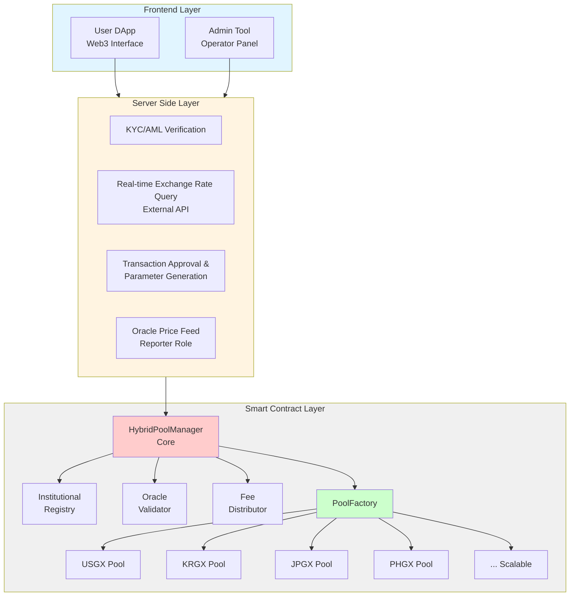
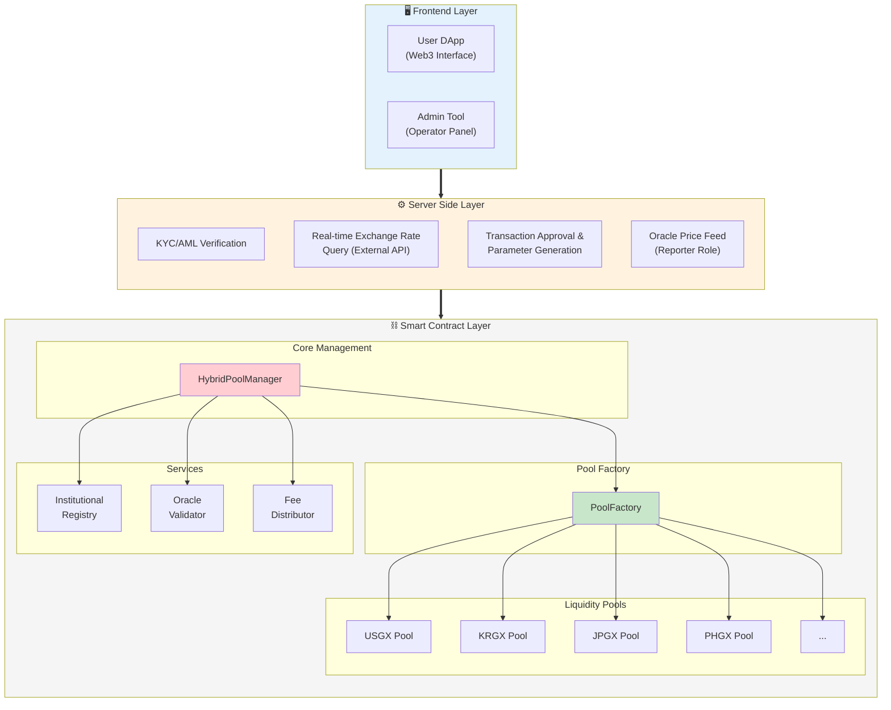

# GuruDEX System Architecture - 3-Layer Design

## Mermaid Diagram Code

## Alternative: Detailed Component View

## Usage Instructions

1. Copy the code block above (including the triple backticks with `mermaid`)
2. Go to https://mermaid.live/
3. Paste the code in the editor
4. The diagram will render automatically
5. You can export as PNG, SVG, or edit further

## Diagram Type

- **Type**: `graph TD` (Top-Down graph) or `flowchart TB` (Top-Bottom flowchart)
- **Best for**: System architecture, layered designs
- **Alternative types**: Use `graph LR` for Left-Right orientation

