# Institutional Onboarding Workflow

## Mermaid Diagram Code

```mermaid
flowchart TD
    Start([Start: New Institution]) --> Step1
    
    Step1["📝 Step 1: Basic Information Registration<br/>Institution → registerInstitution()<br/>Status: PENDING"]
    
    Step1 --> Step2
    
    Step2["🔍 Step 2: Off-chain KYC/AML Verification<br/>FXSwap Operations Team<br/>• Verify corporate registration<br/>• Verify representative identity<br/>• Verify fund sources<br/>• Check regulatory compliance"]
    
    Step2 --> Decision1{Verification<br/>Passed?}
    
    Decision1 -->|No| Rejected[❌ Registration Rejected]
    Decision1 -->|Yes| Step3
    
    Step3["✅ Step 3: Institution Activation<br/>Operator → activateInstitution()<br/>• Set transaction limits<br/>• Set custom fee rate<br/>• Set max price deviation<br/>• Set data freshness requirements<br/>Status: ACTIVE"]
    
    Step3 --> Step4
    
    Step4["🔑 Step 4: Access Authorization<br/>Operator → allowCoinForInstitution()<br/>Operator → authorizePoolForInstitution()<br/>• Specify tradeable coins<br/>• Grant pool access"]
    
    Step4 --> Step5
    
    Step5["🎉 Step 5: Trading Enabled<br/>Institution can now perform swaps"]
    
    Step5 --> End([End: Active Institution])
    
    Rejected --> End2([End: Rejected])
    
    style Start fill:#e8f5e9
    style Step1 fill:#fff9c4
    style Step2 fill:#fff3e0
    style Decision1 fill:#ffccbc
    style Step3 fill:#c8e6c9
    style Step4 fill:#b3e5fc
    style Step5 fill:#c5e1a5
    style End fill:#a5d6a7
    style Rejected fill:#ef9a9a
    style End2 fill:#ef9a9a
```

## Alternative: Swimlane Diagram

```mermaid
sequenceDiagram
    actor Institution
    participant Contract as Smart Contract
    participant Operator as FXSwap Operator
    participant Team as Operations Team
    
    Institution->>Contract: 1. registerInstitution()
    Contract-->>Institution: Status: PENDING
    
    Note over Team: 2. Off-chain KYC/AML<br/>Verification Process
    Team->>Team: Verify documents
    Team->>Team: Check compliance
    
    alt Verification Passed
        Operator->>Contract: 3. activateInstitution()
        Note right of Contract: Set custom parameters:<br/>- Transaction limits<br/>- Fee rates<br/>- Risk parameters
        Contract-->>Institution: Status: ACTIVE
        
        Operator->>Contract: 4. allowCoinForInstitution()
        Operator->>Contract: 4. authorizePoolForInstitution()
        Contract-->>Institution: Access Granted
        
        Institution->>Contract: 5. Can now perform swaps
        Contract-->>Institution: ✅ Trading Enabled
    else Verification Failed
        Team-->>Institution: ❌ Registration Rejected
    end
```

## Alternative: State Diagram

## Usage Instructions

1. Choose the diagram style that best fits your needs:
   - **Flowchart**: Best for showing step-by-step process
   - **Sequence Diagram**: Best for showing actor interactions
   - **State Diagram**: Best for showing status transitions

2. Copy the desired code block
3. Go to https://mermaid.live/
4. Paste and render
5. Export as needed

## Diagram Types

- **flowchart TD**: Top-Down flowchart with decision points
- **sequenceDiagram**: Actor interaction timeline
- **stateDiagram-v2**: State machine transitions

