# Risk Mitigation: 4-Layer Defense Strategy

## Mermaid Diagram Code

```mermaid
flowchart TD
    Threat[⚠️ Exchange Rate Volatility<br/>& Market Threats]
    
    Threat --> Layer1
    
    subgraph Layer1["🛡️ Layer 1: Exchange Rate Risk Reserve"]
        L1A["Insurance Fund: 5-10% of liquidity"]
        L1B["Dual Management:<br/>• Retail Reserve 3-5%<br/>• Institutional Reserve 5-10%"]
        L1C["Auto-replenishment<br/>from trading fees"]
        L1A --> L1B --> L1C
    end
    
    Layer1 --> |Loss Compensated| Layer2
    
    subgraph Layer2["⚖️ Layer 2: Dynamic Fee Adjustment"]
        L2A["Monitor Pool State:<br/>• Utilization Rate<br/>• Volatility Level"]
        L2B["Calculate Dynamic Fee:<br/>Fee = Base × 1 + Coef_util + Coef_vol"]
        L2C["Fee Range:<br/>0.30% → 0.63% in crisis"]
        L2A --> L2B --> L2C
    end
    
    Layer2 --> |Trading Suppressed| Layer3
    
    subgraph Layer3["🔒 Layer 3: Limits & Validation"]
        L3A["Swap Size Limits:<br/>Max 5% of pool per tx"]
        L3B["Oracle Triple Validation:<br/>• Time < 5 min<br/>• Deviation < 2%<br/>• Confidence > 95%"]
        L3C["Daily Limits<br/>per Institution"]
        L3A --> L3B --> L3C
    end
    
    Layer3 --> |Manipulation Blocked| Layer4
    
    subgraph Layer4["🚨 Layer 4: Circuit Breaker"]
        L4A{Threat<br/>Detected?}
        L4B["Level 1: Warning<br/>Limit large trades"]
        L4C["Level 2: Partial Halt<br/>Stop specific pool"]
        L4D["Level 3: Full Halt<br/>Stop all trading"]
        L4A -->|Minor| L4B
        L4A -->|Serious| L4C
        L4A -->|Critical| L4D
    end
    
    Layer4 --> Protected[✅ System Protected<br/>Assets Safe]
    
    style Threat fill:#ffcdd2
    style Layer1 fill:#c8e6c9
    style Layer2 fill:#b3e5fc
    style Layer3 fill:#fff9c4
    style Layer4 fill:#ffccbc
    style Protected fill:#a5d6a7
```

## Alternative: Layer-by-Layer Breakdown

```mermaid
graph LR
    subgraph L1["Layer 1<br/>💰 Reserve Fund"]
        direction TB
        R1[5-10% Liquidity<br/>Reserved]
        R2[Dual Reserves<br/>Retail + Institutional]
        R3[Auto Compensation<br/>on Loss]
        R1 --> R2 --> R3
    end
    
    subgraph L2["Layer 2<br/>⚖️ Dynamic Fees"]
        direction TB
        F1[Monitor<br/>Utilization]
        F2[Adjust Fees<br/>0.3% - 0.63%]
        F3[Suppress<br/>Speculation]
        F1 --> F2 --> F3
    end
    
    subgraph L3["Layer 3<br/>🔒 Validation"]
        direction TB
        V1[Size Limits<br/>Max 5%]
        V2[Triple Check<br/>Oracle Data]
        V3[Block Bad<br/>Trades]
        V1 --> V2 --> V3
    end
    
    subgraph L4["Layer 4<br/>🚨 Circuit Breaker"]
        direction TB
        C1[Detect<br/>Anomalies]
        C2[Auto Halt<br/>Trading]
        C3[Secure<br/>Response Time]
        C1 --> C2 --> C3
    end
    
    L1 ==> L2 ==> L3 ==> L4
    
    style L1 fill:#c8e6c9
    style L2 fill:#b3e5fc
    style L3 fill:#fff9c4
    style L4 fill:#ffccbc
```

## Alternative: Cascade Protection Model

## Usage Instructions

1. **Main Diagram**: Shows 4 layers in sequence
2. **Layer-by-Layer**: Emphasizes parallel operation
3. **Cascade Model**: Shows escalation logic

Choose based on your presentation needs:
- System overview → Use main diagram
- Technical detail → Use layer-by-layer
- Incident response → Use cascade model

## Diagram Type

- **Type**: `flowchart TD` or `graph LR`
- **Best for**: Multi-layer defense systems, security architecture

