# Circuit Breaker Operation Process

## Mermaid Diagram Code

```mermaid
flowchart TD
    Start([🚨 Risk Event Occurs])
    
    Start --> Monitor
    
    Monitor["👁️ Step 1: Automated Monitoring<br/>System detects anomaly:<br/>• Price volatility > 5%<br/>• Liquidity drop > 20%<br/>• Suspicious tx pattern<br/>• Oracle failures"]
    
    Monitor --> Trigger
    
    Trigger["⚡ Step 2: Circuit Breaker Triggered<br/>Immediately halt affected operations:<br/>• Block new swaps<br/>• Suspend liquidity add/remove<br/>• Halt institutional trading"]
    
    Trigger --> Alert
    
    Alert["📢 Step 3: Emergency Alert<br/>Notify operations team:<br/>• Slack / Email / SMS alerts<br/>• Risk scenario details<br/>• System status dashboard"]
    
    Alert --> Analyze
    
    Analyze["🔍 Step 4: Situation Analysis<br/>Team investigates:<br/>• Identify attack vector<br/>• Assess damage scope<br/>• Determine response"]
    
    Analyze --> Decision{Issue<br/>Resolved?}
    
    Decision -->|No| Escalate["⚠️ Escalate Response<br/>• Engage security team<br/>• Consider upgrades<br/>• Prepare recovery plan"]
    
    Escalate --> Analyze
    
    Decision -->|Yes| Resume
    
    Resume["✅ Step 5: System Recovery<br/>Gradually resume functions:<br/>• Perform test transactions<br/>• Phased resumption<br/>• Enhanced monitoring"]
    
    Resume --> End([✅ System Operational])
    
    style Start fill:#ffcdd2
    style Monitor fill:#fff9c4
    style Trigger fill:#ef5350,color:#fff
    style Alert fill:#ff9800,color:#fff
    style Analyze fill:#b3e5fc
    style Decision fill:#ffccbc
    style Escalate fill:#ff9800
    style Resume fill:#c8e6c9
    style End fill:#81c784
```

## Alternative: Timeline View

## Alternative: 3-Level Circuit Breaker

```mermaid
stateDiagram-v2
    [*] --> Normal: System Operating
    
    Normal --> Level1: Minor Threat Detected
    Normal --> Level2: Serious Threat Detected
    Normal --> Level3: Critical Threat Detected
    
    state Level1 {
        [*] --> Warning
        Warning: ⚠️ Level 1: WARNING
        Warning: • Limit large trades
        Warning: • Enhanced monitoring
        Warning: • Auto-release after 30 min
    }
    
    state Level2 {
        [*] --> PartialHalt
        PartialHalt: 🛑 Level 2: PARTIAL HALT
        PartialHalt: • Stop specific pool
        PartialHalt: • Suspend pool liquidity changes
        PartialHalt: • Other pools continue
        PartialHalt: • Requires Operator approval
    }
    
    state Level3 {
        [*] --> FullHalt
        FullHalt: 🚨 Level 3: FULL HALT
        FullHalt: • Stop ALL swaps
        FullHalt: • Stop ALL liquidity changes
        FullHalt: • Complete institutional halt
        FullHalt: • Requires Owner + Governance
    }
    
    Level1 --> Normal: Auto-Resume<br/>After 30 min
    Level1 --> Level2: Escalate<br/>if persists
    
    Level2 --> Normal: Operator<br/>Approves Resume
    Level2 --> Level3: Escalate<br/>if worsens
    
    Level3 --> Normal: Owner +<br/>Governance Approve
    
    Normal --> [*]: End
```

## Real-World Example Sequence

```mermaid
sequenceDiagram
    actor Attacker
    participant Pool as USGX-KRGX Pool
    participant Monitor as Monitoring System
    participant CB as Circuit Breaker
    participant Ops as Operations Team
    
    Note over Attacker: 09:30:00
    Attacker->>Pool: Borrow massive funds
    Attacker->>Pool: Attempt large swap #1
    Attacker->>Pool: Attempt large swap #2
    Attacker->>Pool: Attempt large swap #3
    Attacker->>Pool: Attempt large swap #4
    Attacker->>Pool: Attempt large swap #5
    
    Note over Monitor: 09:30:15<br/>Detect Pattern
    Monitor->>Monitor: 5 max-size tx in 15 sec
    Monitor->>Monitor: 30% liquidity moved
    Monitor-->>CB: 🚨 ALERT: Suspicious Pattern
    
    Note over CB: 09:30:16<br/>ACTIVATE
    CB->>Pool: HALT ALL TRANSACTIONS
    CB-->>Attacker: ❌ Transaction Rejected
    
    Note over CB: 09:30:20
    CB->>Ops: 📢 Emergency Alert
    
    Note over Ops: 09:30:20 - 09:45:00<br/>Investigation
    Ops->>Ops: Analyze attack vector
    Ops->>Ops: Confirm flash loan attack
    Ops->>Ops: Verify no actual loss
    
    Note over Ops: 09:45:00
    Ops->>CB: Approve Resume
    CB->>Pool: RESUME TRADING
    
    Note over Pool: 10:00:00<br/>✅ Normal Operation
    
    rect rgb(255, 200, 200)
        Note right of Attacker: Attack Window:<br/>16 seconds<br/>❌ BLOCKED
    end
    
    rect rgb(200, 255, 200)
        Note right of Pool: Result:<br/>💰 Zero Loss<br/>✅ System Safe
    end
```

## Usage Instructions

1. **Main Diagram**: Step-by-step operation flow
2. **Timeline View**: Shows time-based progression
3. **State Diagram**: Shows 3 severity levels
4. **Sequence Diagram**: Real attack prevention example

## Diagram Types

- **flowchart TD**: Process flow
- **gantt**: Timeline visualization
- **stateDiagram-v2**: State transitions
- **sequenceDiagram**: Actor interactions over time

