# Swap Execution Flows

## Retail Swap Flow

```mermaid
flowchart TD
    Start([👤 Retail User Initiates Swap])
    
    Start --> Input["📝 Input Parameters<br/>• Direction: USGX → KRGX<br/>• Amount In: 1,000 USGX<br/>• Min Amount Out: 1,280,000 KRGX"]
    
    Input --> Verify
    
    Verify["✅ Step 1: User Verification<br/>Check user type via InstitutionalRegistry<br/>Verify rate limits"]
    
    Verify --> CalcFee
    
    CalcFee["💰 Step 2: Calculate Dynamic Fee<br/>Check pool imbalance<br/>Formula: Fee = Base × 1 + imbalance%<br/>Result: 0.3% (balanced pool)"]
    
    CalcFee --> Deduct
    
    Deduct["➖ Step 3: Fee Deduction<br/>1,000 USGX × 0.997 = 997 USGX"]
    
    Deduct --> CalcOut
    
    CalcOut["🔢 Step 4: Calculate Output AMM<br/>Formula: Δy = y × Δx_fee / x + Δx_fee<br/>Result: ~1,286,710 KRGX"]
    
    CalcOut --> CheckSlip
    
    CheckSlip{⚠️ Step 5:<br/>Slippage Check<br/>1,286,710 >= 1,280,000?}
    
    CheckSlip -->|Yes| Update
    CheckSlip -->|No| Revert[❌ Transaction Reverted<br/>Slippage too high]
    
    Update["📊 Step 6: Update State<br/>• Update pool reserves<br/>• Accumulate fees<br/>• Update imbalance state"]
    
    Update --> Transfer
    
    Transfer["💸 Step 7: Transfer Funds<br/>Send 1,286,710 KRGX to user<br/>Send 3 USGX fee to FeeDistributor"]
    
    Transfer --> Event
    
    Event["📢 Step 8: Emit Event<br/>Record transaction on-chain<br/>for transparency"]
    
    Event --> End([✅ Swap Complete])
    Revert --> EndFail([❌ Swap Failed])
    
    style Start fill:#e3f2fd
    style CalcFee fill:#fff9c4
    style CalcOut fill:#b3e5fc
    style CheckSlip fill:#ffccbc
    style Update fill:#c8e6c9
    style Transfer fill:#c8e6c9
    style End fill:#81c784
    style Revert fill:#ef9a9a
    style EndFail fill:#ef9a9a
```

## Institutional Swap Flow

```mermaid
flowchart TD
    Start([🏦 Institution Initiates Swap])
    
    Start --> PreCheck
    
    PreCheck["🔍 Step 1: Pre-Trade Verification Off-chain<br/>Server checks:<br/>• KYC/AML Status: ACTIVE<br/>• Daily Limit: 1M USGX remaining<br/>• Custom Fee: 0.1%"]
    
    PreCheck --> UpdateOracle
    
    UpdateOracle["📡 Step 2: Oracle Update<br/>Server updates PriceOracle<br/>• Rate: 1 USD = 1,300 KRW<br/>• Time: 14:30:00<br/>• Confidence: 99.5%"]
    
    UpdateOracle --> Submit
    
    Submit["📝 Step 3: Submit Swap<br/>Institution calls swap function<br/>• Amount In: 100,000 USGX<br/>• Oracle Price: 1,300"]
    
    Submit --> CheckStatus
    
    CheckStatus{✅ Step 4:<br/>Status Check<br/>Institution ACTIVE?}
    
    CheckStatus -->|No| Reject1[❌ Rejected:<br/>Not Active]
    CheckStatus -->|Yes| ValidatePrice
    
    ValidatePrice["🔐 Step 5: Triple Validation<br/>Time: ✅ 2 min ago < 5 min<br/>Deviation: ✅ 0.08% < 2%<br/>Confidence: ✅ 99.5% > 95%"]
    
    ValidatePrice --> CheckLimit
    
    CheckLimit{📊 Step 6:<br/>Limit Check<br/>Within limits?}
    
    CheckLimit -->|No| Reject2[❌ Rejected:<br/>Limit Exceeded]
    CheckLimit -->|Yes| CalcOut
    
    CalcOut["🔢 Step 7: Calculate Output<br/>Formula: Out = In × Price × 1-Fee<br/>100,000 × 1,300 × 0.999<br/>= 129,870,000 KRGX"]
    
    CalcOut --> UpdateState
    
    UpdateState["📊 Step 8: Update State<br/>• Update pool reserves<br/>• Record daily volume<br/>• Store compliance logs"]
    
    UpdateState --> TransferFunds
    
    TransferFunds["💸 Step 9: Transfer Funds<br/>Send 129,870,000 KRGX<br/>Fee: 130,000 KRGX to distributor"]
    
    TransferFunds --> EmitEvent
    
    EmitEvent["📢 Step 10: Emit Event<br/>Institutional swap event<br/>for audit trail"]
    
    EmitEvent --> End([✅ Swap Complete<br/>Slippage: ~0%])
    
    Reject1 --> EndFail([❌ Swap Failed])
    Reject2 --> EndFail
    
    style Start fill:#e3f2fd
    style PreCheck fill:#fff3e0
    style UpdateOracle fill:#b3e5fc
    style ValidatePrice fill:#c8e6c9
    style CheckLimit fill:#ffccbc
    style CalcOut fill:#b3e5fc
    style End fill:#81c784
    style Reject1 fill:#ef9a9a
    style Reject2 fill:#ef9a9a
    style EndFail fill:#ef9a9a
```

## Comparison: Retail vs Institutional

```mermaid
graph TB
    subgraph Retail["👤 Retail Swap Path"]
        direction TB
        R1[User Request]
        R2[Check Rate Limits]
        R3[Dynamic Fee<br/>0.3% - 0.63%]
        R4[AMM Calculation<br/>x × y = k]
        R5[Slippage Protection<br/>minAmountOut]
        R6[Variable Slippage<br/>Depends on size]
        R1 --> R2 --> R3 --> R4 --> R5 --> R6
    end
    
    subgraph Institutional["🏦 Institutional Swap Path"]
        direction TB
        I1[Institution Request]
        I2[KYC/AML Check<br/>Off-chain]
        I3[Fixed Fee<br/>0.1%]
        I4[Oracle Price<br/>Direct multiply]
        I5[Triple Validation<br/>Time/Dev/Conf]
        I6[Minimal Slippage<br/>Price locked]
        I1 --> I2 --> I3 --> I4 --> I5 --> I6
    end
    
    Start([User Type Decision])
    Start -->|Retail| Retail
    Start -->|Institutional| Institutional
    
    Retail --> EndR[✅ AMM-based Swap]
    Institutional --> EndI[✅ Oracle-based Swap]
    
    style Retail fill:#e3f2fd
    style Institutional fill:#fff3e0
    style Start fill:#f0f0f0
    style EndR fill:#81c784
    style EndI fill:#81c784
```

## Algorithm Selection Logic

```mermaid
flowchart LR
    User([User Initiates Swap])
    
    User --> Check{Check User Type<br/>via InstitutionalRegistry}
    
    Check -->|RETAIL| PathA
    Check -->|INSTITUTIONAL| PathB
    Check -->|NONE| PathA
    
    subgraph PathA["AMM Path"]
        direction TB
        A1["• Dynamic fees<br/>• Pool-based pricing<br/>• Variable slippage"]
        A2["_swapRetail function"]
        A1 --> A2
    end
    
    subgraph PathB["Oracle Path"]
        direction TB
        B1["• Fixed fees<br/>• Oracle pricing<br/>• Minimal slippage"]
        B2["_swapInstitutional function"]
        B1 --> B2
    end
    
    PathA --> ResultA[✅ Retail Swap Complete]
    PathB --> ResultB[✅ Institutional Swap Complete]
    
    style User fill:#e3f2fd
    style Check fill:#fff9c4
    style PathA fill:#b3e5fc
    style PathB fill:#fff3e0
    style ResultA fill:#81c784
    style ResultB fill:#81c784
```

## Usage Instructions

1. **Retail Flow**: Shows 8-step AMM-based process
2. **Institutional Flow**: Shows 10-step oracle-based process with triple validation
3. **Comparison**: Side-by-side view of both paths
4. **Selection Logic**: Shows how system chooses algorithm

## Diagram Type

- **Type**: `flowchart TD` (Top-Down)
- **Best for**: Process flows, decision trees
- **Features**: Decision diamonds, subgraphs, styling

