# Pool Structure Comparison: Single vs Separated vs Hybrid

## Comparison Overview

```mermaid
graph TB
    subgraph Single["Single Pool Shared"]
        direction TB
        S1["🏊 One Pool for All"]
        S2["Retail + Institutional<br/>Liquidity Mixed"]
        S3["✅ Best Capital Efficiency<br/>✅ Minimal Slippage<br/>❌ Revenue Unfairness<br/>❌ Risk Propagation"]
        S4["Score: 72/100"]
        S1 --> S2 --> S3 --> S4
    end
    
    subgraph Separated["Separated Pools Independent"]
        direction TB
        P1["🏊🏊 Two Separate Pools"]
        P2["Retail Pool | Institutional Pool<br/>Completely Separated"]
        P3["✅ Perfect Revenue Fairness<br/>✅ Risk Isolation<br/>❌ Liquidity Fragmentation<br/>❌ High Slippage"]
        P4["Score: 58/100"]
        P1 --> P2 --> P3 --> P4
    end
    
    subgraph Hybrid["Hybrid Dual-Layer Optimal"]
        direction TB
        H1["🏊 Core Pool 50%<br/>+ Dedicated Pools 50%"]
        H2["Layer 1: Shared Base Pool<br/>Layer 2: Retail + Inst Dedicated"]
        H3["✅ Great Capital Efficiency<br/>✅ Revenue Fairness<br/>✅ Risk Isolation<br/>✅ Optimal Selection"]
        H4["⭐ Score: 88/100"]
        H1 --> H2 --> H3 --> H4
    end
    
    Start([Pool Architecture Choice])
    Start --> Single
    Start --> Separated
    Start --> Hybrid
    
    Single --> Compare[Comparison Analysis]
    Separated --> Compare
    Hybrid --> Compare
    
    Compare --> Winner["🏆 Winner: Hybrid Model"]
    
    style Single fill:#ffccbc
    style Separated fill:#fff9c4
    style Hybrid fill:#c8e6c9
    style Winner fill:#81c784
    style H4 fill:#4caf50,color:#fff
```

## Detailed Comparison Matrix

```mermaid
graph LR
    subgraph Criteria["Evaluation Criteria"]
        direction TB
        C1[Capital Efficiency]
        C2[Swap Efficiency]
        C3[Revenue Fairness]
        C4[Risk Management]
        C5[Complexity]
    end
    
    subgraph Single["Single Pool"]
        direction TB
        S1[🟢 Best]
        S2[🟢 Best]
        S3[🔴 Worst]
        S4[🔴 Risky]
        S5[🟢 Simple]
    end
    
    subgraph Separated["Separated"]
        direction TB
        P1[🔴 Worst]
        P2[🔴 Worst]
        P3[🟢 Best]
        P4[🟢 Safe]
        P5[🔴 Complex]
    end
    
    subgraph Hybrid["Hybrid"]
        direction TB
        H1[🟡 Excellent]
        H2[🟡 Excellent]
        H3[🟢 Best]
        H4[🟡 Safe]
        H5[🟡 Moderate]
    end
    
    C1 -.-> S1
    C1 -.-> P1
    C1 -.-> H1
    
    C2 -.-> S2
    C2 -.-> P2
    C2 -.-> H2
    
    C3 -.-> S3
    C3 -.-> P3
    C3 -.-> H3
    
    C4 -.-> S4
    C4 -.-> P4
    C4 -.-> H4
    
    C5 -.-> S5
    C5 -.-> P5
    C5 -.-> H5
    
    style Criteria fill:#f0f0f0
    style Single fill:#ffccbc
    style Separated fill:#fff9c4
    style Hybrid fill:#c8e6c9
```

## Hybrid Model Architecture

## Revenue Fairness Problem in Single Pool

```mermaid
sequenceDiagram
    participant RL as Retail LP<br/>50% stake
    participant Pool as Single Pool<br/>100% liquidity
    participant IL as Inst LP<br/>50% stake
    
    Note over Pool: Scenario: Single Shared Pool
    
    Note right of RL: Retail trades<br/>Small volume<br/>High fee 0.3%
    RL->>Pool: Contributes high fees
    
    Note right of IL: Inst trades<br/>Large volume<br/>Low fee 0.1%
    IL->>Pool: Contributes low fees
    
    Note over Pool: Total Fees:<br/>Retail: 70%<br/>Inst: 30%
    
    Note over Pool: Distribution by Stake:<br/>50/50 split
    
    Pool->>RL: Gets 50% of total<br/>❌ Less than contributed!
    Pool->>IL: Gets 50% of total<br/>✅ More than contributed!
    
    rect rgb(255, 200, 200)
        Note over RL,IL: UNFAIR: Inst benefits from<br/>retail fee contributions
    end
```

## Hybrid Model Solution

## Usage Instructions

1. **Comparison Overview**: High-level architecture comparison
2. **Matrix**: Detailed scoring by criteria
3. **Hybrid Architecture**: Shows dual-layer structure
4. **Problem Illustration**: Shows unfairness in single pool
5. **Solution**: Shows how hybrid solves it

## Diagram Types

- **graph TB/LR**: Architecture diagrams
- **sequenceDiagram**: Revenue flow comparison
- **subgraph**: Grouping related components

