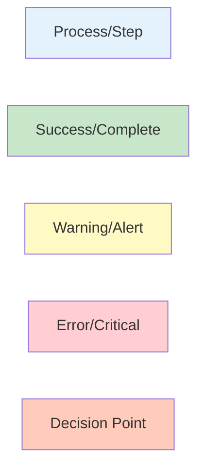

# GuruDEX Documentation Diagrams

This directory contains Mermaid diagram code for all visual diagrams used in the GuruDEX documentation.

## 📊 Available Diagrams

### 1. System Architecture
**File**: `01_system_architecture.md`
- 3-layer architecture diagram (Frontend, Server-side, Smart Contract)
- Component interaction flows
- Detailed layer breakdown

**Diagram Types**: `graph TD`, `flowchart TB`

---

### 2. Institutional Onboarding Workflow
**File**: `02_institutional_onboarding_workflow.md`
- 5-step onboarding process
- State transition diagram
- Sequence diagram with actors
- ABC Bank example

**Diagram Types**: `flowchart TD`, `sequenceDiagram`, `stateDiagram-v2`

---

### 3. 4-Layer Defense Strategy
**File**: `03_risk_mitigation_4layer.md`
- Layer-by-layer protection model
- Cascade protection flow
- Defense escalation logic

**Diagram Types**: `flowchart TD`, `graph LR`

---

### 4. Circuit Breaker Operation
**File**: `04_circuit_breaker_operation.md`
- 5-step operation process
- Timeline view (Gantt)
- 3-level severity system
- Real flash loan attack example

**Diagram Types**: `flowchart TD`, `gantt`, `stateDiagram-v2`, `sequenceDiagram`

---

### 5. Swap Execution Flows
**File**: `05_swap_execution_flows.md`
- Retail swap flow (8 steps)
- Institutional swap flow (10 steps)
- Comparison diagram
- Algorithm selection logic

**Diagram Types**: `flowchart TD`, `graph TB`

---

### 6. Pool Comparison
**File**: `06_pool_comparison.md`
- Single vs Separated vs Hybrid comparison
- Scoring matrix
- Hybrid dual-layer architecture
- Revenue fairness problem illustration
- Solution sequence

**Diagram Types**: `graph TB`, `graph LR`, `sequenceDiagram`

---

## 🚀 How to Use

### Option 1: Mermaid Live Editor
1. Go to https://mermaid.live/
2. Copy the code from any diagram file (including the triple backticks with `mermaid`)
3. Paste into the editor
4. The diagram renders automatically
5. Export as PNG, SVG, or Markdown

### Option 2: Mermaid CLI
```bash
# Install Mermaid CLI
npm install -g @mermaid-js/mermaid-cli

# Render diagram to PNG
mmdc -i diagram.md -o output.png

# Render to SVG
mmdc -i diagram.md -o output.svg
```

### Option 3: VS Code Extension
1. Install "Markdown Preview Mermaid Support" extension
2. Open any `.md` file in this directory
3. Use preview (Ctrl+Shift+V) to see rendered diagram

### Option 4: Direct in Markdown
Many platforms support Mermaid natively:
- GitHub
- GitLab
- Notion (with plugins)
- Obsidian
- HackMD

Simply paste the code block in your markdown file.

---

## 📝 Diagram Types Reference

| Type | Best For | Example Use Case |
|------|----------|-----------------|
| `graph TD/LR` | System architecture, component relationships | System layers, data flow |
| `flowchart TB/LR` | Process flows, decision trees | Swap execution, onboarding |
| `sequenceDiagram` | Actor interactions, timelines | Attack scenarios, API calls |
| `stateDiagram-v2` | State machines, status transitions | Institution states, circuit breaker levels |
| `gantt` | Timeline visualization, project planning | Incident response timeline |

---

## 🎨 Styling Tips

### Colors Used in Diagrams



### Common Styling Patterns

- **Process steps**: Light blue (`#e3f2fd`)
- **Success states**: Green (`#c8e6c9`, `#81c784`)
- **Warning states**: Yellow (`#fff9c4`, `#ffccbc`)
- **Error states**: Red (`#ffcdd2`, `#ef5350`)
- **Critical alerts**: Dark red with white text (`#ef5350`, `color:#fff`)

---

## 🔧 Customization

Each diagram file contains multiple variations. Choose based on your needs:

1. **Presentation/Overview**: Use main diagrams (simpler, high-level)
2. **Technical Documentation**: Use detailed/alternative diagrams
3. **Incident Response**: Use timeline/sequence diagrams
4. **Architecture Review**: Use component/layer diagrams

---

## 📚 Additional Resources

- [Mermaid Documentation](https://mermaid.js.org/)
- [Mermaid Live Editor](https://mermaid.live/)
- [Mermaid GitHub](https://github.com/mermaid-js/mermaid)
- [Diagram Syntax Guide](https://mermaid.js.org/intro/syntax-reference.html)

---

## 💡 Tips for Best Results

1. **Keep it Simple**: Don't overcrowd diagrams
2. **Use Subgraphs**: Group related components
3. **Consistent Styling**: Use same colors for same types
4. **Add Notes**: Use `Note` for additional context
5. **Test Rendering**: Always preview before exporting
6. **Export High-Res**: Use SVG for scalability

---

## 📞 Support

If you have questions or need custom diagrams:
- Check the main GuruDEX documentation
- Refer to the FXSwap analysis report
- Review existing diagram files for patterns

---

## 📄 License

These diagrams are part of the GuruDEX documentation and follow the same license as the main project.

