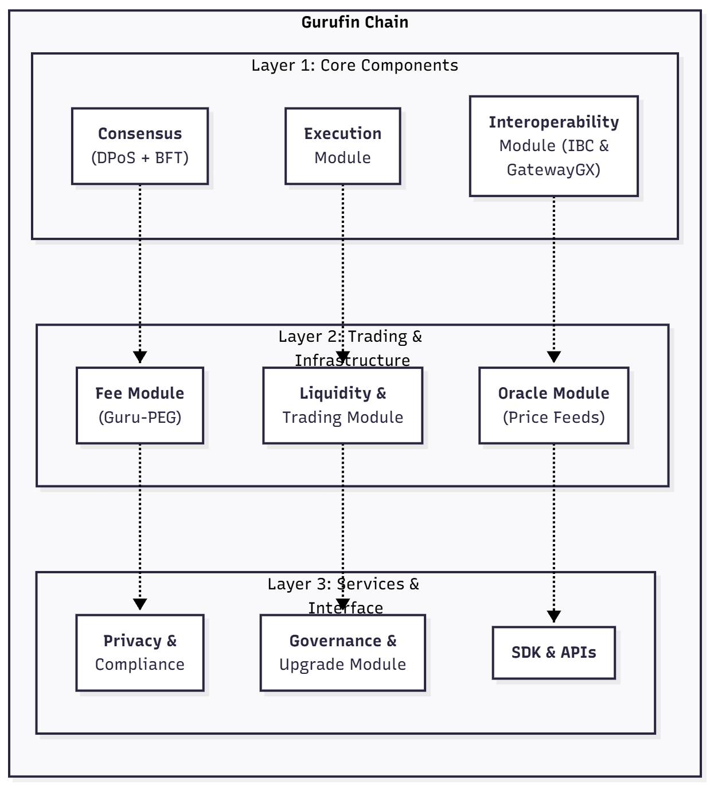

# Architecture

Gurufin Chain is a high-performance, public Layer-1 blockchain designed as a global on-chain FX and DeFi hub for the Web3 economy. It is purpose-built to support stablecoins, tokenized assets, and cross-border payments with a focus on interoperability, scalability, and regulatory compliance. This page provides a comprehensive technical deep dive into the Gurufin Chain architecture, covering its consensus mechanism, core engine, performance characteristics, and modular design principles.

***

## Overview

At its core, Gurufin Chain leverages a Delegated Proof-of-Stake (DPoS) consensus model integrated with a Tendermint-class Byzantine Fault Tolerant (BFT) engine. This combination delivers deterministic finality, high throughput, and low latency, enabling the chain to process thousands of transactions per second with block times ranging between 1 to 3 seconds.

The architecture is modular and extensible, facilitating seamless integration with other blockchains through Inter-Blockchain Communication (IBC) protocols and Ethereum Virtual Machine (EVM) compatibility layers. This design supports Gurufin Chain’s role as a neutral settlement layer for cross-border FX and DeFi applications.

***

## Consensus Mechanism: DPoS with Tendermint BFT

Gurufin Chain employs a Delegated Proof-of-Stake (DPoS) consensus protocol enhanced by the Tendermint Byzantine Fault Tolerant (BFT) engine. Validators are elected by token holders to produce blocks and validate transactions, ensuring decentralization while maintaining high performance.

The Tendermint BFT engine provides instant finality by achieving consensus among validators through a multi-round voting process that tolerates up to one-third faulty or malicious nodes. This guarantees that once a block is committed, it cannot be reverted, enabling deterministic sub-second finality critical for financial applications.

| Feature             | Description                                                             |
| ------------------- | ----------------------------------------------------------------------- |
| Consensus Algorithm | Delegated Proof-of-Stake (DPoS) with Tendermint BFT                     |
| Fault Tolerance     | Byzantine Fault Tolerant up to 1/3 faulty nodes                         |
| Finality            | Deterministic, sub-second finality                                      |
| Validator Selection | Token holder voting elects a fixed set of active validators             |
| Security Model      | Economic incentives and slashing mechanisms to ensure validator honesty |

***

## Performance Characteristics

Gurufin Chain is engineered for high throughput and low latency to meet the demands of real-time FX settlements and DeFi operations.

* **Block Time:** 1 to 3 seconds per block, balancing fast confirmation with network stability.
* **Throughput:** Capable of processing transactions in the five-figure TPS (transactions per second) range, supporting large-scale institutional and retail activity.
* **Finality:** Achieves deterministic finality within sub-second intervals after block proposal, eliminating uncertainty in transaction settlement.

These performance metrics position Gurufin Chain as a robust infrastructure for cross-border payments, stablecoin FX trading, and tokenized asset settlement.

***

## Modular Architecture

The Gurufin Chain architecture is designed with modularity and extensibility in mind, leveraging the Cosmos SDK framework. This modular design allows independent development, testing, and upgrading of components without disrupting the entire system.

### Key Modules

* **Consensus Module:** Implements the DPoS Tendermint BFT consensus engine.
* **Execution Module:** Handles transaction processing, smart contract execution, and state transitions.
* **Interoperability Module:** Supports IBC protocols for cross-chain communication and the GatewayGX module for bridging with non-IBC chains such as Ethereum and Solana.
* **Fee Management Module:** Implements the Guru-PEG mechanism for fiat-indexed, predictable gas fees with congestion pricing and circuit breakers.
* **Liquidity and Trading Module:** Supports hybrid execution fabric combining Automated Market Maker (AMM) and Request-for-Quote (RFQ) models.
* **Oracle Module:** Integrates permissioned oracle networks for real-time price feeds with bonding and slashing incentives.
* **Privacy and Compliance Module:** Provides optional zk-proof privacy modes and wallet-tier compliance features.

### Architecture Diagram Description

<figure><figcaption></figcaption></figure>

The diagram illustrates the layered modular structure. The consensus and execution modules form the blockchain core, while interoperability and auxiliary modules enable cross-chain communication, fee management, liquidity provision, oracle integration, and compliance enforcement. This separation of concerns enhances maintainability and scalability.

***

## Detailed Components

### 1. DPoS Consensus with Tendermint BFT Engine

The consensus layer combines the efficiency of Delegated Proof-of-Stake with the robustness of Tendermint’s BFT protocol. Validators are elected through a stake-weighted voting process. The Tendermint engine runs a three-phase commit protocol (Propose, Prevote, Precommit) to finalize blocks with Byzantine fault tolerance.

This design ensures:

* **High Throughput:** Validators produce blocks rapidly without waiting for slow proof-of-work computations.
* **Finality:** Once a block is committed, it is irreversible, enabling instant settlement.
* **Security:** Resistant to up to one-third malicious validators through slashing and economic penalties.

### 2. Block Time and Throughput

Gurufin Chain targets a block time between 1 and 3 seconds, optimizing for fast confirmation while maintaining network stability. This rapid block production supports transaction throughput in the range of tens of thousands per second, sufficient for high-frequency FX trading and large-scale DeFi operations.

The deterministic finality achieved by Tendermint BFT eliminates the need for probabilistic confirmation, reducing settlement risk and enabling real-time financial workflows.

### 3. Modular Design Principles

Built on the Cosmos SDK, Gurufin Chain’s modular architecture allows independent development of blockchain features as discrete modules. This approach offers several advantages:

* **Extensibility:** New modules can be added to support emerging use cases without disrupting core functionality.
* **Maintainability:** Isolated modules simplify debugging, testing, and upgrades.
* **Interoperability:** Standardized interfaces facilitate integration with external chains and ecosystems.
* **Customization:** Governance can enable or disable modules based on network requirements.

Modules such as the Guru-PEG fee equilibrium, hybrid AMM/RFQ execution fabric, oracle network, and privacy compliance are implemented as pluggable components within this framework.

***

## Summary Table of Key Architecture Specifications

| Aspect               | Specification                                                                                  |
| -------------------- | ---------------------------------------------------------------------------------------------- |
| Consensus Mechanism  | Delegated Proof-of-Stake (DPoS) combined with Tendermint Byzantine Fault Tolerant (BFT) engine |
| Block Time           | 1 to 3 seconds                                                                                 |
| Throughput           | Five-figure transactions per second (TPS)                                                      |
| Finality             | Deterministic, sub-second finality                                                             |
| Interoperability     | IBC-first architecture, EVM Gateway, GatewayGX module for non-IBC chains                       |
| Fee Model            | Guru-PEG: Fiat-indexed, CPI-indexed gas fees with congestion pricing and circuit breakers      |
| Execution Fabric     | Hybrid AMM (Uniswap v3 style) for retail + RFQ for institutional trades                        |
| Oracle Network       | Permissioned, weighted median aggregation with bonding and slashing                            |
| Privacy & Compliance | Optional zk-proof privacy modes, wallet-tier KYC/AML, FATF Travel Rule metadata support        |
| Modular Framework    | Cosmos SDK-based modular design enabling pluggable components                                  |

***

## Conclusion

Gurufin Chain’s architecture is a sophisticated blend of proven blockchain technologies and innovative features tailored for the global FX and DeFi markets. Its DPoS consensus combined with Tendermint BFT ensures fast, secure, and deterministic finality. The modular design supports extensibility and interoperability, enabling Gurufin Chain to serve as a neutral, scalable settlement layer for stablecoins, tokenized assets, and cross-border payments.

This architecture empowers developers and institutions to build compliant, efficient, and interoperable financial applications that leverage the full potential of Web3 technologies.
