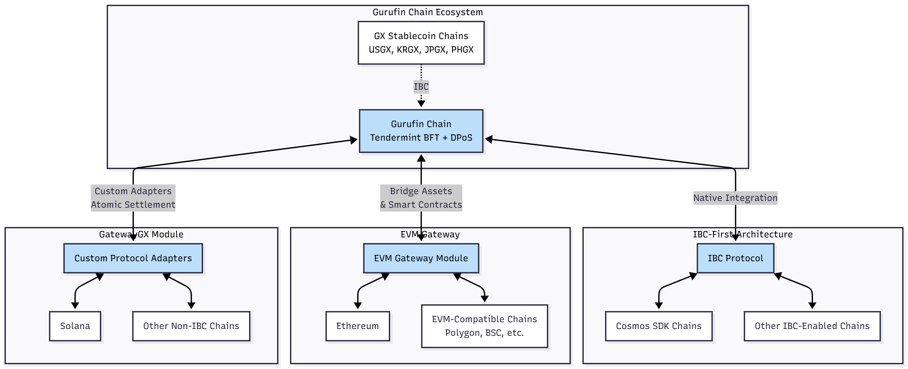

# 상호 운용성

상호 운용성은 Web3 경제를 위한 글로벌 온체인 FX 및 DeFi 허브가 되기 위한 Gurufin Chain의 비전의 핵심입니다. 다양한 블록체인 생태계에 걸쳐 원활하고 안전하며 원자적인 자산 전송 및 스마트 계약 상호 작용을 가능하게 함으로써 Gurufin은 효율적인 국경 간 결제, FX 거래 및 DeFi 조합 가능성을 촉진합니다. 이 페이지는 IBC 우선 접근 방식, Ethereum Virtual Machine (EVM) Gateway 및 GatewayGX 모듈을 강조하는 Gurufin의 상호 운용성 전략을 자세히 설명합니다. 또한 Gurufin이 Ethereum 및 Solana와 같은 주요 체인뿐만 아니라 다른 이기종 블록체인에 어떻게 연결되는지 설명합니다.

***

## IBC 우선 아키텍처

Gurufin Chain은 기초 상호 운용성 프로토콜로 **Inter-Blockchain Communication (IBC) 우선 아키텍처**를 채택합니다. IBC는 독립 Layer-1 블록체인 간의 안전하고 원자적인 크로스체인 통신을 가능하게 하기 위해 Cosmos 생태계에서 원래 개발된 표준화된 프로토콜입니다.

### Gurufin의 IBC 우선 접근 방식의 주요 특성

* **원자적 크로스체인 정산:** IBC를 통해 Gurufin은 국경 간 FX 거래에서 원금 및 브리지 위험을 제거하는 원자적 Payment-versus-Payment (PvP) 정산을 수행할 수 있습니다.
* **네이티브 통합:** Gurufin Chain과 GX Stablecoin 체인은 IBC를 네이티브로 지원하는 Cosmos SDK 및 Tendermint 합의를 사용하여 구축되어 Cosmos 생태계 및 기타 IBC 지원 체인 내에서 원활한 상호 운용성을 보장합니다.
* **높은 처리량 및 최종성:** 1초 미만의 블록 시간과 결정적 1초 미만의 최종성을 통해 Gurufin은 빠르고 신뢰할 수 있는 크로스체인 메시지 전달을 보장합니다.
* **수수료 예측 가능성:** Guru-PEG (Price Equilibrium Governance) 메커니즘은 크로스체인 운영에 대한 법정화폐 인덱스, 소매급 예측 가능한 수수료를 유지하여 사용자 경험과 비용 투명성을 향상시킵니다.

### IBC 우선 설계의 이점

| 기능 | 설명 |
| ----------------------- | --------------------------------------------------------------------------------------------------- |
| 원자성 | 크로스체인 거래의 완전한 성공 또는 실패를 보장하여 부분 상태를 방지합니다. |
| 보안 | 신뢰 최소화 통신을 위해 Tendermint BFT 합의 및 라이트 클라이언트 검증을 활용합니다. |
| 확장성 | 토큰 전송, 스마트 계약 호출 등을 가능하게 하는 임의의 메시지 유형을 지원합니다. |
| 생태계 호환성 | 증가하는 수의 Cosmos SDK 기반 체인 및 IBC 지원 네트워크와의 상호 운용성을 가능하게 합니다. |

IBC를 우선시함으로써 Gurufin은 규제급 규정 준수 및 프라이버시를 통해 주권 스테이블코인 발행, 국경 간 결제 및 DeFi 애플리케이션을 지원하는 강력한 상호 운용성 기반을 구축합니다.

***

## EVM Gateway

IBC가 Cosmos 기반 체인 내에서 네이티브 상호 운용성을 제공하는 반면 Gurufin은 Ethereum의 방대한 생태계와 통합하는 것의 중요성을 인식합니다. 이를 위해 Gurufin은 Ethereum 호환 자산 및 스마트 계약 상호 작용을 가능하게 하는 **EVM Gateway** 모듈을 구현합니다.

### EVM Gateway 개요

EVM Gateway는 Gurufin의 Tendermint 기반 체인과 Ethereum Virtual Machine (EVM) 환경 간의 브리지 역할을 합니다. 다음을 지원합니다:

* **자산 전송:** ERC-20 토큰 및 네이티브 Gurufin 자산은 안전한 잠금 및 발행 메커니즘으로 체인 간에 전송될 수 있습니다.
* **스마트 계약 상호 운용성:** Gurufin에서 Ethereum 스마트 계약의 호출 및 상태 동기화를 가능하게 하며 그 반대도 마찬가지입니다.
* **호환성:** Ethereum 도구, 지갑 및 개발자 프레임워크를 지원하여 Ethereum 개발자 및 사용자의 원활한 온보딩을 촉진합니다.

### 기술 하이라이트

| 측면 | 세부 사항 |
| -------------------- | ------------------------------------------------------------------------------------------------ |
| 프로토콜 | 거래 최종성을 보장하기 위해 암호화 증명을 사용한 크로스체인 메시지 전달을 활용합니다. |
| 자산 표현 | 자산 일관성을 유지하고 이중 지출을 방지하기 위해 양측에서 래핑된 토큰을 지원합니다. |
| 수수료 모델 | 크로스체인 운영에 대한 예측 가능하고 저렴한 가스 수수료를 유지하기 위해 Guru-PEG를 활용합니다. |
| 보안 | 크로스체인 상태 전환을 보호하기 위해 다중 서명 및 검증자 세트 합의를 사용합니다. |

따라서 EVM Gateway는 Gurufin의 고성능, 저지연 Layer-1을 Ethereum의 풍부한 DeFi 및 NFT 생태계와 연결하여 Gurufin 네이티브 스테이블코인 및 자산의 도달 범위와 유용성을 확대합니다.

***

## GatewayGX 모듈

IBC 지원 및 EVM 호환 체인을 넘어 상호 운용성을 확장하기 위해 Gurufin은 Solana 및 기타 비 IBC 체인을 포함한 이기종 블록체인 통합을 위해 설계된 전문 상호 운용성 레이어인 **GatewayGX 모듈**을 도입합니다.

### 목적 및 기능

GatewayGX는 IBC 또는 EVM 표준을 네이티브로 지원하지 않는 Gurufin과 블록체인 간의 안전하고 원자적인 크로스체인 통신 및 자산 전송을 촉진합니다. 다음을 통해 이를 달성합니다:

* **맞춤형 프로토콜 어댑터:** 맞춤형 어댑터는 Gurufin의 프로토콜과 대상 체인 프로토콜 간의 메시지를 변환하고 중계합니다.
* **검증자 조율 중계:** 라이선스 검증자와 오라클은 크로스체인 메시지 검증 및 합의에 참여합니다.
* **원자적 정산 보증:** 이기종 환경에서 원자성을 보장하고 이중 지출을 방지하는 메커니즘을 구현합니다.

### 지원되는 체인

| 체인 | 통합 방법 | 참고 사항 |
| ------------ | ------------------ | ------------------------------------------------------------ |
| Ethereum | EVM Gateway | 전체 EVM 호환성, 자산 및 계약 상호 운용성. |
| Solana | GatewayGX 모듈 | Solana의 Proof-of-History 및 런타임을 위한 맞춤형 어댑터. |
| 기타 체인 | GatewayGX 모듈 | 맞춤형 어댑터로 추가 체인으로 확장 가능. |

### 이점

* **크로스 생태계 연결:** Gurufin이 다양한 블록체인 생태계를 연결하는 중립적인 정산 레이어 역할을 할 수 있도록 합니다.
* **확장성:** 모듈식 설계를 통해 기존 통합을 방해하지 않고 새로운 체인을 점진적으로 추가할 수 있습니다.
* **규정 준수 및 프라이버시:** 연결된 체인 전반에 걸쳐 감독 등급 관찰 가능성 및 선택적 zk-proof 프라이버시 모드(zkGuru)를 지원합니다.

***

## Gurufin의 크로스체인 연결: Ethereum, Solana 등

Gurufin의 상호 운용성 스택은 IBC, EVM Gateway 및 GatewayGX의 강점을 결합하여 주요 블록체인 생태계와의 포괄적인 연결을 구축합니다.

### 상호 운용성 아키텍처 다이어그램

<figure><figcaption></figcaption></figure>

### Ethereum에 연결

Ethereum 통합은 주로 EVM Gateway를 통해 달성되며 다음을 허용합니다:

* **ERC-20 토큰 브리징:** Gurufin 스테이블코인(예: USGX)은 Ethereum에서 래핑된 토큰으로 브리징되어 유동성 제공 및 DeFi 참여를 가능하게 합니다.
* **스마트 계약 상호 작용:** 크로스체인 호출을 통해 분산 애플리케이션이 Gurufin의 FX 및 스테이블코인 인프라를 활용할 수 있습니다.
* **수수료 및 가스 관리:** Guru-PEG는 Ethereum의 변동성 가스 수수료와 비교하여 사용자 경험을 개선하는 예측 가능한 거래 비용을 보장합니다.

### Solana에 연결

Solana의 높은 처리량, 저지연 환경은 GatewayGX 모듈을 통해 통합됩니다:

* **맞춤형 프로토콜 어댑터:** Solana의 거래 및 메시지 형식을 Gurufin의 IBC 호환 메시지로 변환합니다.
* **원자적 자산 전송:** 정산 최종성 보증과 함께 스테이블코인 및 토큰 전송을 가능하게 합니다.
* **크로스체인 DeFi:** Gurufin의 FX 풀과 Solana 기반 DeFi 프로토콜 간의 조합 가능성을 촉진합니다.

### 다른 체인으로 확장

GatewayGX 모듈의 모듈식 어댑터 프레임워크를 통해 Gurufin은 고유한 합의 또는 런타임 모델을 가진 체인을 포함한 추가 체인을 온보딩할 수 있습니다. 이 확장성은 진정한 글로벌, 다중 체인 FX 및 DeFi 허브라는 Gurufin의 비전을 지원합니다.

***

## 요약 표: Gurufin 상호 운용성 구성 요소

| 구성 요소 | 설명 | 지원되는 체인 | 주요 기능 |
| --------------- | ----------------------------------------------------------- | ---------------------------------- | ---------------------------------------------------------- |
| **IBC 우선** | 네이티브 크로스체인 통신 프로토콜 | Cosmos SDK 기반 체인 | 원자적 PvP 정산, 빠른 최종성, 수수료 예측 가능성 |
| **EVM Gateway** | 자산 및 계약을 위한 Ethereum 호환 브리지 | Ethereum 및 EVM 체인 | ERC-20 브리징, 스마트 계약 호출, 가스 수수료 안정성 |
| **GatewayGX** | 비 IBC, 비 EVM 체인을 위한 모듈식 상호 운용성 모듈 | Solana, 기타 이기종 체인 | 맞춤형 프로토콜 어댑터, 원자적 정산, 확장성 |

---

## 결론

Gurufin Chain의 상호 운용성 전략은 EVM Gateway 및 GatewayGX 모듈로 보완된 IBC 우선 아키텍처를 활용하여 원활하고 안전하며 효율적인 크로스체인 연결을 제공합니다. 이 다층 접근 방식을 통해 Gurufin은 Ethereum, Solana 및 광범위한 다른 블록체인과 연결할 수 있어 진화하는 Web3 경제를 위한 중립적이고 고성능 정산 및 FX 허브로 자리매김합니다. 예측 가능한 수수료, 원자적 크로스체인 정산 및 규제급 규정 준수를 통해 Gurufin은 사용자와 기관이 국경 간 결제, 스테이블코인 FX 거래 및 상호 운용 가능한 DeFi에서 새로운 가능성을 열 수 있도록 합니다.
