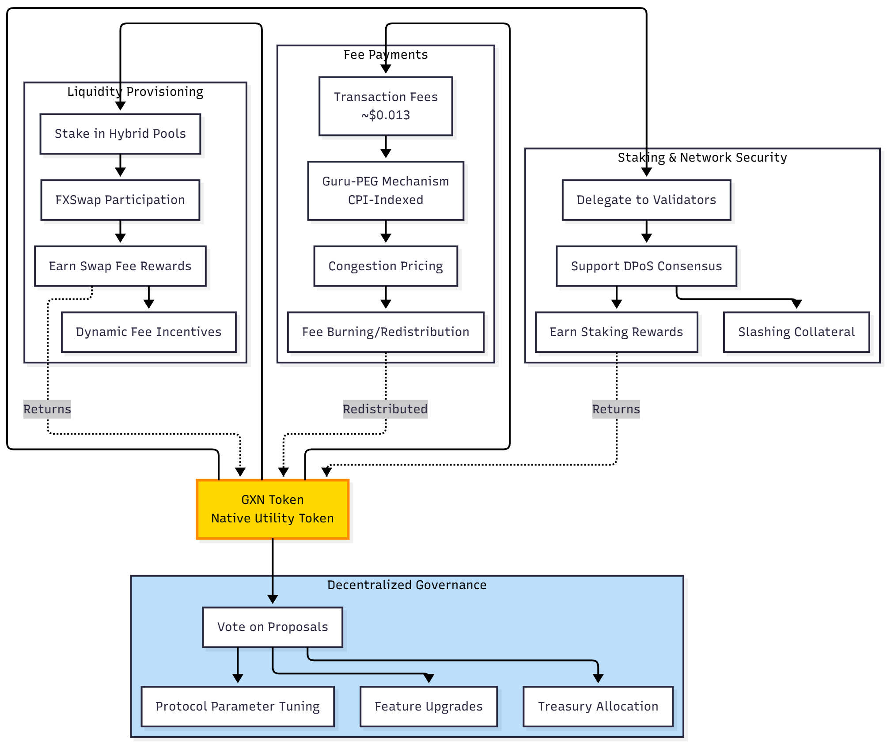

# Tokenomics (GXN)

The Guru native token (GXN) is the foundational utility token of the Gurufin ecosystem, designed to empower participants across the Gurufin Chain and GX Stablecoin networks. GXN plays a pivotal role in enabling decentralized governance, incentivizing network security through staking, facilitating fee payments, and supporting liquidity provisioning within the platform’s innovative DeFi and FX infrastructure. This page provides a comprehensive overview of GXN’s tokenomics, detailing its multifaceted utility and economic design.

***

## Overview of GXN Token Utility

GXN serves as the native token for Gurufin Chain, a high-performance Delegated Proof-of-Stake (DPoS) Layer-1 blockchain optimized for stablecoins, tokenized assets, and cross-border payments. The token’s utility is deeply integrated into the chain’s core functionalities, including consensus participation, governance, transaction fee settlement, and liquidity management within the hybrid Automated Market Maker (AMM) and Request-for-Quote (RFQ) trading venues.

The tokenomics model is designed to align incentives among validators, liquidity providers, governance participants, and end-users, fostering a robust, secure, and efficient ecosystem. GXN’s role extends beyond a simple transactional token to become a key economic lever that sustains network health and drives ecosystem growth.

***

## Staking and Network Security

GXN holders can participate in the Gurufin Chain’s Delegated Proof-of-Stake consensus mechanism by staking their tokens to support network security and transaction finality. Validators, selected through delegated voting by GXN holders, operate the nodes that maintain the blockchain’s Byzantine Fault Tolerant (BFT) consensus with Tendermint-class finality.

Staking GXN confers several benefits:

* **Validator Selection:** GXN holders delegate tokens to trusted validators, influencing the validator set responsible for block production and consensus.
* **Reward Distribution:** Stakers earn rewards proportional to their stake and validator performance, incentivizing active participation and honest behavior.
* **Slashing and Security:** Validators are subject to slashing penalties for misbehavior, with staked GXN serving as collateral to ensure network integrity.

This staking model ensures a secure, high-throughput blockchain environment with deterministic sub-second finality, critical for the Gurufin Chain’s role as a neutral settlement layer for cross-border FX and DeFi applications.

***

## Governance Participation

GXN token holders possess governance rights within the Gurufin ecosystem, enabling decentralized decision-making on protocol upgrades, parameter adjustments, and ecosystem initiatives. Governance is conducted through on-chain voting mechanisms where GXN tokens represent voting power.

Key governance functions include:

* **Protocol Parameter Tuning:** Adjusting network parameters such as fee schedules, staking requirements, and consensus configurations.
* **Feature Proposals:** Submitting and voting on proposals for new features, integrations, or changes to the hybrid AMM/RFQ mechanisms.
* **Ecosystem Fund Allocation:** Deciding on the use of treasury funds for development grants, marketing, or community incentives.

This governance framework empowers the community to steer the evolution of the Gurufin Chain and GX Stablecoin networks in a transparent and inclusive manner.

***

## Fee Payments and Economic Stability

GXN is the primary token used for paying transaction fees across the Gurufin Chain. The chain’s innovative **Guru-PEG (Price Equilibrium Governance)** mechanism ensures that gas fees remain predictable and retail-friendly by indexing fees to the Consumer Price Index (CPI). This results in stable, fiat-equivalent fees approximately $0.013 for Layer-1 transfers and $0.040 for asset operations.

Using GXN for fee payments offers several advantages:

* **Fee Stability:** The CPI-indexed fee model reduces volatility in transaction costs, enhancing user experience for retail and institutional participants.
* **Congestion Pricing:** Dynamic fee adjustments during network congestion protect against spam and maintain service quality.
* **Fee Burning and Redistribution:** A portion of fees paid in GXN may be burned or redistributed to stakers and liquidity providers, contributing to token scarcity and value accrual.

This fee model supports the chain’s goal of becoming a neutral, low-cost settlement layer for cross-border payments and DeFi activities.

***

## Liquidity Provisioning and Rewards

Liquidity providers (LPs) on Gurufin Chain’s FXSwap platform utilize GXN tokens to participate in the hybrid liquidity pools that combine institutional and retail liquidity. The platform’s unique single-pool design per stablecoin pair maximizes liquidity concentration, reduces slippage, and simplifies pool management.

GXN’s role in liquidity provisioning includes:

* **Liquidity Staking:** LPs stake GXN alongside stablecoins in hybrid pools to facilitate efficient FX swaps and stablecoin trading.
* **Fee Rewards:** LPs earn a share of the dynamic swap fees collected from retail AMM trades and institutional RFQ transactions, distributed proportionally based on their GXN-backed liquidity contributions.
* **Incentive Alignment:** GXN rewards encourage sustained liquidity provision, ensuring deep pools for stablecoin FX pairs such as USGX, KRGX, JPGX, and PHGX.

The dynamic fee mechanism, which adjusts fees based on pool imbalance, further incentivizes LPs to maintain equilibrium, enhancing overall market efficiency.

***

## GXN Token Utility Summary

### GXN Token Utility Flow Diagram

<figure><figcaption></figcaption></figure>

| Utility Category        | Description                                                                                | Benefits                                                                                        |
| ----------------------- | ------------------------------------------------------------------------------------------ | ----------------------------------------------------------------------------------------------- |
| **Staking**             | Stake GXN to support DPoS consensus and secure the network.                                | Earn staking rewards; participate in validator selection; contribute to network security.       |
| **Governance**          | Use GXN tokens to vote on protocol upgrades, parameter changes, and ecosystem proposals.   | Influence network evolution; ensure decentralized decision-making; access to governance rights. |
| **Fee Payments**        | Pay transaction and operational fees on Gurufin Chain with CPI-indexed, predictable costs. | Stable and low transaction fees; protection against congestion; potential fee burning.          |
| **Liquidity Provision** | Stake GXN in hybrid liquidity pools for stablecoin FX trading and DeFi applications.       | Earn swap fee rewards; support deep liquidity; benefit from dynamic fee incentives.             |

***

## Conclusion

The GXN token is a cornerstone of the Gurufin ecosystem, intricately woven into the chain’s consensus, governance, fee economy, and liquidity infrastructure. By enabling secure staking, empowering decentralized governance, facilitating stable fee payments, and incentivizing liquidity provision, GXN drives the sustainable growth and resilience of the Gurufin Chain and GX Stablecoin networks. Participants holding and utilizing GXN contribute directly to the platform’s vision of becoming the global on-chain FX and DeFi hub for the Web3 economy.
