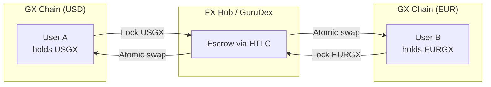

# Multi-Currency Support

GX Chain is designed to support stablecoins across multiple jurisdictions and currencies through its sovereign chain architecture. Rather than issuing all stablecoins from a single chain, each supported currency operates on its own dedicated Layer-1 blockchain with jurisdiction-specific governance and compliance requirements.

This multi-currency approach enables Gurufin to serve as a global FX and settlement hub while respecting the regulatory frameworks of each participating jurisdiction.

---

**Jurisdictional Sovereignty**

Each GX stablecoin chain operates as an independent blockchain governed by licensed validators who are regulated entities within that specific jurisdiction. This design ensures that stablecoin issuance, reserve management, and transactional compliance adhere to local laws and supervisory requirements.

The sovereign chain model provides legal clarity since validators operate under local laws with clear accountability. It enables regulatory alignment because each chain can implement jurisdiction-specific compliance rules. Local banking integration is achieved through partnerships with local custodian banks and payment providers. The model also ensures operational independence so that issues in one jurisdiction do not affect stablecoins in other jurisdictions.

---

**Cross-Chain Interoperability**

While each stablecoin chain operates independently, they are connected through IBC (Inter-Blockchain Communication) to enable seamless cross-currency transactions. Users can swap between different GX stablecoins on Gurufin Chain's GuruDex, enabling efficient FX trading and cross-border payments.

When stablecoins move from their native GX chain to Gurufin Chain for trading or DeFi activities, atomic cross-chain settlement ensures that transfers either complete fully or revert entirely. This eliminates counterparty risk in cross-currency transactions.

---

**FX Settlement and PvP**

GX includes a native Foreign Exchange layer that functions like a real-time on-chain CLS (Continuous Linked Settlement) system. Cross-currency flows use **Payment-versus-Payment (PvP)** settlement with escrowed holds via IBC/HTLCs (Hash Time-Locked Contracts), ensuring neither leg settles unless both do—eliminating principal (Herstatt) risk.

For correlated stablecoin pairs, pools use **low-curvature stable-swap curves** to minimize slippage near parity. Large tickets can be time-weighted (TWAP/TWAMM) to reduce market footprint. Pool telemetry (depth, slippage, utilization) is published in real time to the Scanner.

FX liquidity is supplied by regulated LPs, banks, PSPs, and market makers who post two-sided inventory with concentration caps and transparent maker–taker fees.

---

**Onboarding New Currencies**

The GX framework is designed for extensibility. New sovereign stablecoins can be onboarded through a structured process that includes regulatory assessment to evaluate the legal framework and licensing requirements of the target jurisdiction. Validator recruitment identifies and licenses regulated entities to serve as validators. Banking integration establishes custodial relationships with local banks for reserve management. Technical deployment launches the new GX chain with IBC connectivity to Gurufin Chain. Ongoing compliance ensures continuous regulatory monitoring and proof-of-reserves transparency.

---

This modular approach allows Gurufin to expand its stablecoin network to additional jurisdictions over time while maintaining consistent security, compliance, and operational standards across all supported currencies.
