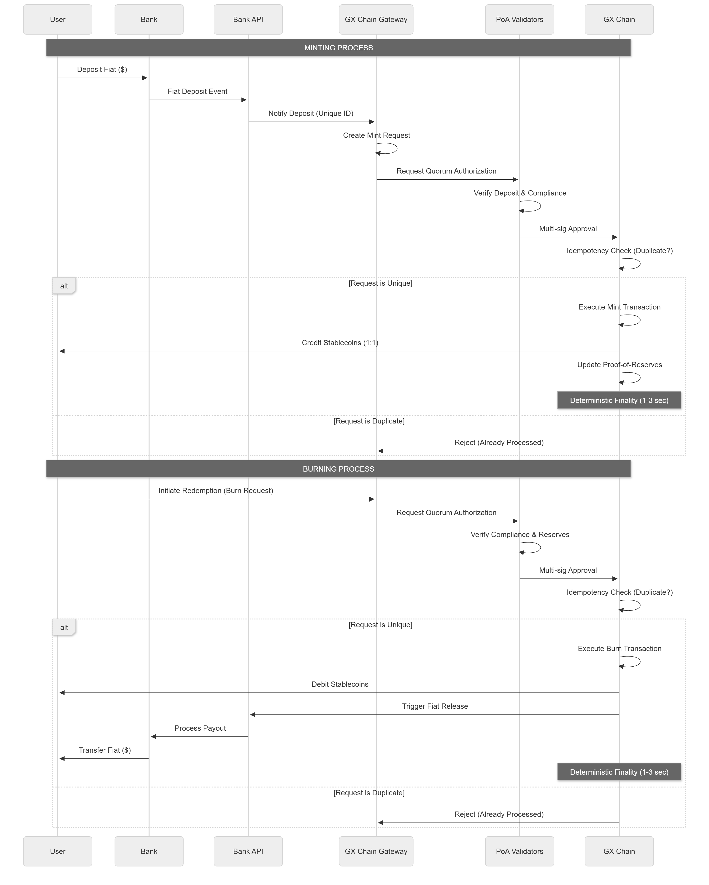

# Mint & Burn Mechanism

The Mint & Burn Mechanism is a foundational component of the GX Stablecoin Chain, enabling automated issuance and redemption of sovereign stablecoins anchored to real-world fiat reserves. This process is tightly integrated with licensed banking partners via secure APIs, ensuring that every token minted or burned corresponds to an actual fiat movement in the banking system. This page provides a comprehensive overview of the automated minting and burning workflow, explains critical concepts such as idempotency, quorum authorization, and deterministic finality, and presents detailed process flow tables to guide developers and integrators.

***

## Overview

GX Stablecoin Chain operates a permissioned Proof-of-Authority (PoA) consensus model with licensed validators bound to specific jurisdictions. The stablecoins issued on GX chains (e.g., USGX, KRGX, JPGX, PHGX) are fully fiat-backed at a 1:1 ratio, with reserves held in regulated banks and subject to continuous proof-of-reserves transparency.

The minting and burning of stablecoins are automated and anchored to bank API events, ensuring that token supply strictly corresponds to on-chain representations of off-chain fiat reserves. This integration eliminates manual reconciliation delays and mitigates risks associated with double issuance or redemption.

***

## Automated Minting and Burning Process

The mint and burn process is triggered by fiat movements detected via bank APIs. When a user deposits fiat into a custodian bank account, an automated minting event is initiated on the GX chain, crediting the user with the equivalent stablecoin amount. Conversely, when a user redeems stablecoins, the burning process is initiated, and the corresponding fiat amount is released from the bank to the user.

### Mint and Burn Flow Diagram

<figure><figcaption></figcaption></figure>

### Step-by-Step Process

| Step | Description                                                                                                                      | Actor(s)                  | Outcome                                               |
| ---- | -------------------------------------------------------------------------------------------------------------------------------- | ------------------------- | ----------------------------------------------------- |
| 1    | **Fiat Deposit Detected**: Bank API signals a fiat deposit into the custodian account.                                           | Bank API                  | Deposit event logged and queued for minting.          |
| 2    | **Mint Request Creation**: The GX chain gateway module creates a mint request anchored to the deposit event.                     | GX Chain Gateway Module   | Mint request prepared with deposit details.           |
| 3    | **Quorum Authorization**: Multi-party validator quorum reviews and signs off on the mint request.                                | Licensed Validators (PoA) | Authorization signatures collected.                   |
| 4    | **Idempotency Check**: System verifies if the mint request has been processed previously to avoid duplication.                   | GX Chain Module           | Duplicate requests rejected; unique requests proceed. |
| 5    | **Mint Execution**: Upon quorum approval and idempotency validation, the mint transaction is executed on-chain.                  | GX Chain Validators       | Stablecoins minted and credited to user wallet.       |
| 6    | **Finality Confirmation**: Deterministic finality ensures the mint transaction is irreversible and finalized within sub-seconds. | GX Chain Consensus Layer  | Mint transaction finalized and recorded.              |
| 7    | **Fiat Redemption Request**: User initiates stablecoin redemption, triggering a burn request.                                    | User & GX Chain Gateway   | Burn request created and queued.                      |
| 8    | **Quorum Authorization**: Validators review and approve the burn request based on compliance and reserve checks.                 | Licensed Validators (PoA) | Burn request authorized.                              |
| 9    | **Idempotency Check**: System ensures the burn request is unique and not previously processed.                                   | GX Chain Module           | Duplicate burn requests rejected.                     |
| 10   | **Burn Execution**: Stablecoins are burned on-chain, reducing the circulating supply.                                            | GX Chain Validators       | Tokens burned and user balance debited.               |
| 11   | **Fiat Release**: Bank processes the fiat payout to the user, completing the redemption cycle.                                   | Bank API & Custodian Bank | Fiat funds transferred to user’s bank account.        |

***

## Key Concepts Explained

### Idempotency

Idempotency is a critical design principle ensuring that repeated processing of the same mint or burn request does not result in multiple token issuances or redemptions. This is essential in distributed systems where network retries or duplicate API calls may occur. The GX chain implements idempotency by assigning unique identifiers to each bank event and mint/burn request. Before processing, the system checks if the request ID has already been executed, thereby preventing double spending or double minting.

### Quorum Authorization

To maintain security and regulatory compliance, mint and burn requests require multi-party authorization from a quorum of licensed validators operating under Proof-of-Authority consensus. This quorum mechanism enforces separation of duties and prevents unilateral issuance or redemption. Validators verify the legitimacy of bank events, compliance status, and reserve sufficiency before signing off on the transaction. Only upon reaching the required quorum threshold does the system proceed with minting or burning.

### Deterministic Finality

Deterministic finality guarantees that once a mint or burn transaction is committed on the GX chain, it becomes irreversible and immediately recognized by all network participants. Leveraging Tendermint-class Byzantine Fault Tolerant consensus, the GX chain achieves sub-second finality, enabling rapid and predictable settlement of stablecoin issuance and redemption. This deterministic finality is crucial for maintaining trust and synchronization between on-chain token supply and off-chain fiat reserves.

***

## Process Flow Tables

### Minting Process Flow

| Stage              | Description                                                                             | System Component        | Notes                                 |
| ------------------ | --------------------------------------------------------------------------------------- | ----------------------- | ------------------------------------- |
| Deposit Detection  | Bank API detects fiat deposit and sends event notification.                             | Bank API                | Event includes unique transaction ID. |
| Request Generation | GX chain gateway generates mint request referencing bank event ID.                      | GX Chain Gateway Module | Prepares transaction payload.         |
| Validator Review   | Licensed validators verify deposit authenticity and compliance.                         | PoA Validators          | Multi-signature quorum required.      |
| Idempotency Check  | System checks if mint request ID is already processed.                                  | GX Chain Mint Module    | Prevents double minting.              |
| Mint Execution     | Mint transaction is executed on-chain, crediting stablecoins to user wallet.            | GX Chain Validators     | Transaction broadcast and committed.  |
| Finality           | Transaction reaches deterministic finality, confirming mint completion.                 | Tendermint Consensus    | Finality within 1-3 seconds.          |
| Confirmation       | User wallet balance updated; event logged for audit and proof-of-reserves transparency. | GX Chain Ledger         | Real-time proof-of-reserves updated.  |

### Burning Process Flow

| Stage             | Description                                                                             | System Component          | Notes                                    |
| ----------------- | --------------------------------------------------------------------------------------- | ------------------------- | ---------------------------------------- |
| Burn Request      | User submits burn request via GX chain gateway, indicating redemption intent.           | GX Chain Gateway Module   | Includes unique burn request ID.         |
| Validator Review  | Validators verify burn request compliance, reserve sufficiency, and user authorization. | PoA Validators            | Multi-signature quorum required.         |
| Idempotency Check | System verifies burn request has not been processed before.                             | GX Chain Burn Module      | Prevents double burning.                 |
| Burn Execution    | Stablecoins are burned on-chain, reducing circulating supply.                           | GX Chain Validators       | Transaction broadcast and committed.     |
| Finality          | Burn transaction reaches deterministic finality, confirming token destruction.          | Tendermint Consensus      | Finality within 1-3 seconds.             |
| Fiat Release      | Bank API triggers fiat release to user’s bank account per redemption request.           | Bank API & Custodian Bank | Off-chain fiat movement completes cycle. |

***

## Summary

The GX Stablecoin Chain's Mint & Burn Mechanism exemplifies a robust, secure, and compliant approach to bridging fiat and blockchain assets. By anchoring token issuance and redemption to bank API events, enforcing idempotency, requiring quorum authorization, and leveraging deterministic finality, the system ensures that stablecoin supply is always fully backed and accurately reflects real-world fiat reserves. This mechanism underpins the trustworthiness and regulatory alignment of GX stablecoins, enabling seamless cross-border payments, FX trading, and DeFi applications on the Gurufin Chain ecosystem.

***

For further technical details on API specifications, validator roles, and integration guides, please refer to the [GX Stablecoin Developer Resources](../developer-resources/).
