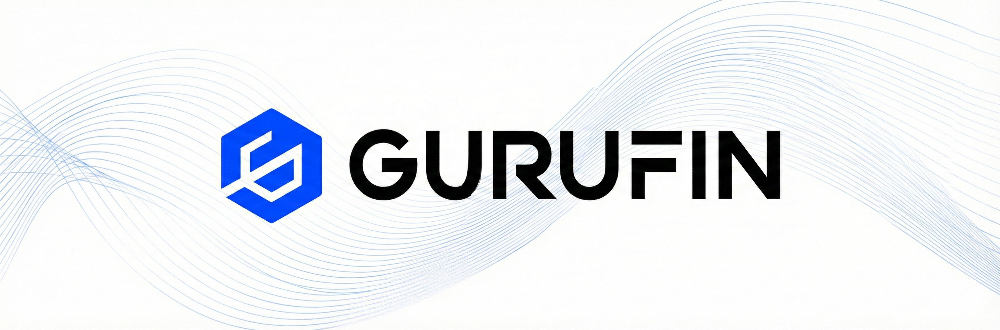

# What is Gurufin?

<figure><figcaption></figcaption></figure>

Gurufin is a specialized financial infrastructure that combines the efficiency of blockchain technology with the stability and regulatory compliance required for institutional adoption.&#x20;

_The ecosystem is built on two interconnected pillars:_

**Gurufin Chain**

* Public, permissionless Layer-1 blockchain built on Cosmos SDK with Tendermint BFT consensus
* Sub-second finality and throughput of up to 10,000 TPS
* Serves as the neutral settlement layer where FX trading, DeFi applications, and cross-chain transactions occur
* Native token (GXN) for staking, governance, and fee payment
* CosmWasm smart contracts with EVM Gateway for interoperability

**GX Stablecoin Network**

* Federation of sovereign stablecoin chains, each operating under its own jurisdiction
* Licensed validators bound to jurisdictional Proof-of-Authority (PoA) consensus
* Fully backed 1:1 by fiat reserves held in regulated custodians
* Automated minting and burning via bank API integration
* 24/7 live proof-of-reserves attestation

Together, these components create a complete system: GX Stablecoins are minted when users deposit fiat through licensed partners, flow to Gurufin Chain via IBC for trading and DeFi activities, and can be redeemed back to fiat at any time.
